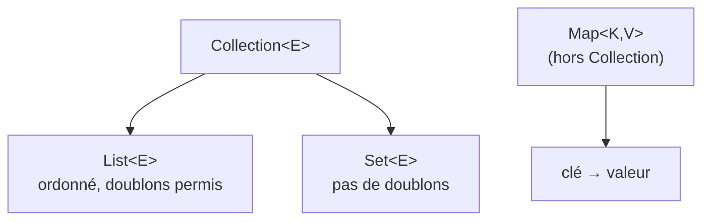

## Le changement de paradigme n°3 : un seul type PHP, plusieurs familles Java

En PHP, **un seul type** couvre tous les usages : liste ordonnée, dictionnaire clé-valeur,
ensemble, pile, file — tout est un `array`. C'est extrêmement pratique, mais ça a un coût :
rien dans le type ne dit à quoi sert réellement ce tableau à cet endroit précis du code.
Java éclate ça en **familles de collections typées**, chacune avec un rôle précis.



> **PHP → Java.** `$fruits = ['apple', 'banana'];` (liste) et `$prices = ['apple' => 1.2];`
> (dictionnaire) utilisent le **même** type PHP. En Java, ce sont deux mondes distincts :
> `List<String>` pour le premier, `Map<String, Double>` pour le second — le type de la
> variable **annonce** immédiatement son usage, avant même de lire le code qui l'utilise.

## `List` : la liste ordonnée

```java
List<String> fruits = new ArrayList<>();
fruits.add("apple");
fruits.add("banana");
fruits.add("apple");        // duplicates allowed, order preserved

System.out.println(fruits.get(0));    // "apple"
System.out.println(fruits.size());    // 3
```

- `List` est l'**interface** (le contrat) ; `ArrayList` est l'**implémentation** la plus
  courante (tableau redimensionnable en interne, accès rapide par index).
- Autre implémentation fréquente : `LinkedList` (insertions/suppressions rapides en
  milieu de liste, accès par index plus lent) — à choisir seulement si le profil d'usage
  le justifie réellement.

> **Réflexe à prendre.** Déclare toujours la **variable** avec le type **interface**
> (`List<String>`), et n'instancie l'**implémentation** concrète (`ArrayList`) qu'au
> moment de la construction. Ça permet de changer d'implémentation plus tard sans
> toucher au reste du code — l'équivalent de coder contre une interface Symfony plutôt
> que contre un service concret.

## `Set` : pas de doublons

```java
Set<String> uniqueTags = new HashSet<>();
uniqueTags.add("java");
uniqueTags.add("php");
uniqueTags.add("java");     // ignored: already present

System.out.println(uniqueTags.size());   // 2, not 3
```

> **Passerelle.** En PHP, garantir l'unicité d'un tableau demande un `array_unique()`
> manuel après coup, ou une convention (clés = valeurs). En Java, `Set` **garantit**
> l'unicité en permanence, à chaque `add()` — ce n'est pas une opération ponctuelle mais
> une propriété du type lui-même.

## `Map` : le dictionnaire clé-valeur

```java
Map<String, Double> prices = new HashMap<>();
prices.put("apple", 1.20);
prices.put("banana", 0.80);

double applePrice = prices.get("apple");         // 1.20
Double missing = prices.get("cherry");            // null — no exception, just null!

// Safer: getOrDefault() to avoid a null branch
double cherryPrice = prices.getOrDefault("cherry", 0.0);   // 0.0
```

> ⚠️ **Erreur fréquente — oublier que `get()` sur une clé absente renvoie `null`, pas une
> exception.** C'est cohérent avec PHP (`$prices['cherry'] ?? 0`), mais le piège Java
> spécifique est le **unboxing** : si tu écris `double p = prices.get("cherry");` (type
> primitif, pas `Double`), Java tente de déboxer ce `null` et lève une
> `NullPointerException`. Utilise `getOrDefault()` ou vérifie `containsKey()` avant.

## Trois implémentations de `Map` à connaître

| Implémentation | Ordre | Cas d'usage |
|---|---|---|
| `HashMap` | **aucun ordre garanti** | usage général, le plus courant |
| `LinkedHashMap` | ordre d'**insertion** conservé | quand l'ordre d'ajout compte |
| `TreeMap` | trié par **clé** | quand tu veux parcourir dans l'ordre naturel des clés |

> **Passerelle.** Un tableau associatif PHP conserve **toujours** l'ordre d'insertion par
> défaut — un comportement qui n'a **pas d'équivalent implicite** en Java : `HashMap` ne
> garantit **aucun ordre**. Si l'ordre d'insertion compte pour toi (cas très fréquent
> venant de PHP), utilise explicitement `LinkedHashMap`.

## À retenir

- PHP a un tableau universel ; Java a des **familles typées** : `List` (ordonné, doublons
  permis), `Set` (unique), `Map` (clé-valeur).
- Déclare la variable avec le type **interface**, instancie une implémentation concrète.
- `HashMap` **ne garantit aucun ordre** — contrairement au tableau associatif PHP. Utilise
  `LinkedHashMap` si l'ordre d'insertion doit être préservé.
- `Map.get()` sur une clé absente renvoie `null` : attention à l'unboxing avec un type
  primitif, préfère `getOrDefault()`.
