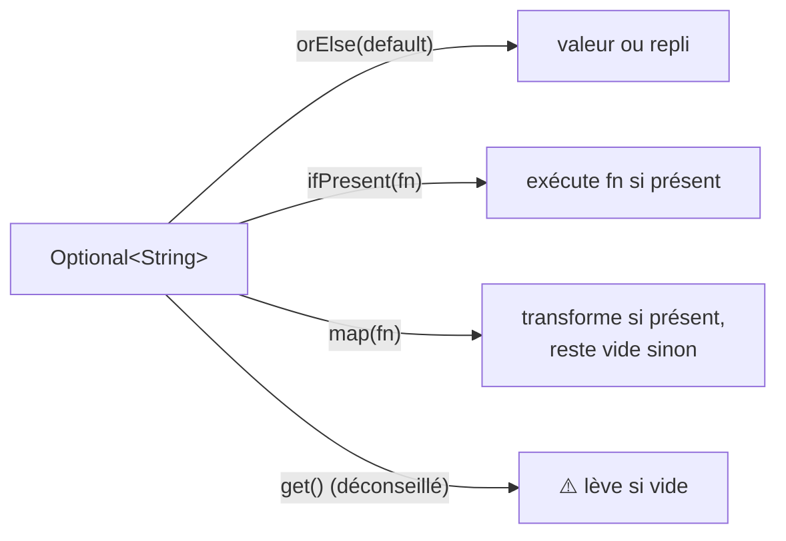

## Le problème du `null` : le milliard de dollars

Tony Hoare, l'inventeur du concept de référence `null` (1965), l'a lui-même qualifié
d'« erreur à un milliard de dollars » : un `null` peut se cacher n'importe où, et
`NullPointerException` (`NPE`) est **l'exception la plus fréquente en Java**, tellement
courante qu'elle a son propre surnom informel, « NPE ».

> **Passerelle.** PHP gère l'absence avec le type nullable (`?string`) et l'opérateur de
> coalescence `??` (`$value ?? 'default'`) — des outils légers, au cas par cas. Java 8 a
> introduit une approche différente et plus **explicite** : le type `Optional<T>`, un
> **objet conteneur** qui représente « une valeur, ou son absence » comme un type à part
> entière, qu'on **doit** gérer explicitement.

## `Optional<T>` en pratique

```java
Optional<String> maybeEmail = findEmailByUserId(42);

// Never do this — defeats the whole purpose of Optional:
// String email = maybeEmail.get();   // throws if empty!

// Instead, handle both cases explicitly:
String email = maybeEmail.orElse("no-email@example.com");

// Or act only if present:
maybeEmail.ifPresent(e -> System.out.println("Found: " + e));

// Or transform the value only if present (like a safe "map" over the box):
Optional<String> domain = maybeEmail.map(e -> e.substring(e.indexOf('@') + 1));
```



> ⚠️ **Erreur fréquente — appeler `.get()` directement.** `.get()` lève une
> `NoSuchElementException` si l'`Optional` est vide — c'est **exactement** le problème
> que `Optional` est censé éviter, juste déplacé. Utiliser `.get()` sans `.isPresent()`
> avant est un anti-pattern courant chez les débutants Java venant d'un autre langage.

## Où utiliser `Optional` — et où ne PAS l'utiliser

> ⚠️ **Erreur fréquente — mettre `Optional` partout, y compris en paramètre de méthode.**
> La documentation officielle Java est explicite sur ce point : `Optional` est conçu comme
> **type de retour** d'une méthode, pour signaler « je peux ne rien avoir à te donner ».
> Ce n'est **pas** fait pour :
> - un **paramètre** de méthode (`process(Optional<String> name)` — préfère la surcharge
>   de méthode, ou simplement accepter `null` documenté) ;
> - un **champ de classe** (utilise directement le type nullable et documente-le) ;
> - un élément de `List`/`Map` (`List<Optional<String>>` complique tout sans bénéfice).

```java
// ✅ Idiomatic: Optional as a RETURN type
public Optional<User> findById(long id) {
    User user = database.lookup(id);
    return Optional.ofNullable(user);   // wraps null into an empty Optional
}

// ❌ Not idiomatic: Optional as a method PARAMETER
public void process(Optional<String> name) { /* avoid this */ }
```

> **Réflexe à prendre.** Une méthode qui renvoie `Optional<User>` **documente son
> contrat** directement dans sa signature : « cet utilisateur peut ne pas exister, gère
> les deux cas ». C'est plus explicite qu'un simple `?User` (nullable) — au prix d'un peu
> plus de verbosité à chaque appel.

## À retenir

- `Optional<T>` rend l'**absence de valeur explicite dans le type de retour**, plutôt
  qu'implicite via `null` (comme le `??` de PHP, mais formalisé en type).
- N'appelle **jamais** `.get()` sans vérifier la présence — utilise `orElse()`,
  `ifPresent()`, `map()`.
- Réserve `Optional` aux **types de retour** de méthode ; jamais en paramètre, champ, ou
  élément de collection.
- `NullPointerException` reste possible en Java classique (hors `Optional`) : `Optional`
  est un outil de conception, pas une élimination totale du `null` du langage.
