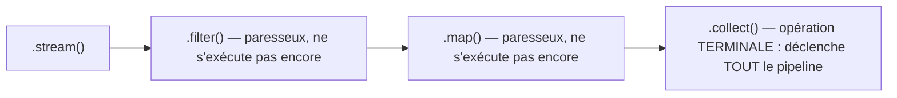

## De `array_map`/`array_filter` aux Streams

Tu utilises probablement déjà `array_map`, `array_filter`, `array_reduce` en PHP pour
transformer des collections sans boucle explicite. L'API `Stream` de Java (8+) répond au
même besoin, avec une syntaxe **chaînée** et un comportement **paresseux** qui surprend
au premier abord.

```java
List<String> names = List.of("Charlie", "Alice", "Bob", "Anna");

List<String> result = names.stream()
    .filter(name -> name.startsWith("A"))
    .map(String::toUpperCase)
    .sorted()
    .collect(Collectors.toList());

System.out.println(result);   // [ALICE, ANNA]
```

> **PHP → Java.** L'équivalent PHP serait :
> ```php
> $result = array_filter($names, fn($n) => str_starts_with($n, 'A'));
> $result = array_map('strtoupper', $result);
> sort($result);
> ```
> Trois appels imbriqués/successifs en PHP deviennent une **chaîne fluide** en Java —
> chaque étape (`.filter()`, `.map()`, `.sorted()`) renvoie un nouveau `Stream`, jusqu'au
> `.collect()` final qui matérialise le résultat.

## Le piège : un Stream est paresseux et à usage unique

C'est **la** vraie surprise pour un dev PHP : `array_map()`/`array_filter()` s'exécutent
**immédiatement** et renvoient un nouveau tableau. Un `Stream` Java, lui, ne fait **rien**
tant qu'aucune **opération terminale** n'est appelée.



```java
Stream<String> stream = names.stream()
    .filter(name -> {
        System.out.println("Filtering: " + name);   // won't print yet!
        return name.startsWith("A");
    });

System.out.println("Nothing printed above this line yet.");

List<String> collected = stream.collect(Collectors.toList());
// ONLY NOW do the println() calls above actually execute
```

> ⚠️ **Erreur fréquente — réutiliser un Stream déjà consommé.** Un `Stream` ne se
> parcourt **qu'une seule fois**. Appeler une deuxième opération terminale sur le même
> `Stream` (par exemple `stream.count()` après un `stream.collect(...)`) lève une
> `IllegalStateException` (« stream has already been operated upon or closed »). Si tu
> as besoin de reparcourir les données, repars de la collection source
> (`names.stream()` à nouveau), pas du `Stream` déjà utilisé.

## Les opérations clés

**Intermédiaires** (paresseuses, renvoient un nouveau `Stream`) :

```java
.filter(predicate)     // keeps elements matching a condition
.map(function)         // transforms each element
.sorted()              // sorts (natural order, or provide a Comparator)
.distinct()            // removes duplicates
.limit(n)              // keeps only the first n elements
```

**Terminales** (déclenchent l'exécution, renvoient un résultat concret) :

```java
.collect(Collectors.toList())               // materializes into a List
.reduce(0, (acc, x) -> acc + x)              // folds into a single value
.forEach(System.out::println)                // side effect, no return value
.count()                                     // counts elements
```

## `reduce` : le fold, comme `array_reduce`

```java
List<Integer> numbers = List.of(1, 2, 3, 4, 5);

int sum = numbers.stream()
    .reduce(0, (accumulator, current) -> accumulator + current);

System.out.println(sum);   // 15
```

> **Passerelle.** `array_reduce($numbers, fn($acc, $n) => $acc + $n, 0)` (PHP) et
> `.reduce(0, (acc, n) -> acc + n)` (Java) sont quasiment interchangeables — l'ordre des
> arguments diffère (valeur initiale d'abord en Java, en dernier en PHP), à surveiller.

## `Collectors` : au-delà de `toList()`

```java
Map<Boolean, List<String>> partitioned = names.stream()
    .collect(Collectors.partitioningBy(n -> n.length() > 4));

String joined = names.stream()
    .collect(Collectors.joining(", ", "[", "]"));   // "[Charlie, Alice, Bob, Anna]"

Map<Character, List<String>> grouped = names.stream()
    .collect(Collectors.groupingBy(n -> n.charAt(0)));   // group by first letter
```

> 💡 **À retenir.** `Collectors.groupingBy(...)` remplace élégamment une boucle manuelle
> avec `computeIfAbsent()` — c'est l'un des `Collectors` les plus utilisés en pratique
> pour reconstruire un `Map<Clé, List<Valeurs>>` à partir d'une liste plate.

## À retenir

- Un `Stream` est **paresseux** : rien ne s'exécute avant l'opération **terminale**
  (`collect`, `reduce`, `forEach`, `count`…) — contrairement à `array_map`/`array_filter`,
  eager par nature.
- Un `Stream` ne se **consomme qu'une fois** : une deuxième opération terminale sur le
  même `Stream` lève une exception.
- Le pipeline `.filter().map().sorted().collect(...)` remplace élégamment des appels
  imbriqués `array_filter`/`array_map`/`sort`.
- `Collectors` (`toList`, `joining`, `groupingBy`, `partitioningBy`) couvrent la plupart
  des besoins de collecte finale.
