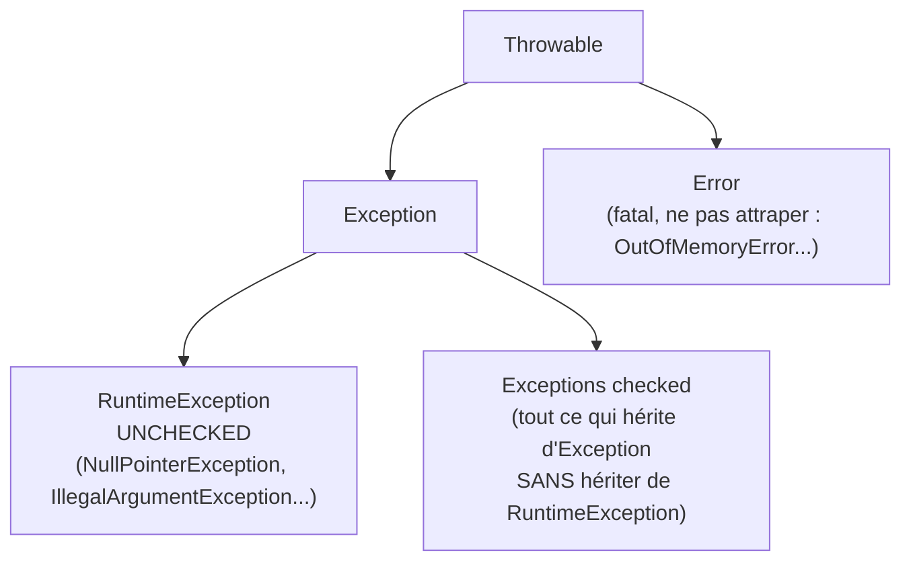

## En PHP, toutes les exceptions sont « unchecked »

En PHP, n'importe quelle méthode peut lever n'importe quelle exception, **sans jamais le
déclarer** dans sa signature. Rien n'oblige l'appelant à l'attraper : si personne ne le
fait, l'exception remonte jusqu'en haut de la pile et casse la requête (avec, au mieux,
un handler d'erreur global Symfony qui logue proprement). Le compilateur (ou plutôt,
l'absence de compilateur) ne dit jamais rien à ce sujet.

Java fait un choix radicalement différent, et c'est **la** vraie surprise de ce module :
il existe deux familles d'exceptions, et l'une d'elles est **vérifiée par le
compilateur**.



## Checked : le compilateur t'oblige à réagir

Une exception **checked** (tout ce qui hérite d'`Exception` sans hériter de
`RuntimeException`) doit **obligatoirement** être :
- soit **attrapée** (`try`/`catch`) ;
- soit **déclarée** dans la signature de la méthode via `throws`, reportant l'obligation
  à l'appelant.

```java
import java.io.IOException;

public void readConfigFile(String path) throws IOException {
    // IOException is a checked exception: declaring "throws IOException" is mandatory
    // here since we don't catch it ourselves — we pass the obligation to our caller.
    Files.readString(Path.of(path));
}

public void loadConfig() {
    try {
        readConfigFile("config.yaml");
    } catch (IOException e) {
        System.out.println("Could not read config: " + e.getMessage());
    }
}
```

> ⚠️ **Erreur fréquente — oublier de gérer une checked exception.** Si `loadConfig()`
> appelait `readConfigFile(...)` **sans** `try/catch` ni `throws IOException` dans sa
> propre signature, le code **ne compile pas du tout**. C'est une différence radicale
> avec PHP : une exception non gérée y compile toujours, elle ne plante qu'à l'exécution
> — Java refuse ce scénario **avant même de lancer le programme**.

## Unchecked : le comportement familier venant de PHP

Une **`RuntimeException`** (et ses sous-classes : `NullPointerException`,
`IllegalArgumentException`, `IllegalStateException`, `ArithmeticException`...) se
comporte exactement comme n'importe quelle exception PHP : **pas d'obligation** de
déclaration ni de capture. Elle peut remonter silencieusement jusqu'en haut de la pile.

```java
public double divide(int a, int b) {
    if (b == 0) {
        // Unchecked: no "throws" needed in the signature, no obligation for the caller
        throw new IllegalArgumentException("Division by zero");
    }
    return (double) a / b;
}
```

> **PHP → Java.** Toutes les exceptions que tu lèves en PHP
> (`throw new InvalidArgumentException(...)`) se comportent comme les `RuntimeException`
> Java : libres, non vérifiées par le compilateur. La vraie nouveauté est la famille
> **checked**, qui n'a **pas d'équivalent** en PHP.

## Checked ou unchecked : quand choisir quoi ?

> **Réflexe à prendre.** La sagesse moderne Java (depuis Java 8, portée notamment par
> les créateurs des Streams) tend à **limiter fortement** l'usage des exceptions
> checked. Règle pragmatique :
> - **Unchecked** (`RuntimeException`) par défaut, pour tout ce qui relève d'un **bug de
>   programmation** (argument invalide, état incohérent) — l'appelant ne peut de toute
>   façon rien faire d'autre que corriger le code.
> - **Checked** réservé aux cas où l'appelant **peut réellement réagir** de façon
>   différenciée à l'échec (fichier absent → proposer d'en créer un ; connexion réseau
>   perdue → retenter). Même dans ce cas, beaucoup d'équipes préfèrent aujourd'hui une
>   `RuntimeException` custom, documentée, plutôt qu'une checked.

> 💡 **À retenir.** Les checked exceptions ont eu mauvaise presse ces dernières années :
> elles se propagent mal à travers les lambdas/Streams (une lambda ne peut pas déclarer
> `throws` facilement) et forcent souvent un `try/catch` de pure forme qui ne fait
> qu'emballer l'exception dans une `RuntimeException`. Ne t'étonne pas de voir du code
> moderne qui les évite largement.

## Exceptions personnalisées

```java
// A checked business exception: callers MUST handle it explicitly
public class InsufficientFundsException extends Exception {
    public InsufficientFundsException(String message) {
        super(message);
    }
}

// An unchecked exception: a programming error, no obligation on the caller
public class InvalidOrderStateException extends RuntimeException {
    public InvalidOrderStateException(String message) {
        super(message);
    }
}
```

## À retenir

- Java distingue **checked** (doit être capturée ou déclarée via `throws`, vérifié à la
  compilation) et **unchecked** (`RuntimeException`, libre — comme toute exception PHP).
- Une checked exception non gérée **empêche la compilation** : une différence radicale
  avec PHP, où l'absence de gestion ne casse qu'à l'exécution.
- Par défaut, préfère **unchecked** pour les bugs de programmation ; réserve **checked**
  aux cas où l'appelant peut vraiment agir différemment selon l'échec.
- `Error` (dont `OutOfMemoryError`) ne se rattrape en général **jamais** : ce sont des
  échecs fatals de la JVM elle-même.
