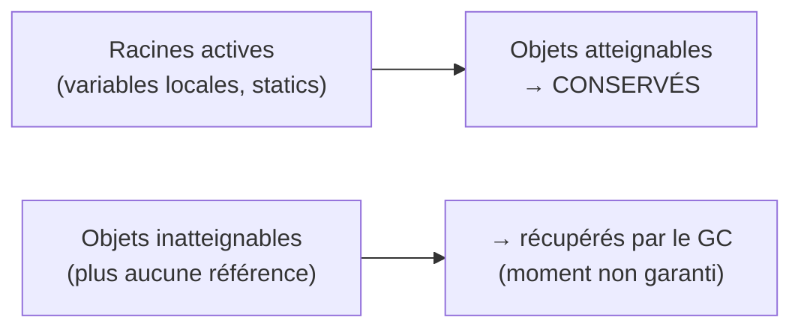

## Pas de `free`, pas de `unset` obligatoire — mais pas magique non plus

Comme PHP, Java **ne demande jamais** de libérer manuellement la mémoire : pas de `free`
(C), pas d'équivalent obligatoire du `unset()` PHP. Un objet devient éligible à la
récupération dès qu'**aucune référence active** ne pointe plus vers lui, et le
**Garbage Collector** (GC) de la JVM s'occupe de le libérer.

> **Passerelle.** PHP utilise principalement un système de **comptage de références**
> (déterministe : dès que le compteur tombe à zéro, la mémoire est libérée
> immédiatement — modulo le ramasse-miettes cyclique de PHP pour les références
> circulaires). La JVM utilise un GC **générationnel** bien plus sophistiqué :
> pas de compteur de références du tout, mais des passages périodiques qui explorent le
> graphe d'objets **atteignables** depuis les racines (variables locales actives, champs
> statiques...) et libèrent tout le reste. Ce mécanisme est **non déterministe** : tu ne
> sais jamais précisément *quand* un objet sera réellement libéré.



> ⚠️ **Erreur fréquente — appeler `System.gc()` en croyant forcer le nettoyage.**
> `System.gc()` n'est qu'une **suggestion** à la JVM (« ce serait bien de passer le GC
> maintenant ») — elle peut l'ignorer complètement. Il n'existe **aucun** moyen de forcer
> une libération immédiate et garantie de la mémoire en Java, contrairement à
> `unset($var)` en PHP qui, combiné au comptage de références, a souvent un effet
> immédiat et prévisible.

## Les fuites mémoire classiques en Java (qui n'existent pas pareil en PHP)

Une fuite mémoire Java n'est **jamais** un objet non libéré « à la main » — c'est
toujours un objet qui reste **accidentellement atteignable** alors qu'il ne devrait plus
l'être. Trois causes très fréquentes :

1. **Collections statiques qui grossissent sans jamais être vidées.**
   ```java
   public class Cache {
       // static: lives for the whole application lifetime — never garbage collected
       private static final Map<String, Object> cache = new HashMap<>();

       public static void store(String key, Object value) {
           cache.put(key, value);   // if nothing ever removes old entries, this grows forever
       }
   }
   ```
2. **Listeners/observateurs jamais désinscrits** : un composant enregistré comme
   *listener* sur un objet à longue durée de vie reste référencé indéfiniment, même si
   plus personne n'en a besoin par ailleurs.
3. **`ThreadLocal` jamais nettoyé**, en particulier dans un pool de threads réutilisés
   (serveur web) : la valeur reste attachée au thread bien après la fin de la requête qui
   l'a créée.

> **Réflexe à prendre.** Il n'existe pas de PHP-FPM qui « repart de zéro » à chaque
> requête côté Java : une application Java (serveur d'application, service Spring…) tourne
> en général **en continu**, parfois des semaines, dans **le même process JVM**. Un état
> statique mal maîtrisé s'accumule silencieusement bien plus longtemps qu'en PHP, où
> chaque requête PHP-FPM repart d'une mémoire vierge.

## `OutOfMemoryError` : quand le GC ne peut plus rien faire

Si la mémoire disponible (le *heap*) est saturée d'objets **encore atteignables**
(donc que le GC ne peut légitimement pas libérer), la JVM lève une `OutOfMemoryError` —
une `Error`, pas une `Exception` : il ne faut généralement **pas** essayer de l'attraper,
l'application est dans un état trop dégradé pour continuer sereinement.

```bash
# Common flag to size the JVM heap explicitly (useful in containers)
java -Xmx512m -jar my-app.jar
```

## À retenir

- Pas de libération manuelle en Java : le **GC** libère automatiquement tout objet
  devenu **inatteignable** — mais le moment précis n'est **jamais garanti**
  (contrairement au comptage de références PHP, plus immédiat).
- `System.gc()` n'est qu'une suggestion, jamais une garantie.
- Les fuites Java classiques : **collections statiques** qui grossissent sans limite,
  **listeners** jamais désinscrits, **`ThreadLocal`** jamais nettoyé.
- Une JVM applicative tourne en continu (pas de "reset" par requête comme PHP-FPM) : un
  état statique mal géré s'accumule bien plus longtemps qu'en PHP.
- `OutOfMemoryError` est une `Error` fatale : ne cherche généralement pas à la rattraper.
