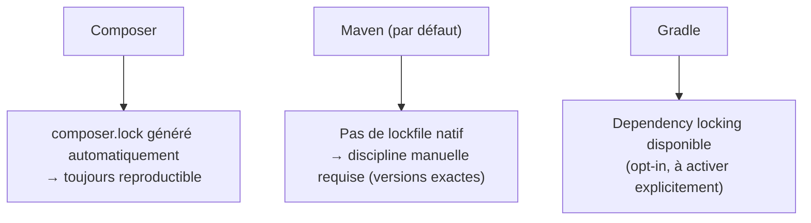

## Des coordonnées à trois parties, pas un simple nom de paquet

Composer identifie un paquet par `vendor/package` (ex. `symfony/console`). Maven/Gradle
utilisent des **coordonnées GAV** : `groupId:artifactId:version`.

```xml
<dependency>
    <groupId>org.springframework.boot</groupId>   <!-- vendor/organization -->
    <artifactId>spring-boot-starter-web</artifactId> <!-- the package itself -->
    <version>3.2.5</version>                       <!-- exact version -->
</dependency>
```

> **PHP → Java.** `groupId` correspond au `vendor` Composer (`symfony`, `doctrine`),
> `artifactId` au `package` (`console`, `orm`). La différence : Maven **exige** de
> préciser aussi le **groupId**, même quand l'`artifactId` seul semblerait suffisant à
> l'identifier — une désambiguïsation plus stricte qu'un simple `vendor/package`.

## Maven Central : le Packagist de Java

**Maven Central** est le repository public par défaut, l'équivalent direct de
**Packagist**. Les deux outils (Maven et Gradle) le déclarent par défaut ou via une
ligne de configuration explicite (`mavenCentral()` en Gradle).

## Les scopes/configurations : une dépendance n'est pas toujours packagée

Composer distingue `require` (production) et `require-dev` (développement). Maven va
plus loin avec des **scopes** dédiés à des moments précis du cycle de vie :

| Scope Maven | Rôle | Équivalent Composer |
|---|---|---|
| `compile` *(défaut)* | disponible partout, embarqué dans le livrable | `require` |
| `test` | uniquement pour compiler/exécuter les tests | `require-dev` |
| `provided` | disponible à la compilation, **fourni par l'environnement d'exécution** (pas embarqué) | pas d'équivalent direct |
| `runtime` | nécessaire à l'exécution, pas à la compilation | rare en PHP |

```xml
<dependency>
    <groupId>jakarta.servlet</groupId>
    <artifactId>jakarta.servlet-api</artifactId>
    <version>6.0.0</version>
    <scope>provided</scope>  <!-- the servlet container (Tomcat...) already provides this -->
</dependency>
```

> **Passerelle.** Le scope `provided` n'a pas de réel équivalent Composer : il sert à
> dire « ce code a besoin de cette API pour compiler, mais ne l'embarque **pas** dans le
> livrable final, car le serveur d'application la fournira lui-même à l'exécution » — une
> nuance héritée de l'écosystème Java EE/Jakarta EE, absente du monde PHP où le runtime
> ne "fournit" jamais de dépendances applicatives de cette façon.

## Le vrai piège pour un dev Composer : pas de lockfile automatique

> ⚠️ **Erreur fréquente — chercher l'équivalent de `composer.lock`.** Composer génère
> **systématiquement** un `composer.lock` qui fige les versions exactes résolues, garanti
> reproductible d'une machine à l'autre. **Maven n'a pas d'équivalent officiel natif** :
> par défaut, si tu déclares une version avec un intervalle (`[1.0,2.0)`) ou omets un
> `<dependencyManagement>` cohérent, deux builds à des moments différents peuvent
> résoudre des versions transitively différentes. En pratique :
> - fixe **toujours des versions exactes** (`3.2.5`, jamais de range) dans `pom.xml` ;
> - ou utilise le plugin `maven-enforcer-plugin` pour interdire les ranges d'un projet ;
> - côté Gradle, le **dependency locking** natif (`./gradlew dependencies --write-locks`)
>   se rapproche davantage du comportement de `composer.lock`.



## Le cache local : `.m2` vs `vendor/`

Composer télécharge les dépendances **dans le projet** (`vendor/`). Maven télécharge
**une seule fois par machine**, dans un cache **global** partagé entre tous tes projets :
`~/.m2/repository/`.

> **Passerelle.** Avantage : pas de re-téléchargement pour chaque projet utilisant la
> même dépendance. Inconvénient : un projet n'est **pas** autonome dans son dossier
> comme avec un `vendor/` — reproduire un build sur une autre machine implique de
> retélécharger depuis `~/.m2/` (ou Maven Central) la première fois.

## À retenir

- Coordonnées **GAV** (`groupId:artifactId:version`) remplacent `vendor/package` — un
  niveau de précision de plus.
- **Maven Central** est l'équivalent direct de **Packagist**.
- Les **scopes** Maven (`compile`, `test`, `provided`, `runtime`) vont au-delà de la
  simple distinction `require`/`require-dev` de Composer.
- **Pas de `composer.lock` natif** côté Maven : fixe des versions exactes, ou active le
  dependency locking de Gradle si tu utilises cet outil.
- Cache **global** (`~/.m2/`) partagé entre projets, contrairement au `vendor/` local par
  projet de Composer.
