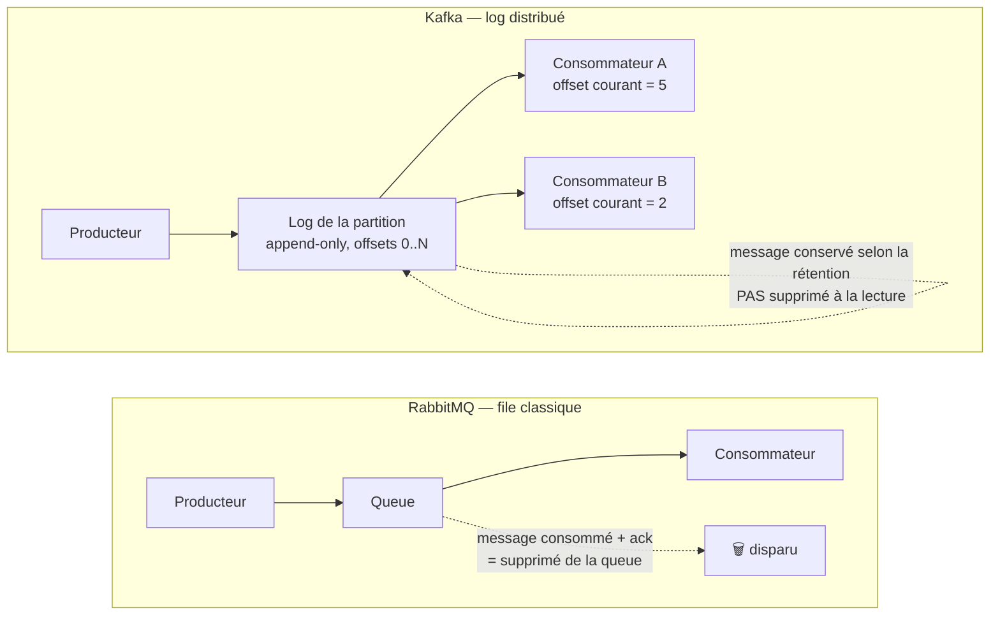
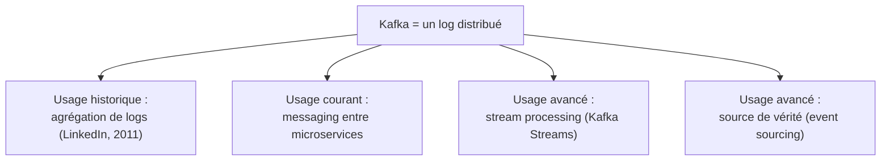

## Ce que tu sais déjà — et ce qui va changer

Chez OCP, tu as écrit des producteurs et des consommateurs `php-rdkafka` : tu sais
`produce()` un message, tu sais `subscribe()` puis `consume()`. Ça marche. Mais si on te
demande *pourquoi* un consommateur peut relire un message déjà traité, ou *pourquoi* deux
consommateurs du même groupe ne reçoivent jamais le même message, l'API seule ne répond
pas. Il faut comprendre ce que Kafka **est**, pas seulement comment on l'appelle.

Et ce que Kafka *est* surprend souvent un dev qui vient de RabbitMQ : **ce n'est pas une
file de messages**. C'est un **log distribué, append-only, qu'on peut relire**.

## Le broker qui pousse et oublie

Dans RabbitMQ, une queue est une structure **éphémère** : un message y attend d'être
consommé, puis il **disparaît** (ack → suppression, ou expiration). Le broker route les
messages vers des queues et pousse activement (ou les distribue à la demande) vers les
consommateurs. Une fois consommé et acquitté, le message n'existe plus nulle part.

Kafka fonctionne à l'inverse : chaque message écrit dans un **topic** est **ajouté à la
fin d'un fichier journal** (le *log*) et y **reste**, selon une politique de rétention
(durée ou taille), **indépendamment du fait qu'il ait été lu ou non**. Un consommateur ne
« retire » jamais un message : il **avance un pointeur** (l'*offset*, vue en détail dans
la prochaine leçon) dans ce log. Le message, lui, ne bouge pas.

> **RabbitMQ → Kafka.** Dans RabbitMQ, tu raisonnais en « qui consomme ce message ? » ;
> avec un ack, le message part. Dans Kafka, raisonne en « où en est **ce lecteur** dans le
> log ? ». Le message survit à sa lecture — c'est ce qui permet à **plusieurs équipes**
> (facturation, analytics, audit) de lire **indépendamment** le même flux, chacune à son
> propre rythme, sans jamais se marcher dessus ni épuiser les messages des autres.

## Pourquoi ce choix change tout

Cette différence n'est pas un détail d'implémentation : elle détermine ce que Kafka peut
faire que RabbitMQ ne fait pas naturellement.

- **Relecture (*replay*)** : un nouveau consommateur (un nouveau service, un bug à
  corriger, un besoin d'audit) peut relire l'historique depuis le début — ou depuis un
  point donné. Avec une queue classique, l'historique est perdu dès qu'il est consommé.
- **Plusieurs consommateurs indépendants** : chaque *consumer group* (leçon suivante)
  maintient sa **propre** position de lecture. Le flux de facturation et le flux
  analytics lisent le **même** topic sans interférer.
- **Débit** : un log append-only n'a (presque) que des écritures séquentielles sur
  disque — bien plus rapide qu'une structure de file avec suppressions aléatoires. C'est
  une des raisons pour lesquelles Kafka tient des débits très élevés.
- **Le log comme source de vérité** : puisque rien n'est supprimé à la lecture, le log
  peut servir de **journal des faits qui se sont produits** — la base des patterns
  event-driven que tu verras au module 4 (event sourcing, outbox).

> ⚠️ **Erreur fréquente.** Traiter Kafka comme une « RabbitMQ plus rapide » et s'étonner
> qu'un message reste visible après consommation, ou que deux consommateurs du même
> groupe ne se partagent pas un message comme deux *workers* sur une même queue. Ce n'est
> pas un bug : c'est le modèle. Le log ne connaît qu'une opération de lecture — avancer un
> offset — jamais une suppression.

## Kafka en une phrase

**Kafka est un système de stockage de logs distribué, répliqué, ordonné (par partition) et
durable, sur lequel on branche des producteurs qui écrivent et des consommateurs qui
lisent à leur propre rythme.** Le mot « messaging » dans son écosystème (Kafka Streams,
Kafka Connect) vient de l'**usage** qu'on en fait le plus souvent — transporter des
événements entre services — pas de son **fonctionnement interne**, qui reste un log.

> 💡 **À retenir.**
> - Kafka n'est **pas** une file : c'est un **log append-only** qu'on relit via des
>   *offsets*, pas une structure dont on retire les messages.
> - Un message **survit** à sa consommation (selon la rétention) — plusieurs
>   consommateurs indépendants peuvent lire le même flux à des vitesses différentes.
> - Cette différence de modèle (log vs file) est la source de presque toutes les autres
>   différences avec RabbitMQ que tu croiseras dans ce parcours.
