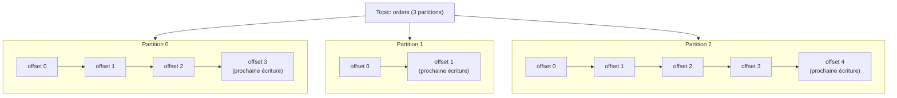
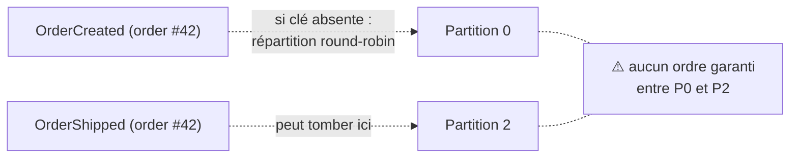

## Le topic : une catégorie, pas un canal unique

Un **topic** (`orders`, `payments.completed`…) est le nom logique sous lequel des
producteurs publient et des consommateurs lisent — jusque-là, rien de très différent d'un
*exchange* RabbitMQ. La différence commence dès qu'on regarde **comment** un topic stocke
ses messages : il n'est **jamais** un seul fichier. Il est découpé en **partitions**.

## La partition : l'unité réelle du log

Une **partition** est la véritable unité de stockage : un log append-only, ordonné, propre
à elle. Un topic avec 3 partitions, c'est **trois logs indépendants**, chacun avec sa
propre séquence d'*offsets* qui repart de `0`.



Chaque partition est un fichier (segmenté en plusieurs fichiers sur disque en pratique)
sur lequel Kafka n'autorise que deux opérations : **ajouter** à la fin, et **lire** à
partir d'un offset donné. Pas d'insertion, pas de suppression ponctuelle, pas de mise à
jour d'un message existant — ce qui explique en grande partie la performance du système.

> **RabbitMQ → Kafka.** Un *exchange* RabbitMQ route vers des queues, mais reste une
> notion assez abstraite côté stockage. Un topic Kafka, lui, se matérialise concrètement
> en N logs séparés (les partitions) répartis sur les brokers du cluster — c'est un
> **découpage physique et logique à la fois**, pas juste une étiquette de routage.

## L'offset : une position, pas un identifiant de message

L'**offset** est un entier qui identifie **la position d'un message dans sa partition** —
`0`, `1`, `2`… un peu comme le numéro de ligne d'un fichier journal. Deux choses
importantes :

- Un offset n'a de sens **qu'à l'intérieur d'une partition donnée**. « L'offset 42 »
  n'identifie rien sans préciser *quelle* partition.
- Un offset n'est jamais réutilisé au sein d'une même partition (sauf purge complète du
  topic) : il **croît de façon monotone**.

Un consommateur ne fait au fond qu'une seule chose : retenir *« j'ai lu jusqu'à l'offset
N sur cette partition »*, puis demander *« donne-moi ce qu'il y a après N »*. C'est cette
position mémorisée — le **commit d'offset**, détaillée au module 2 — qui permet de
reprendre exactement là où on s'était arrêté après un redémarrage.

```bash
# Inspect the earliest and latest offset available on a topic's partitions
kafka-get-offsets.sh --bootstrap-server localhost:9092 \
  --topic orders --time -1   # -1 = latest offset (end of log)

# Consume from a given offset on a specific partition (debugging tool)
kafka-console-consumer.sh --bootstrap-server localhost:9092 \
  --topic orders --partition 0 --offset 42 --max-messages 5
```

## Ordonnancement : garanti par partition, pas par topic

Voici le point le plus important, et la source n°1 de bugs de production autour de
l'ordre des messages : **Kafka garantit l'ordre à l'intérieur d'une partition, jamais à
l'échelle d'un topic.**

Deux messages écrits dans la partition 0 arrivent dans l'ordre d'écriture, toujours. Mais
un message écrit dans la partition 0 et un autre dans la partition 2 n'ont **aucune**
garantie d'ordre relatif entre eux.

> ⚠️ **Erreur fréquente.** Écrire tous les événements d'un topic sans réfléchir à la clé
> de partition, puis s'étonner en production que « l'événement `OrderCreated` d'une
> commande arrive après son `OrderShipped` ». Si les deux événements de cette commande
> sont tombés sur des partitions différentes, **rien** ne garantissait leur ordre relatif
> — ce n'est pas un bug de Kafka, c'est un partitionnement qui ne tenait pas compte de la
> contrainte d'ordre. La clé de partition (leçon suivante) est justement le levier pour
> éviter ça.



## Pourquoi découper en partitions ?

Deux raisons, qu'il faut bien distinguer :

1. **Parallélisme de consommation.** Une partition n'est lue par **qu'un seul**
   consommateur à la fois au sein d'un consumer group (module 2) — plus de partitions,
   plus de consommateurs peuvent travailler en parallèle sur le même topic.
2. **Répartition de la charge sur le cluster.** Les partitions d'un topic peuvent être
   physiquement stockées sur des brokers différents — un topic à 12 partitions peut
   utiliser la capacité disque/réseau de plusieurs machines, pas d'une seule.

> 💡 **À retenir.**
> - Un **topic** = plusieurs **partitions** ; chaque partition est un log indépendant,
>   ordonné, avec ses propres offsets qui repartent de `0`.
> - L'**offset** identifie une position **dans une partition donnée** — jamais dans le
>   topic entier.
> - Kafka garantit l'ordre **par partition**, jamais entre partitions différentes.
> - Le nombre de partitions borne le parallélisme de consommation *au sein d'un même
>   consumer group*.
