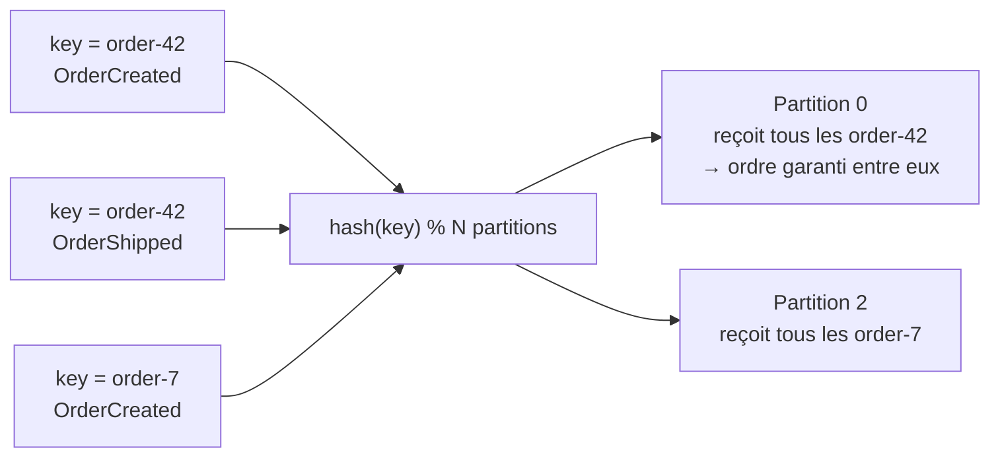
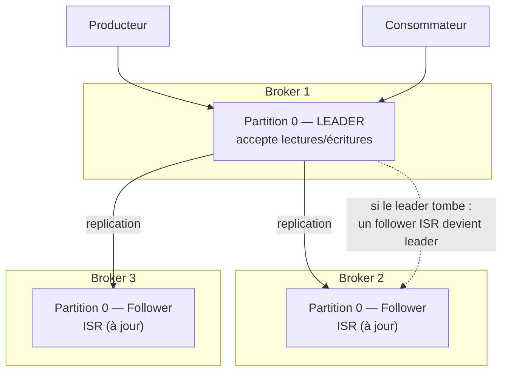

## La clé de partition : choisir *où* écrire, pas *combien de fois*

Quand un producteur envoie un message avec une **clé** (`key`), Kafka ne la stocke pas
juste à titre indicatif : elle **détermine la partition de destination**, via un hachage.
Par défaut (partitionneur standard), c'est `hash(key) % nombre_de_partitions` (en version
simplifiée — l'algorithme réel utilise Murmur2, mais le principe est celui-ci).

Conséquence directe, et c'est **le** mécanisme à retenir pour garantir de l'ordre : **tous
les messages portant la même clé finissent toujours sur la même partition**, donc sont
toujours lus **dans l'ordre d'écriture** par rapport aux autres messages de cette clé.



> **Réflexe à prendre.** Dès qu'un flux d'événements a une notion d'**entité** dont
> l'ordre compte (une commande, un compte utilisateur, un panier), utilise **l'identifiant
> de cette entité comme clé de partition**. C'est le premier réflexe de design à avoir
> avant même d'écrire le premier producteur — pas un détail qu'on corrige après coup.

Sans clé (`key = null`), Kafka répartit les messages en round-robin (ou par lots, selon la
version du client) entre les partitions : bon pour la répartition de charge, mais **aucune
garantie d'ordre** entre deux messages, même consécutifs.

```java
// With a key: all events for the same order always land on the same partition,
// preserving their relative order.
ProducerRecord<String, String> record =
    new ProducerRecord<>("orders", "order-42", orderCreatedJson);
producer.send(record);

// Without a key: Kafka spreads messages across partitions —
// good for load balancing, NO ordering guarantee between messages.
ProducerRecord<String, String> unordered =
    new ProducerRecord<>("orders", null, orderCreatedJson);
producer.send(unordered);
```

> ⚠️ **Erreur fréquente — changer le nombre de partitions d'un topic existant.** Ajouter
> des partitions à un topic déjà en production **change le résultat du hachage** pour de
> nombreuses clés (le `% N` change de valeur). Les nouveaux messages d'une même clé
> peuvent alors atterrir sur une **partition différente** de celle des anciens messages —
> rompant l'ordre que tu croyais garanti. Dimensionne le nombre de partitions **avant** la
> mise en production, ou prévois une migration explicite si tu dois en ajouter.

## Réplication : un leader, des followers, des ISR

Chaque partition n'existe pas en un seul exemplaire : elle est **répliquée** sur plusieurs
brokers, selon le `replication.factor` du topic (typiquement `3` en production).

- Une des réplicas est élue **leader** : c'est **elle seule** qui accepte les écritures et
  les lectures des clients pour cette partition.
- Les autres réplicas sont des **followers** : elles copient passivement le log du leader.
- Les followers à jour (qui n'ont pas de retard significatif) forment l'ensemble des
  **ISR** (*In-Sync Replicas*) — c'est parmi elles qu'un nouveau leader sera élu si le
  leader actuel tombe.



Ce mécanisme est ce qui rend Kafka **tolérant aux pannes** : perdre un broker ne perd pas
les données (tant qu'au moins une réplica ISR survit), et le cluster élit automatiquement
un nouveau leader pour continuer à servir les clients.

> **RabbitMQ → Kafka.** RabbitMQ a ses propres mécanismes de haute disponibilité
> (*mirrored queues*, puis *quorum queues*) qui reposent sur des principes voisins
> (répliquer et élire). Le paramètre à retenir côté Kafka pour la fiabilité d'écriture,
> `acks`, sera détaillé au module 2 — il dépend directement du nombre de réplicas
> synchronisées (ISR).

## KRaft : Kafka n'a plus besoin de ZooKeeper

Historiquement, un cluster Kafka déléguait la gestion des métadonnées (quel broker est
leader de quelle partition, la liste des topics, etc.) à un cluster **ZooKeeper** séparé.
Depuis Kafka 3.x et **par défaut à partir de la 4.0**, ce rôle est assuré nativement par
Kafka lui-même via le mode **KRaft** (*Kafka Raft*) : un sous-ensemble des brokers joue le
rôle de *controller*, en utilisant l'algorithme de consensus Raft — plus de dépendance
externe à opérer, un déploiement plus simple, un failover plus rapide.

> 💡 Si tu croises encore de la documentation ou des clusters historiques mentionnant
> ZooKeeper, sache que c'est l'ancien mode (toujours supporté un temps pour la migration,
> mais déprécié) : tout nouveau cluster Kafka se déploie aujourd'hui en KRaft.

## À retenir

- La **clé** du message détermine sa **partition** (via hachage) : même clé → même
  partition → ordre garanti entre messages de cette clé.
- **Pas de clé** = répartition round-robin = pas de garantie d'ordre entre messages.
- Changer le nombre de partitions **après coup** peut casser l'affectation clé→partition
  pour les messages existants : dimensionne en amont.
- Chaque partition a un **leader** (seul point d'écriture/lecture) et des **followers**
  répliqués ; les followers à jour forment les **ISR**, réservoir pour l'élection d'un
  nouveau leader en cas de panne.
- Depuis Kafka 3.x (par défaut en 4.0), le mode **KRaft** remplace ZooKeeper pour la
  gestion des métadonnées du cluster.
