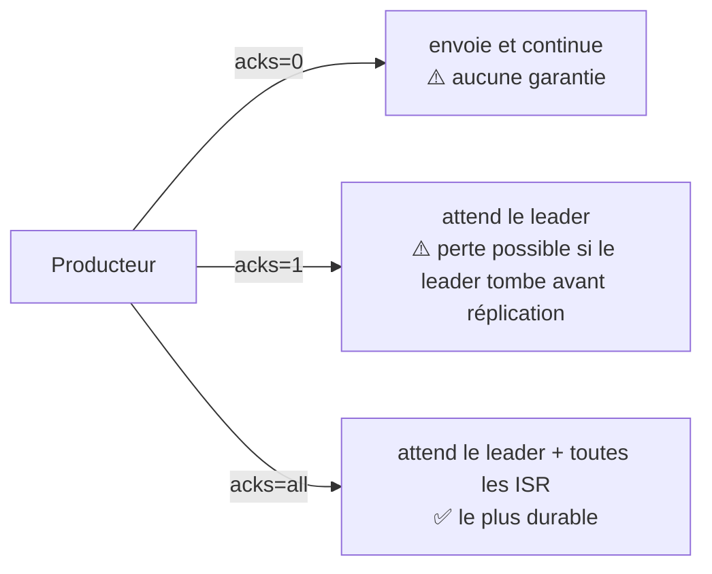

## Ce que fait vraiment `producer.send()`

Tu as déjà appelé `produce()` avec `php-rdkafka`. Derrière cet appel, un producteur Kafka
fait bien plus qu'un simple envoi réseau : il **choisit une partition** (via la clé, vue
au module 1), **accumule** les messages en petits lots (*batching*) pour l'efficacité
réseau, éventuellement les **compresse**, puis les envoie au broker qui héberge le
**leader** de la partition ciblée — et lui seul.

```java
Properties props = new Properties();
props.put("bootstrap.servers", "broker1:9092,broker2:9092");
props.put("key.serializer", "org.apache.kafka.common.serialization.StringSerializer");
props.put("value.serializer", "org.apache.kafka.common.serialization.StringSerializer");

// acks=all: wait for every in-sync replica to acknowledge before considering
// the write successful — the strongest durability setting (see below).
props.put("acks", "all");

KafkaProducer<String, String> producer = new KafkaProducer<>(props);

ProducerRecord<String, String> record =
    new ProducerRecord<>("orders", "order-42", orderCreatedJson);

// send() is asynchronous: it returns a Future<RecordMetadata> immediately.
producer.send(record, (metadata, exception) -> {
    if (exception != null) {
        // The broker never confirmed the write — handle and possibly retry.
        log.error("Failed to send record", exception);
    } else {
        log.info("Written to partition {} at offset {}", metadata.partition(), metadata.offset());
    }
});
```

> ⚠️ **Erreur fréquente.** Appeler `send()` et ignorer le callback (ou le `Future`
> retourné). `send()` est **asynchrone** : l'appel revient avant même que le broker ait
> confirmé quoi que ce soit. Sans vérifier le résultat, une erreur d'écriture passe
> totalement inaperçue — le message est silencieusement perdu côté application.

## `acks` : jusqu'où attendre avant de considérer l'écriture réussie

Le paramètre `acks` du producteur est le levier principal de **durabilité vs latence** :

| `acks` | Comportement | Risque |
|---|---|---|
| `0` | Le producteur n'attend **aucune** confirmation, il envoie et continue. | Perte silencieuse possible (panne réseau, broker down) — le plus rapide, le moins sûr. |
| `1` | Le producteur attend l'ack du **leader** uniquement, avant réplication vers les followers. | Si le leader tombe juste après l'ack, avant d'avoir répliqué, le message peut être perdu. |
| `all` (ou `-1`) | Le producteur attend l'ack du leader **et** de toutes les réplicas ISR. | Le plus sûr : un message acké a survécu à la panne d'un broker (tant qu'il reste une ISR). Latence plus élevée. |



> **RabbitMQ → Kafka.** `acks=all` chez Kafka joue un rôle proche des **publisher
> confirms** de RabbitMQ (`confirm_select` + attente d'un `ack` du broker avant de
> considérer le message publié en sécurité) : dans les deux cas, c'est le producteur qui
> décide d'attendre — ou non — une confirmation avant de continuer.

> **Réflexe à prendre.** Pour tout flux où perdre un message a un coût métier réel
> (paiement, commande, facturation), utilise `acks=all` — combiné à
> `min.insync.replicas` côté topic (le nombre minimum d'ISR exigées pour accepter une
> écriture). Pour de la télémétrie ou des logs applicatifs peu critiques, `acks=1` (voire
> `0`) peut être un compromis raisonnable pour le débit.

## Le partitionneur : comment `key` devient un numéro de partition

Sans partitionneur personnalisé, le comportement par défaut est celui vu au module 1 :
`murmur2(key) % nombre_de_partitions`. Le producteur peut aussi implémenter un
partitionneur **sur mesure** — utile si le hachage par défaut ne convient pas (par
exemple pour garantir qu'une catégorie de client va toujours sur un sous-ensemble
dédié de partitions).

```properties
# producer.properties — plugging a custom partitioner
partitioner.class=com.example.CustomerTierPartitioner
```

## Le batching : produire par lots, pas message par message

Deux paramètres du producteur contrôlent un compromis débit/latence important :

- `linger.ms` : combien de temps le producteur **attend** avant d'envoyer un lot, pour
  laisser d'autres messages s'accumuler (défaut : `0`, envoi quasi immédiat).
- `batch.size` : la taille maximale (en octets) d'un lot avant envoi forcé.

Augmenter `linger.ms` de quelques millisecondes améliore souvent le débit global de
façon spectaculaire (moins de requêtes réseau, meilleure compression), au prix d'une
latence légèrement supérieure par message — un compromis à ajuster selon le cas d'usage,
jamais un défaut à laisser au hasard en production à fort volume.

## À retenir

- `acks=0/1/all` règle le compromis **durabilité vs latence** ; `acks=all` +
  `min.insync.replicas` est le réglage de référence pour tout flux critique.
- `send()` est **asynchrone** : toujours vérifier le callback / `Future` pour détecter un
  échec d'écriture — sinon, perte silencieuse.
- La **clé** pilote la partition cible (hachage par défaut, personnalisable via
  `partitioner.class`).
- `linger.ms` / `batch.size` arbitrent le compromis **débit vs latence** à l'écriture.
