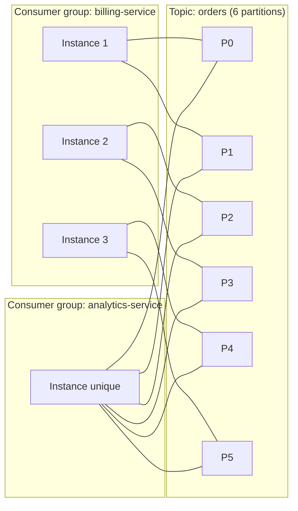

## Le consumer group : une position de lecture partagée

Un **consumer group** est un identifiant (`group.id`) que partagent plusieurs instances
d'un même consommateur. Kafka garantit une règle simple mais structurante : **au sein d'un
groupe donné, chaque partition n'est lue que par une seule instance à la fois.**

C'est ce mécanisme qui permet de **scaler** la consommation d'un topic : ajouter des
instances au groupe répartit automatiquement les partitions entre elles.



Deux groupes différents (`billing-service`, `analytics-service`) lisent le **même** topic
de façon totalement **indépendante** — chacun avec sa propre progression d'offsets par
partition. C'est le mécanisme qui permet à plusieurs services métier de consommer le même
flux d'événements sans jamais se gêner.

> **RabbitMQ → Kafka.** L'équivalent le plus proche côté RabbitMQ serait : plusieurs
> *workers* qui consomment la **même** queue se partagent ses messages (chacun n'en reçoit
> qu'une partie) — mais pour que **plusieurs services indépendants** reçoivent chacun
> **tous** les messages, il fallait déjà, côté RabbitMQ, un exchange `fanout`/`topic` avec
> une queue **par service**. Avec Kafka, ce comportement (plusieurs lecteurs indépendants
> du flux complet) est natif du modèle groupe-par-service, sans configuration
> supplémentaire de routage.

## La conséquence directe : partitions et parallélisme

Puisqu'une partition n'est lue que par **une seule** instance d'un groupe donné à la fois,
le nombre de partitions **plafonne** le parallélisme utile de ce groupe :

- **Instances > partitions** : les instances excédentaires restent **inactives** (elles
  n'ont aucune partition assignée). Avoir 10 instances pour 4 partitions, c'est laisser 6
  instances ne rien faire.
- **Instances < partitions** : chaque instance se voit assigner **plusieurs** partitions.
  Pas d'erreur, mais moins de parallélisme que le maximum permis par le topic.
- **Instances == partitions** : répartition idéale, une partition par instance.

> ⚠️ **Erreur fréquente.** Vouloir scaler un service en ajoutant des instances au
> déploiement sans avoir vérifié le nombre de partitions du topic source. Au-delà du
> nombre de partitions, les nouvelles instances ne servent à rien pour ce topic — c'est
> une cause fréquente de « pourquoi j'ai scalé et rien n'a changé ? » en production.

```java
Properties props = new Properties();
props.put("bootstrap.servers", "broker1:9092,broker2:9092");
props.put("group.id", "billing-service");   // shared across all instances of this consumer
props.put("key.deserializer", "org.apache.kafka.common.serialization.StringDeserializer");
props.put("value.deserializer", "org.apache.kafka.common.serialization.StringDeserializer");

KafkaConsumer<String, String> consumer = new KafkaConsumer<>(props);
consumer.subscribe(List.of("orders"));

while (true) {
    ConsumerRecords<String, String> records = consumer.poll(Duration.ofMillis(500));
    for (ConsumerRecord<String, String> record : records) {
        processOrderEvent(record.key(), record.value());
    }
}
```

## Le rééquilibrage (*rebalance*)

Quand une instance rejoint ou quitte un groupe (démarrage, crash, déploiement, arrêt
propre), Kafka doit **réassigner** les partitions entre les instances restantes : c'est un
**rebalance**. Pendant un rebalance, la consommation du groupe **s'interrompt** un court
instant, le temps que la nouvelle affectation soit calculée et appliquée.

Deux stratégies existent, avec un impact très différent :

- **Eager rebalancing** (historique) : **toutes** les partitions sont révoquées à toutes
  les instances, puis réaffectées depuis zéro — une pause de consommation qui touche
  l'ensemble du groupe à chaque changement, même mineur.
- **Cooperative sticky rebalancing** (recommandé aujourd'hui, `CooperativeStickyAssignor`) :
  seules les partitions qui **doivent** changer de propriétaire sont révoquées ; les autres
  restent assignées sans interruption. Beaucoup moins de pause en production.

```properties
# consumer.properties — prefer cooperative rebalancing in production
partition.assignment.strategy=org.apache.kafka.clients.consumer.CooperativeStickyAssignor
```

> ⚠️ **Erreur fréquente — des déploiements fréquents qui déclenchent des rebalances en
> cascade.** Chaque redémarrage d'instance (rolling deploy, autoscaling agressif)
> déclenche un rebalance. Sur un groupe très instable (redémarrages fréquents), ça peut
> se traduire par une consommation qui n'avance presque jamais — un signe à surveiller via
> le **lag** (module 5).

## À retenir

- Au sein d'un **consumer group**, une partition n'est lue que par **une seule** instance
  à la fois — c'est ce qui répartit la charge et **plafonne** le parallélisme au nombre de
  partitions.
- Des **consumer groups différents** lisent le même topic **indépendamment**, chacun avec
  sa propre progression.
- Un **rebalance** survient à chaque changement de composition du groupe ; préfère
  `CooperativeStickyAssignor` pour minimiser la pause de consommation induite.
