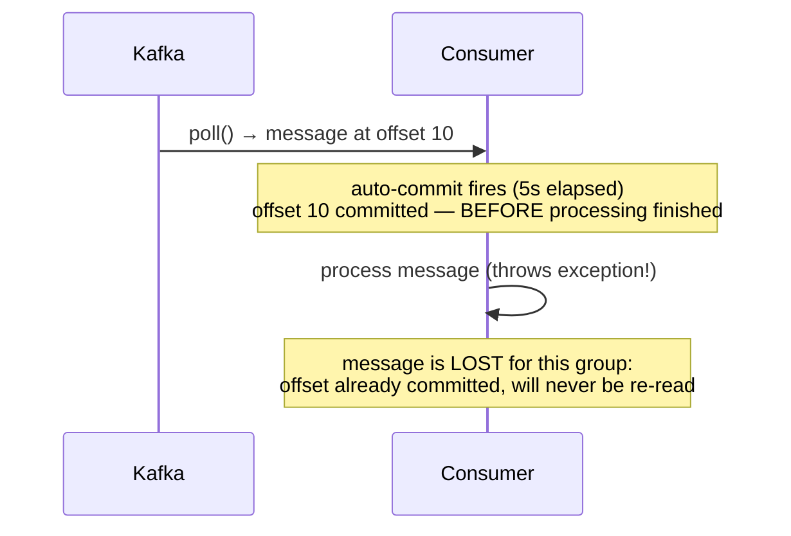

## Le commit : ce que Kafka retient de « ce que j'ai déjà lu »

Un consommateur ne fait qu'une chose de fondamental : lire des messages, puis
**enregistrer** jusqu'où il en est, pour un couple (groupe, partition). Cet enregistrement
s'appelle un **commit d'offset** ; il est stocké par Kafka lui-même, dans un topic interne
dédié (`__consumer_offsets`) — pas dans une base externe.

Le *moment* où ce commit a lieu, **par rapport** au traitement effectif du message, est
**LA** décision qui détermine la garantie de livraison obtenue (détaillée au module 3).

## Commit automatique : simple, mais dangereux par défaut

```properties
# consumer.properties
enable.auto.commit=true
auto.commit.interval.ms=5000
```

Avec `enable.auto.commit=true` (le défaut historique), le client commit l'offset **en
arrière-plan, à intervalle régulier**, indépendamment de savoir si le message a été
**réellement traité avec succès**. Le piège :



> ⚠️ **Erreur fréquente.** Laisser `enable.auto.commit=true` sur un flux où perdre un
> message a un coût métier. L'auto-commit peut valider un offset **avant** que le
> traitement associé ait réussi — un crash de l'application entre les deux, et le message
> est perdu pour ce groupe, sans aucune erreur visible : Kafka a fait exactement ce qu'on
> lui a demandé.

## Commit manuel : le contrôle sur *quand*

```java
Properties props = new Properties();
props.put("group.id", "billing-service");
props.put("enable.auto.commit", "false");   // WE decide when to commit
KafkaConsumer<String, String> consumer = new KafkaConsumer<>(props);
consumer.subscribe(List.of("orders"));

while (true) {
    ConsumerRecords<String, String> records = consumer.poll(Duration.ofMillis(500));
    for (ConsumerRecord<String, String> record : records) {
        processOrderEvent(record.key(), record.value());   // must succeed BEFORE commit
    }
    // Commit ONLY after every record in this batch was processed successfully.
    consumer.commitSync();
}
```

Avec un commit manuel **après** traitement réussi, un crash avant le commit fait relire
le message au redémarrage — c'est la base du modèle **at-least-once** (module 3) : un
message peut être retraité, mais jamais silencieusement perdu.

> **Réflexe à prendre.** `enable.auto.commit=false` + commit explicite **après** le succès
> du traitement doit être ton défaut pour tout flux métier important — comme tu aurais
> réflexe, en `php-rdkafka`, d'appeler `commit()` toi-même après avoir persisté le
> résultat en base, plutôt que de t'en remettre au comportement implicite du client.

## `commitSync()` vs `commitAsync()`

- `commitSync()` : bloque jusqu'à la confirmation du broker. Plus sûr (on sait que le
  commit a réussi avant de continuer), mais ralentit la boucle de consommation.
- `commitAsync()` : n'attend pas de confirmation, plus rapide, mais un échec de commit
  passe par un callback — à ne jamais ignorer, et à ne jamais retenter naïvement (un
  commit asynchrone en échec peut être suivi d'un commit plus récent qui, lui, a réussi —
  retenter l'ancien écraserait un état plus à jour).

```java
consumer.commitAsync((offsets, exception) -> {
    if (exception != null) {
        log.warn("Commit failed for offsets {}", offsets, exception);
        // Do NOT blindly retry an old commitAsync — a newer commit may have already succeeded.
    }
});
```

## Le `ConsumerRebalanceListener` : sauver son état à la révocation

Quand un rebalance retire une partition à une instance (module précédent), tout traitement
en cours sur cette partition doit être **finalisé et commité** avant la perte de
propriété — sinon, le prochain propriétaire de la partition repartira d'un offset plus
ancien que nécessaire, et retraitera des messages déjà traités.

```java
consumer.subscribe(List.of("orders"), new ConsumerRebalanceListener() {
    @Override
    public void onPartitionsRevoked(Collection<TopicPartition> partitions) {
        // Commit whatever was successfully processed BEFORE losing ownership.
        consumer.commitSync();
    }

    @Override
    public void onPartitionsAssigned(Collection<TopicPartition> partitions) {
        // New partitions assigned — nothing required here in the simple case.
    }
});
```

## À retenir

- Kafka stocke les offsets commités dans un topic interne (`__consumer_offsets`) — le
  commit **n'est pas** automatiquement lié à la réussite du traitement.
- **Auto-commit** (défaut historique) peut valider un offset avant traitement réussi →
  perte silencieuse possible en cas de crash.
- **Commit manuel après traitement réussi** est le réflexe par défaut pour un flux
  métier important : il fait basculer vers un modèle **at-least-once** (retraiter, jamais
  perdre).
- Toujours **commiter les partitions révoquées** dans `onPartitionsRevoked` avant un
  rebalance, pour éviter un retraitement inutilement large par le prochain propriétaire.
