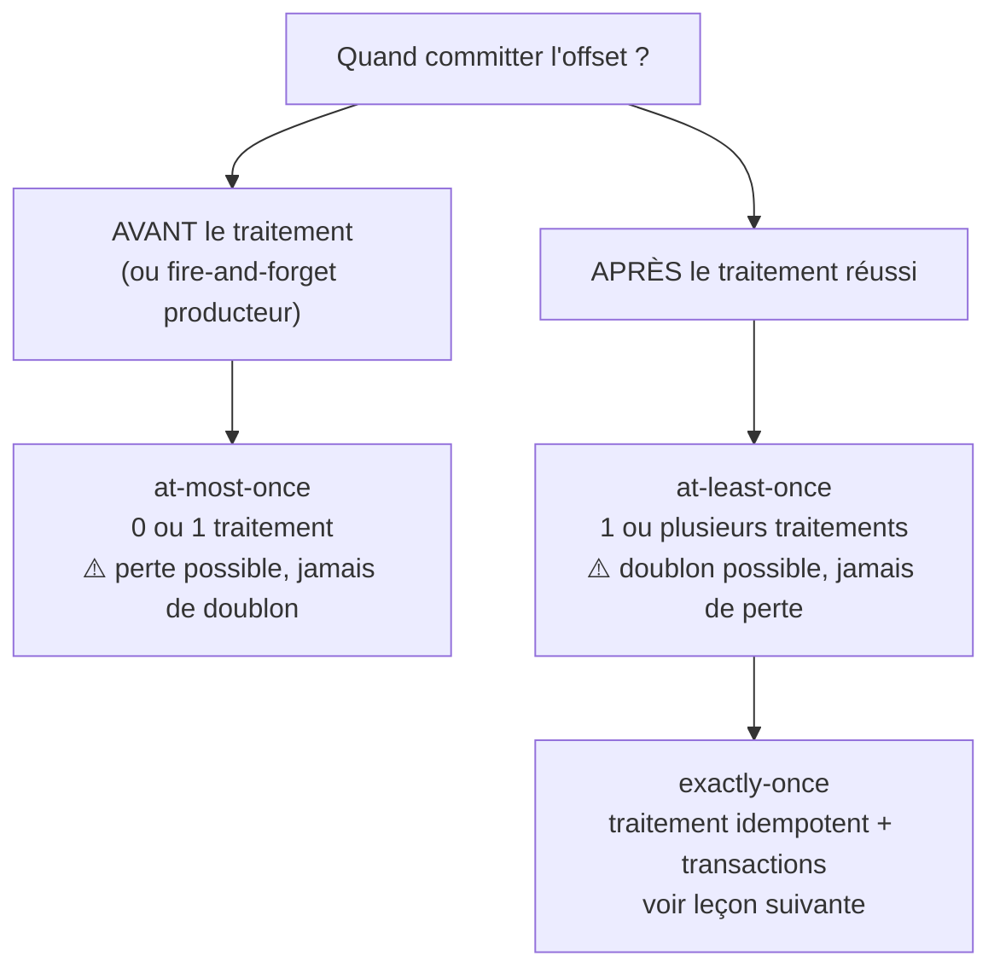
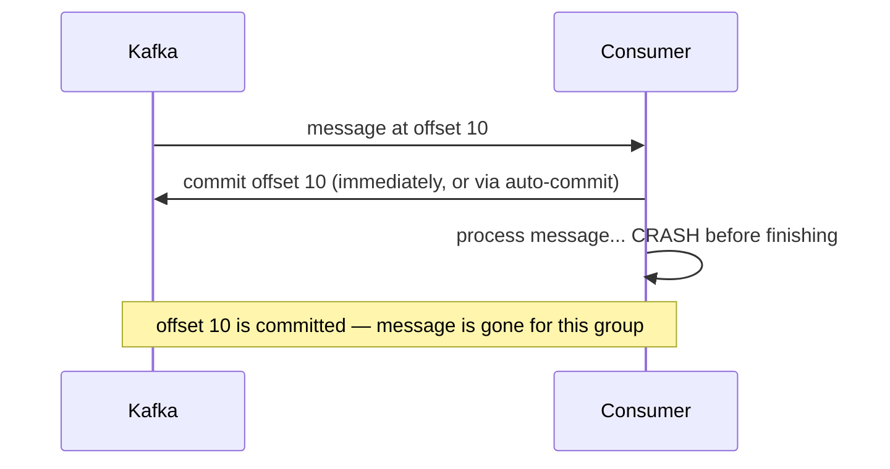
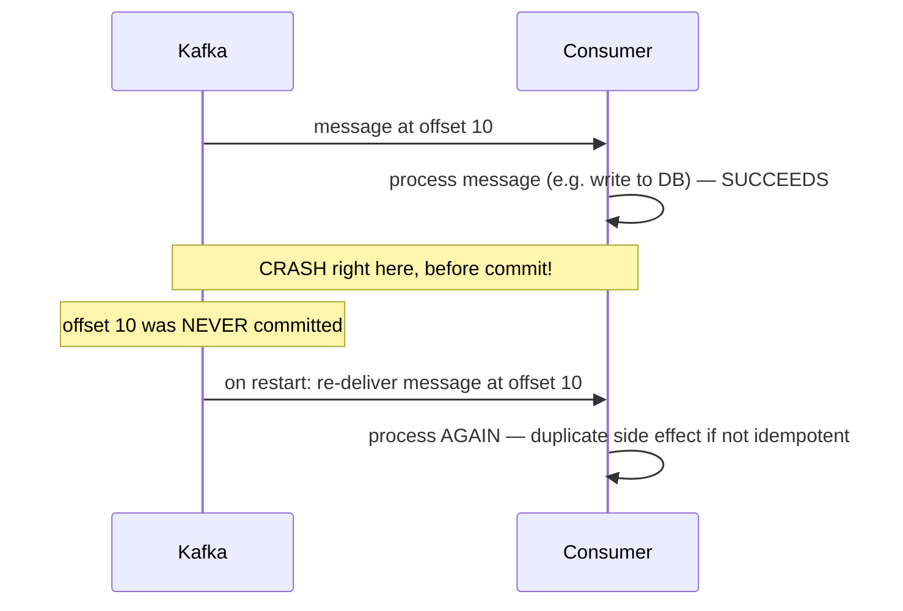

## Trois mots, trois comportements très différents

Quand on parle de « garantie de livraison » d'un message, on parle en réalité de la
combinaison de deux décisions indépendantes : **quand commit-on l'offset** (avant ou après
le traitement), et **le traitement lui-même peut-il être rejoué sans dommage**. Ça donne
trois régimes possibles.

## At-most-once : on committe *avant* de savoir si ça a marché

C'est le comportement par défaut de `enable.auto.commit=true` vu au module précédent (ou
d'un producteur `acks=0` côté écriture) : l'offset est avancé **sans garantie** que le
traitement associé ait réussi. Si un crash survient entre le commit et la fin du
traitement, le message **ne sera jamais relu** — perdu, silencieusement.

- **Où c'est acceptable** : métriques, logs applicatifs, télémétrie — perdre
  occasionnellement un point de mesure n'a pas de conséquence métier grave, et le gain en
  simplicité/débit est réel.
- **Où c'est dangereux** : paiements, commandes, tout ce qui a une valeur métier
  individuelle.

## At-least-once : on committe *après*, donc on peut retraiter

En committant **après** un traitement réussi (leçon précédente), un crash entre le
traitement et le commit fait relire le message au redémarrage. Le message n'est **jamais**
perdu — mais il peut être **traité plusieurs fois**.

> ⚠️ **Erreur fréquente.** Confondre « at-least-once » avec « pas de bug » : c'est une
> garantie **volontairement** imparfaite — elle élimine la perte, mais **introduit** le
> risque de doublon. Un traitement qui n'est pas conçu pour être rejoué sans effet
> indésirable (ex. un `INSERT` sans contrainte d'unicité, un appel API de débit sans clé
> d'idempotence) **dupliquera** son effet de bord au moindre retraitement.

> **RabbitMQ → Kafka.** Le même arbitrage existe côté RabbitMQ, avec les mêmes noms : ack
> manuel **après** traitement pour de l'at-least-once (le message peut être re-livré s'il
> n'a pas été acké), `auto_ack`/ack immédiat pour de l'at-most-once. Le vocabulaire et le
> compromis se transposent directement — ce n'est pas un concept propre à Kafka.

## Le choix par défaut : at-least-once + idempotence applicative

Dans l'immense majorité des systèmes de production, le choix retenu est
**at-least-once combiné à un traitement idempotent** (détaillé dans la leçon suivante) :
on accepte de committer après traitement (donc de parfois retraiter), et on rend le
traitement **sans danger à rejouer** — plutôt que de chercher à empêcher tout retraitement,
ce qui est en pratique impossible à garantir totalement de bout en bout dans un système
distribué (voir la leçon 3 sur le mythe de l'exactly-once).

> 💡 **À retenir.**
> - **At-most-once** : commit avant/sans garantie de traitement → **perte possible**,
>   **jamais** de doublon. Acceptable pour du non-critique.
> - **At-least-once** : commit après traitement réussi → **jamais** de perte, **doublon
>   possible** en cas de crash entre traitement et commit.
> - Le choix par défaut en production : **at-least-once + traitement idempotent**, plutôt
>   que de chercher à supprimer tout risque de retraitement.
