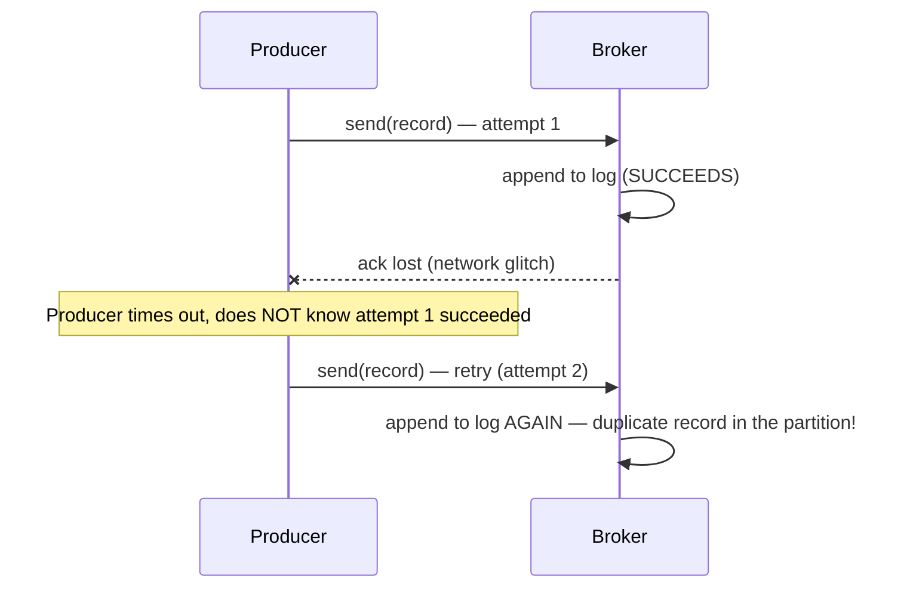
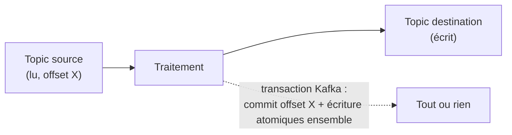

## Le doublon côté écriture : quand un retry duplique

L'idempotence côté consommateur (leçon suivante) protège contre le retraitement. Mais un
doublon peut aussi apparaître **côté écriture**, dès le producteur : si un `send()` échoue
par timeout réseau (le broker a peut-être écrit le message, mais l'accusé de réception
s'est perdu), le comportement par défaut du client est de **retenter** l'envoi — ce qui
peut créer **deux fois** le même message dans le log, si la première tentative avait en
réalité réussi côté broker.



## Le producteur idempotent : Kafka déduplique lui-même les retries réseau

Depuis plusieurs versions, Kafka propose un mode **producteur idempotent**
(`enable.idempotence=true`, activé par défaut dans les clients récents) : chaque
producteur se voit attribuer un identifiant unique (le *Producer ID*, PID) et numérote
chaque message envoyé sur une partition donnée (un numéro de séquence). Le broker peut
ainsi **détecter et ignorer** un doublon provoqué par un retry réseau — le même PID, la
même partition, le même numéro de séquence déjà vu.

```properties
# producer.properties
enable.idempotence=true
# acks=all and retries are implied/required by idempotence
```

> 💡 Ce mécanisme protège **uniquement** contre les doublons dus aux retries **du
> producteur lui-même** en cas d'échec réseau — pas contre le fait qu'un même événement
> métier soit produit deux fois par erreur applicative (ex. le service appelle `send()`
> deux fois par bug). Ça reste une garantie précise et locale, pas une solution
> universelle.

## Les transactions Kafka : écrire sur plusieurs partitions/topics de façon atomique

Un producteur transactionnel va plus loin : il peut regrouper des écritures sur
**plusieurs partitions, voire plusieurs topics**, dans une transaction qui est soit
**intégralement visible**, soit **intégralement invisible**, aux consommateurs configurés
en lecture stricte (`isolation.level=read_committed`).

```java
Properties props = new Properties();
props.put("enable.idempotence", "true");
props.put("transactional.id", "order-processor-1");   // must be stable and unique per producer instance

KafkaProducer<String, String> producer = new KafkaProducer<>(props);
producer.initTransactions();

try {
    producer.beginTransaction();
    producer.send(new ProducerRecord<>("orders", "order-42", orderCreatedJson));
    producer.send(new ProducerRecord<>("order-audit-log", "order-42", auditJson));
    producer.commitTransaction();   // BOTH records become visible together, atomically
} catch (Exception e) {
    producer.abortTransaction();    // BOTH records are discarded, none becomes visible
}
```

C'est ce mécanisme qui sert de base à ce qu'on appelle « exactly-once » dans
l'écosystème Kafka — mais uniquement pour un flux **read-process-write entièrement
interne à Kafka** (lire un topic, transformer, écrire sur un autre topic, typiquement via
Kafka Streams) : le producteur peut alors committer, dans la **même** transaction, à la
fois les messages produits **et** l'offset consommé en entrée. Soit tout est visible
(entrée consommée + sortie produite), soit rien ne l'est.



> **RabbitMQ → Kafka.** RabbitMQ propose aussi des transactions de canal (`tx.*`), mais
> peu utilisées en pratique pour leur coût en performance ; les *publisher confirms*
> couvrent l'essentiel des besoins de fiabilité. Les transactions Kafka, elles, servent
> un besoin plus spécifique : l'atomicité **read-consume-transform-produce**, pas
> simplement confirmer un envoi.

## À retenir

- **Producteur idempotent** (`enable.idempotence=true`) : élimine les doublons dus aux
  **retries réseau** du producteur lui-même — un mécanisme précis, pas une solution
  générale contre tout doublon applicatif.
- **Transactions Kafka** : regroupent plusieurs écritures (et un commit d'offset en
  entrée) en un « tout ou rien », visible uniquement en `read_committed`.
- Le vrai « exactly-once » de Kafka ne couvre que les flux **read-process-write internes**
  à Kafka — pas un effet de bord externe (une écriture en base, un appel API). La leçon
  suivante détaille précisément pourquoi.
