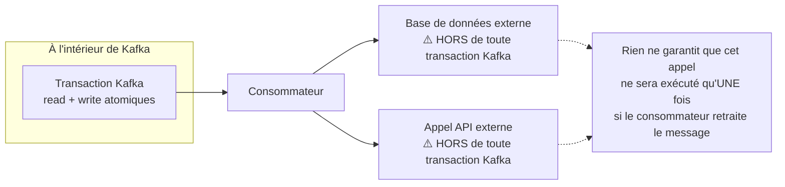

## ⚠️ Le mythe de l'exactly-once end-to-end

C'est sans doute la confusion la plus répandue autour de Kafka : entendre « Kafka
supporte l'exactly-once » et en conclure qu'un message ne sera **jamais** traité deux
fois, **quel que soit** ce que fait le consommateur de ce message. C'est faux dès que le
traitement produit un **effet de bord en dehors de Kafka** — une écriture en base de
données, un appel à une API de paiement, l'envoi d'un email.



Les transactions Kafka (leçon précédente) garantissent l'atomicité **entre topics
Kafka**. Elles n'ont **aucune emprise** sur ce qui se passe une fois que le consommateur
sort du monde Kafka pour écrire ailleurs. Si le consommateur crashe **après** avoir
inséré une ligne en base mais **avant** d'avoir commité son offset (le scénario
at-least-once classique du module précédent), le message sera relu — et l'insertion en
base **rejouée**, dupliquant la donnée si rien ne l'en empêche.

> ⚠️ **Erreur fréquente.** Configurer `enable.idempotence=true` côté producteur et des
> transactions Kafka, puis considérer le problème des doublons comme « réglé », sans
> avoir touché au code du consommateur qui écrit en base ou appelle une API externe.
> Aucun de ces mécanismes ne protège cet effet de bord — c'est au consommateur, et à lui
> seul, de s'en charger.

## La vraie solution : rendre le traitement du consommateur idempotent

Puisque le message **peut** être relivré (at-least-once, choix par défaut du module
précédent), la seule protection fiable est de faire en sorte que **traiter deux fois le
même message produise le même résultat que le traiter une fois**. Deux techniques
concrètes, souvent combinées :

**1. Une clé d'idempotence métier + une contrainte d'unicité en base.**

```java
// The event carries a stable, unique identifier (produced once, at creation time)
record PaymentCapturedEvent(String eventId, String paymentId, BigDecimal amount) {}
```

```sql
-- The unique constraint makes a duplicate INSERT fail instead of duplicating data
CREATE TABLE processed_payments (
  event_id VARCHAR(36) PRIMARY KEY,   -- comes from the event, not auto-generated
  payment_id VARCHAR(36) NOT NULL,
  amount NUMERIC(10,2) NOT NULL,
  processed_at TIMESTAMP NOT NULL
);
```

```java
try {
    // INSERT fails on duplicate event_id — retraitement sans effet supplémentaire
    insertProcessedPayment(event.eventId(), event.paymentId(), event.amount());
} catch (DuplicateKeyException e) {
    // Already processed — safely ignore, this is expected under at-least-once
    log.info("Payment event {} already processed, skipping", event.eventId());
}
```

**2. Une opération naturellement idempotente (`UPSERT` plutôt que `INSERT`).**

```sql
-- Re-running this statement with the same values has no additional effect
INSERT INTO account_balance (account_id, balance)
VALUES ('acc-42', 150.00)
ON CONFLICT (account_id) DO UPDATE SET balance = EXCLUDED.balance;
```

Un `UPSERT` (ou un `SET balance = 150.00` plutôt qu'un `balance = balance + 10`) donne le
**même état final** qu'on l'exécute une ou dix fois — c'est la définition même de
l'idempotence : le résultat ne dépend pas du nombre de répétitions.

> **RabbitMQ → Kafka.** C'est exactement le même réflexe qu'un `php-rdkafka` consumer
> at-least-once côté RabbitMQ, ou n'importe quel système de queue avec ack manuel : la
> garantie de livraison protège contre la **perte**, jamais contre le **doublon** — c'est
> systématiquement à la charge du code applicatif de rendre le traitement rejouable sans
> danger.

## Où placer la déduplication : avant ou pendant l'écriture ?

- **Vérifier puis écrire** (`SELECT` puis `INSERT` si absent) : simple à lire, mais
  vulnérable à une **race condition** si deux instances traitent le même événement en
  parallèle (rare mais possible lors d'un rebalance, par exemple).
- **Contrainte d'unicité en base + gestion de l'exception** (l'exemple ci-dessus) : plus
  robuste, la base elle-même garantit l'atomicité de la vérification+écriture — c'est le
  choix à privilégier.

> 💡 **À retenir.**
> - **Exactly-once**, dans Kafka, ne couvre que les flux **internes à Kafka**
>   (read-process-write via transactions) — jamais un effet de bord externe (DB, API,
>   email).
> - Dès qu'un consommateur écrit **en dehors** de Kafka, la seule protection fiable contre
>   les doublons (inévitables en at-least-once) est un **traitement idempotent** : clé
>   d'idempotence + contrainte d'unicité, ou opération naturellement idempotente
>   (`UPSERT`).
> - Ne jamais confondre « le producteur/broker est idempotent » avec « mon système est
>   protégé de bout en bout » : la dernière étape (l'effet de bord applicatif) reste
>   toujours de ta responsabilité.
