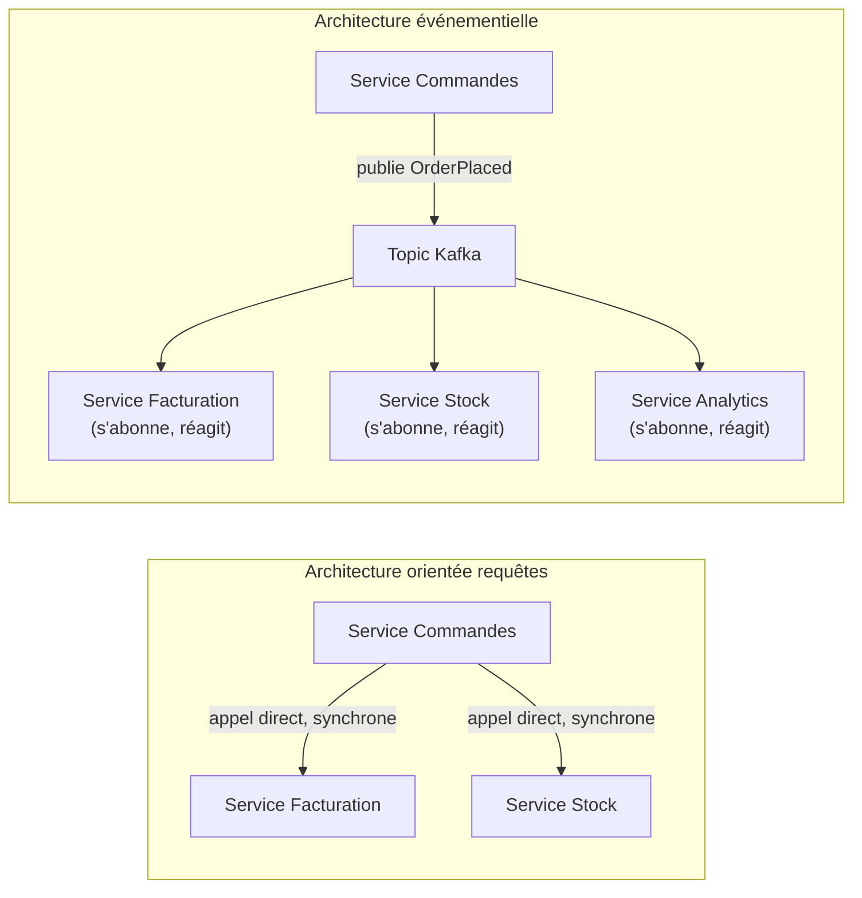

## Ce que change une architecture événementielle

Dans une architecture classique orientée requêtes (REST/RPC entre services), un service A
qui a besoin d'une information du service B **l'appelle directement** — un couplage
temporel fort : B doit être disponible **au moment** où A l'appelle.

Une **architecture événementielle** (*event-driven architecture*, EDA) inverse la
logique : un service **publie** un fait qui vient de se produire (« `OrderPlaced` »), sans
savoir qui — ni combien de services — s'y intéresse. Les services intéressés
**s'abonnent** et réagissent, chacun à son rythme. C'est très exactement le modèle que
Kafka rend naturel via les topics et les consumer groups indépendants (module 2).



Le service Commandes n'a **plus besoin de connaître** l'existence du service Analytics
pour que celui-ci reçoive l'événement — un découplage réel, pas seulement une indirection
technique.

## Deux styles d'événements, deux niveaux de couplage

Tous les événements ne se ressemblent pas. La distinction la plus utile à connaître est
entre **event notification** et **event-carried state transfer**.

### Event notification : « il s'est passé quelque chose, va chercher les détails »

L'événement contient le **minimum** — souvent juste un identifiant — et le consommateur
doit **rappeler** le service source pour obtenir le détail complet.

```json
{
  "type": "OrderPlaced",
  "orderId": "order-42",
  "occurredAt": "2026-07-15T09:12:00Z"
}
```

- **Avantage** : message minimal, jamais de risque que l'événement contienne une donnée
  périmée par rapport à l'état actuel.
- **Inconvénient** : réintroduit un couplage temporel — le service source doit être
  disponible pour répondre à l'appel de rappel, exactement le problème que l'EDA voulait
  éviter.

### Event-carried state transfer : « voici l'état complet, tu n'as besoin de rien d'autre »

L'événement porte **toutes les données nécessaires** au traitement du consommateur, sans
appel retour.

```json
{
  "type": "OrderPlaced",
  "orderId": "order-42",
  "customerId": "cust-7",
  "items": [
    { "sku": "SKU-100", "quantity": 2, "unitPrice": 19.90 },
    { "sku": "SKU-204", "quantity": 1, "unitPrice": 49.00 }
  ],
  "totalAmount": 88.80,
  "occurredAt": "2026-07-15T09:12:00Z"
}
```

- **Avantage** : découplage réel et complet — le consommateur n'a jamais besoin d'appeler
  le service source. C'est le style qui exploite pleinement ce que Kafka permet (le log
  survit à sa lecture, un consommateur peut même reconstruire un état complet en rejouant
  l'historique — utile pour le CQRS/event sourcing, module suivant).
- **Inconvénient** : messages plus volumineux, et le schéma de l'événement doit être géré
  avec soin dans le temps (compatibilité, Schema Registry — leçon 3).

> **Réflexe à prendre.** Par défaut, privilégie l'**event-carried state transfer** dans un
> système Kafka : c'est ce qui permet un vrai découplage temporel entre producteur et
> consommateurs (aucun rappel synchrone nécessaire), et c'est ce qui rend le log
> réellement exploitable comme source de vérité rejouable.

> ⚠️ **Erreur fréquente.** Adopter Kafka pour « découpler les services », mais continuer à
> publier des event notifications minimalistes qui forcent chaque consommateur à rappeler
> le service source en synchrone pour obtenir les données. Le couplage temporel n'a alors
> pas disparu — il a juste été **déplacé** derrière un intermédiaire Kafka, sans bénéfice
> réel.

## Le prix du découplage : la cohérence devient éventuelle

Un effet secondaire assumé de l'EDA : les différents services voient l'état du système à
des instants **légèrement différents** (le temps que l'événement soit produit, transporté,
consommé). C'est la **cohérence éventuelle** (*eventual consistency*) — à distinguer de la
cohérence forte d'une transaction ACID classique.

> **Passerelle Symfony Messenger.** Si tu as utilisé Symfony Messenger avec un transport
> asynchrone (Doctrine, AMQP, ou un bridge Kafka comme `messenger-kafka`), tu as déjà
> pratiqué ce compromis : dispatcher un message et laisser un *worker* le traiter plus
> tard, plutôt que d'attendre un résultat synchrone dans le contrôleur. L'EDA généralise ce
> principe à l'échelle de plusieurs services, pas seulement au sein d'une application.

## À retenir

- L'**EDA** remplace l'appel direct (couplage temporel fort) par la publication d'un
  fait, consommé indépendamment par qui s'y intéresse.
- **Event notification** (juste un identifiant) réintroduit un couplage temporel via un
  rappel synchrone ; **event-carried state transfer** (l'état complet dans l'événement)
  réalise le découplage réel — c'est le style à privilégier par défaut sur Kafka.
- Le prix du découplage est la **cohérence éventuelle** : les services voient l'état du
  système avec un léger décalage temporel, jamais instantanément synchronisé.
