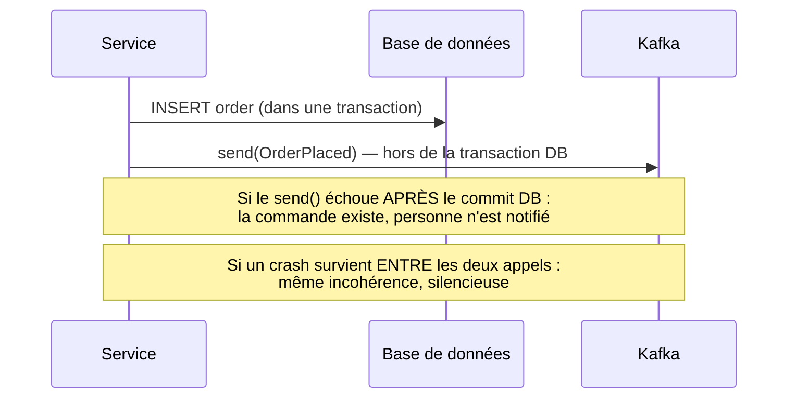
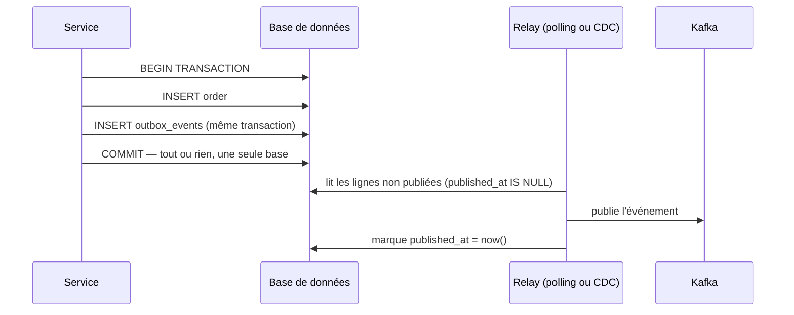

## Le problème du « dual write »

Un service qui persiste un changement d'état **et** publie un événement correspondant
fait, en réalité, **deux écritures** vers **deux systèmes distincts** — sa base de
données, et Kafka. Ces deux systèmes n'ont **aucune transaction commune** : il n'existe
aucun mécanisme natif pour garantir que les deux écritures réussissent, ou échouent,
ensemble.

```java
@Transactional
public void placeOrder(Order order) {
    orderRepository.save(order);                 // (1) DB write — committed by @Transactional
    kafkaProducer.send("orders", orderPlacedEvent(order));   // (2) Kafka write — INDEPENDENT
}
```

Deux scénarios de bug, tous deux réels en production :

- **(1) réussit, (2) échoue** (Kafka indisponible, timeout réseau) : la commande existe en
  base, mais **aucun** service en aval (facturation, stock) n'a été notifié — incohérence
  silencieuse.
- **(1) échoue** (rollback de la transaction, contrainte violée) **mais (2) a déjà été
  envoyé** avant le rollback (ou en cas de crash entre les deux appels) : un événement
  `OrderPlaced` circule pour une commande qui **n'existe pas** en base.



> ⚠️ **Erreur fréquente.** Croire qu'entourer les deux appels d'un `try/catch` (retenter
> l'envoi Kafka en cas d'échec) règle le problème. Ça réduit la fenêtre de risque, mais ne
> l'élimine pas : un crash du processus **entre** les deux lignes reste possible, quel que
> soit le code de gestion d'erreur écrit autour.

## L'outbox pattern : une seule transaction, un relais séparé

La solution robuste ne cherche **pas** à synchroniser deux systèmes distincts au moment de
l'écriture : elle **profite de la transaction déjà existante** de la base de données pour
écrire, **dans la même transaction que la donnée métier**, une ligne représentant
l'événement à publier — dans une table dédiée, la table **outbox**. Un processus séparé
(le *relay*) lit ensuite cette table et publie réellement vers Kafka, de façon
totalement découplée du chemin transactionnel principal.

```sql
CREATE TABLE outbox_events (
  id UUID PRIMARY KEY,
  aggregate_id VARCHAR(36) NOT NULL,   -- e.g. the order id
  event_type VARCHAR(100) NOT NULL,    -- e.g. "OrderPlaced"
  payload JSONB NOT NULL,
  created_at TIMESTAMP NOT NULL DEFAULT now(),
  published_at TIMESTAMP NULL          -- NULL = not yet relayed to Kafka
);
```

```java
@Transactional
public void placeOrder(Order order) {
    orderRepository.save(order);   // (1) business data

    // (2) SAME transaction, SAME database — this either commits WITH (1), or not at all
    outboxRepository.save(new OutboxEvent(
        UUID.randomUUID(), order.getId(), "OrderPlaced", toJson(order)
    ));
    // Kafka is NOT involved here at all — no dual write anymore.
}
```



L'écriture métier et l'écriture de l'événement partagent **la même transaction, la même
base de données** : elles réussissent ou échouent **ensemble**, sans exception possible.
Le relais vers Kafka devient un problème **séparé**, résolu indépendamment (et rejouable :
si le relay crashe avant de marquer `published_at`, il republie simplement l'événement au
redémarrage — un cas d'at-least-once assumé, à traiter avec l'idempotence du module 3).

## Deux façons d'implémenter le relay

- **Polling** : un job périodique interroge `SELECT * FROM outbox_events WHERE
  published_at IS NULL`, publie, puis marque comme publié. Simple à mettre en œuvre,
  introduit une latence égale à l'intervalle de polling.
- **CDC (Change Data Capture)**, via un outil comme **Debezium** : un connecteur lit
  directement le **journal de transactions** de la base (le WAL PostgreSQL, le binlog
  MySQL) et publie chaque nouvelle ligne de la table outbox vers Kafka, en quasi
  temps réel, sans solliciter la base par des requêtes de polling répétées.

> **Passerelle Symfony Messenger.** Le **transport Doctrine** de Symfony Messenger
> (`doctrine://default`) implémente déjà, sans le nommer ainsi, une bonne partie de cette
> idée : un message dispatché est d'abord **stocké en base** (table `messenger_messages`),
> dans la même transaction que le reste si le dispatch a lieu dans un listener Doctrine
> bien placé, puis un *worker* séparé (`messenger:consume`) le relaie. Faire pointer ce
> worker vers un transport Kafka (au lieu du transport Doctrine par défaut) reproduit
> directement le schéma outbox → relay → Kafka.

## À retenir

- Le **dual write** (écrire en base ET publier sur Kafka, séparément, sans transaction
  commune) crée un risque d'incohérence structurel — pas un bug ponctuel qu'un
  `try/catch` peut éliminer.
- L'**outbox pattern** transforme les deux écritures en **une seule**, dans la base de
  données uniquement (donnée métier + ligne outbox, même transaction) ; un **relay**
  séparé se charge ensuite de publier vers Kafka.
- Le relay peut être un **polling** simple, ou du **CDC** (Debezium) pour du temps quasi
  réel sans solliciter la base par des requêtes répétées.
