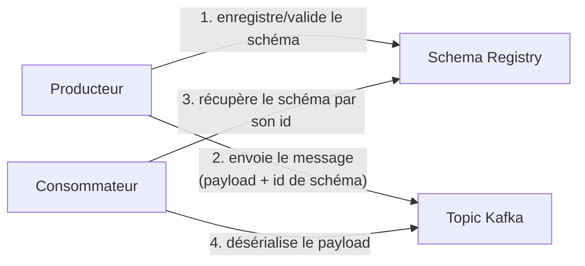
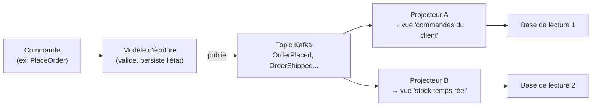

## Le problème que résout un Schema Registry

Une fois plusieurs équipes produisent et consomment le même topic, une question devient
critique : **que se passe-t-il quand le format d'un événement change ?** Si l'équipe
Commandes ajoute un champ à `OrderPlaced`, ou pire, en renomme un, tous les consommateurs
existants doivent-ils être mis à jour **en même temps**, sous peine de planter en
production ? En pratique, non — à condition d'avoir un contrat de schéma explicite.

Un **Schema Registry** (le plus répandu : Confluent Schema Registry, mais l'idée est
générique) est un service qui stocke les **schémas** des messages échangés — le plus
souvent en **Avro**, parfois en **JSON Schema** ou Protobuf — et **valide la
compatibilité** de tout nouveau schéma avant de l'accepter.

```json
{
  "type": "record",
  "name": "OrderPlaced",
  "fields": [
    { "name": "orderId", "type": "string" },
    { "name": "customerId", "type": "string" },
    { "name": "totalAmount", "type": "double" },
    { "name": "currency", "type": "string", "default": "EUR" }
  ]
}
```



## Les modes de compatibilité : le vrai levier anti-rupture

Le Schema Registry n'empêche pas de faire évoluer un schéma — il **empêche de casser** les
consommateurs existants, selon un **mode de compatibilité** choisi par topic :

| Mode | Règle | Effet concret |
|---|---|---|
| `BACKWARD` | Un nouveau schéma peut lire des données écrites avec l'**ancien** schéma. | Ajouter un champ **avec valeur par défaut** est permis ; les vieux messages restent lisibles par le nouveau code. |
| `FORWARD` | Un **ancien** schéma peut lire des données écrites avec le nouveau schéma. | Retirer un champ est permis ; les anciens consommateurs ignorent simplement le champ disparu. |
| `FULL` | Les deux à la fois. | Le plus restrictif — le plus sûr pour un topic à très nombreux consommateurs indépendants. |

> ⚠️ **Erreur fréquente.** Renommer un champ existant en pensant que « c'est juste un nom
> » : pour le Schema Registry, c'est la **suppression** d'un champ et l'**ajout** d'un
> autre — une opération qui casse la compatibilité dans la plupart des modes, sauf à gérer
> un alias explicite. Ajouter un champ **optionnel avec valeur par défaut** est presque
> toujours sûr ; renommer ou changer un type ne l'est presque jamais.

> **RabbitMQ → Kafka.** Rien d'équivalent n'existe nativement côté RabbitMQ (le format du
> message est une convention d'équipe, jamais vérifiée par le broker). C'est une des
> raisons pour lesquelles beaucoup d'organisations qui migrent vers Kafka à grande échelle
> adoptent en même temps un Schema Registry : le broker ne validait rien avant, il ne
> valide toujours rien avec Kafka seul — c'est le Registry qui ajoute ce filet de
> sécurité.

## CQRS et event sourcing : un survol, pas une plongée

Ces deux patterns dépassent le cadre de ce parcours (ils mériteraient une formation à part
entière), mais leur **lien avec Kafka** mérite d'être compris, ne serait-ce que pour
reconnaître le pattern quand tu le croiseras.

**CQRS** (*Command Query Responsibility Segregation*) sépare le modèle utilisé pour
**écrire** (les commandes, qui valident et modifient l'état) du modèle utilisé pour
**lire** (les requêtes, souvent dénormalisées, optimisées pour un cas d'affichage
précis). Kafka sert naturellement de **pont** entre les deux : le côté écriture publie des
événements, un ou plusieurs projecteurs les consomment pour construire des vues de lecture
dédiées (dans Elasticsearch, Redis, une table SQL dénormalisée…).



**Event sourcing** va plus loin : au lieu de stocker **l'état actuel** d'une entité (une
ligne `orders` avec son statut courant), on stocke la **séquence complète des événements**
qui l'ont fait évoluer, et l'état courant est **reconstruit** en rejouant cette séquence.
Un topic **compacté** (*compacted*, détaillé au module 5) — qui ne garde que le dernier
événement par clé — ou, plus souvent, un topic à rétention infinie, peut alors servir de
**source de vérité** : c'est directement une conséquence du modèle « log qu'on peut
relire » vu au module 1.

> 💡 Retiens surtout ceci : Kafka **facilite** CQRS et l'event sourcing (grâce au log
> rejouable et aux consumer groups indépendants), mais **n'impose** aucun des deux. La
> grande majorité des usages de Kafka en production restent de l'event-driven
> « classique » (notifier des changements d'état entre services), sans event sourcing
> complet.

## À retenir

- Un **Schema Registry** valide la **compatibilité** des schémas (Avro/JSON Schema) avant
  qu'un nouveau format ne soit accepté sur un topic — il protège les consommateurs
  existants d'une rupture silencieuse.
- **`BACKWARD`** : le nouveau code lit l'ancien format. **`FORWARD`** : l'ancien code lit
  le nouveau format. **`FULL`** : les deux — le plus sûr pour un topic à nombreux
  consommateurs.
- **CQRS** sépare écriture et lecture ; Kafka sert souvent de pont pour projeter les
  événements vers des vues de lecture dédiées.
- **Event sourcing** stocke la séquence d'événements comme source de vérité, plutôt que
  l'état courant seul — une conséquence directe du modèle « log rejouable » de Kafka,
  mais un choix architectural à part entière, pas un prérequis pour utiliser Kafka.
