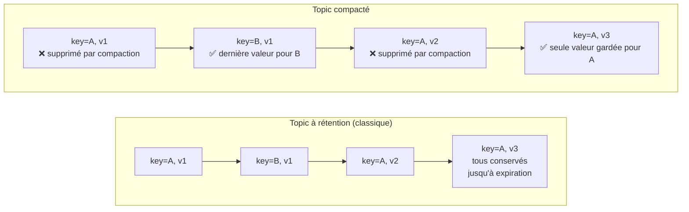

## La rétention classique : purger par le temps ou par la taille

Par défaut, un topic conserve ses messages selon une politique de **rétention** : une
durée (`retention.ms`, souvent 7 jours par défaut) ou une taille maximale
(`retention.bytes`) par partition. Passé ce seuil, les segments de log les plus anciens
sont **supprimés en bloc** — pas message par message, mais par segments entiers de
fichier, ce qui reste une opération peu coûteuse (cohérent avec le modèle « écriture
séquentielle » vu au module 1).

```properties
# topic config — keep messages for 7 days, or up to 50 GB per partition, whichever comes first
retention.ms=604800000
retention.bytes=53687091200
```

C'est le mode adapté à un flux d'**événements transitoires** : des logs applicatifs, des
métriques, des événements métier qu'on n'a pas besoin de conserver indéfiniment une fois
traités par tous les consommateurs concernés.

## La compaction : garder le dernier état par clé, indéfiniment

Un topic **compacté** (`cleanup.policy=compact`) fonctionne selon une logique
différente : au lieu de purger par ancienneté, Kafka **supprime les anciennes valeurs
d'une même clé**, ne conservant que la **dernière** valeur connue pour chaque clé — pour
toujours, tant qu'une nouvelle valeur n'a pas été écrite pour cette clé.

```properties
# topic config — this topic behaves like a compacted changelog, not a transient stream
cleanup.policy=compact
```



Deux usages typiques d'un topic compacté :

- **Changelog d'un état** : reconstruire l'état courant d'une entité (un compte, une
  configuration) sans avoir à conserver tout son historique — utile pour un cache
  distribué reconstruit au démarrage (`KTable` dans Kafka Streams, par exemple).
- **Suppression logique** : écrire une valeur `null` (appelée *tombstone*) pour une clé
  indique à Kafka de supprimer **définitivement** cette clé lors de la prochaine
  compaction — la façon standard d'exprimer « cette entité n'existe plus » dans un
  topic compacté.

```java
// Tombstone: writing a null value for a key marks it for deletion during compaction
producer.send(new ProducerRecord<>("account-config", "acc-42", null));
```

> ⚠️ **Erreur fréquente.** Utiliser `cleanup.policy=compact` sur un flux d'**événements**
> (plusieurs faits distincts pour une même clé, tous utiles à conserver — comme
> `OrderPlaced`, `OrderShipped`, `OrderDelivered` pour la même commande) au lieu d'un flux
> d'**état** (une seule valeur pertinente par clé à un instant donné). Sur un flux
> d'événements, la compaction **détruirait** l'historique intermédiaire — exactement
> l'inverse de ce que l'event sourcing (module 4) cherche à préserver.

> **Réflexe à prendre.** Pose-toi la question : « est-ce que je veux l'**historique
> complet** de cette clé, ou seulement son **dernier état** ? » Historique → rétention
> classique (voire rétention infinie pour de l'event sourcing). Dernier état seul →
> compaction.

## À retenir

- **Rétention classique** : purge par ancienneté/taille, adaptée à un flux d'événements
  transitoires.
- **Compaction** (`cleanup.policy=compact`) : ne garde que la **dernière** valeur par
  clé, indéfiniment — adaptée à un flux représentant un **état**, pas une séquence de
  faits distincts.
- Un **tombstone** (valeur `null` pour une clé) marque cette clé pour suppression
  définitive lors de la prochaine compaction.
- Ne jamais compacter un flux d'événements dont l'historique intermédiaire a de la valeur.
