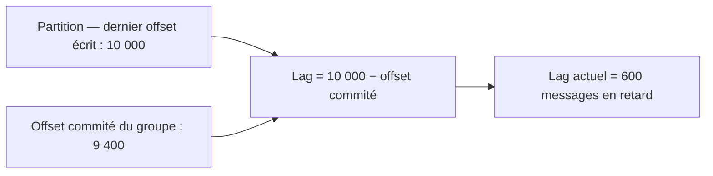
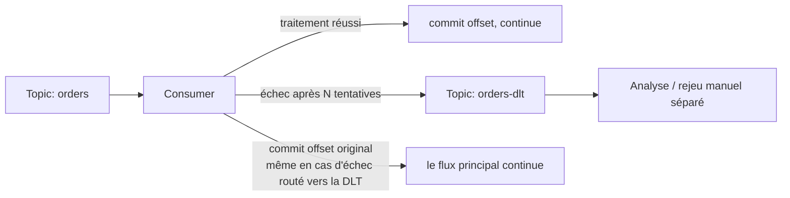

## Dimensionner le nombre de partitions : ni trop peu, ni trop

Le module 2 a montré qu'un nombre de partitions **insuffisant** plafonne le parallélisme
de consommation. Mais l'inverse — **trop** de partitions — a aussi un coût réel, souvent
sous-estimé :

- Chaque partition consomme des ressources sur les brokers (fichiers ouverts, mémoire de
  gestion des réplicas) — multiplier les partitions par prudence « au cas où » dégrade la
  santé globale du cluster à grande échelle.
- Plus de partitions signifie des **rebalances plus longs** (plus d'affectations à
  recalculer) et une latence de bout en bout légèrement supérieure (plus de requêtes
  réseau parallèles pour un même volume).
- Les producteurs qui n'utilisent pas de clé (round-robin) répartissent leur charge sur
  davantage de cibles, ce qui peut réduire la taille des lots (`batch.size`) réellement
  atteinte par partition, et donc l'efficacité du batching.

> **Réflexe à prendre.** Dimensionne le nombre de partitions à partir d'un besoin
> **concret** : le débit cible (Mo/s) divisé par le débit qu'un seul consommateur peut
> soutenir, et/ou le nombre maximal d'instances que le service consommateur doit pouvoir
> faire tourner en parallèle à terme (avec une marge raisonnable, pas un facteur 10 « pour
> être large »). Un topic peut ensuite être **augmenté** en partitions (jamais réduit) si
> le besoin grandit réellement — en gardant en tête l'impact sur l'affectation clé→
> partition vu au module 1.

## Le consumer lag : la métrique n°1 à surveiller

Le **lag** d'un consumer group, pour une partition donnée, est la différence entre
l'offset le plus récent écrit sur la partition et l'offset commité par le groupe :

```
lag = dernier_offset_de_la_partition − offset_commité_du_groupe
```

Un lag qui **croît en continu** signifie que le groupe **consomme moins vite qu'on ne
produit** — un signal d'alerte à traiter avant qu'il ne devienne un incident (retard
métier visible, ou pire, dépassement de la rétention avant lecture).

```bash
# Inspect the current lag of a consumer group per partition
kafka-consumer-groups.sh --bootstrap-server localhost:9092 \
  --describe --group billing-service

# Typical output columns: TOPIC  PARTITION  CURRENT-OFFSET  LOG-END-OFFSET  LAG
```



En production, le lag est presque toujours exposé via **Prometheus** (l'exporteur
`kafka-exporter` ou les métriques JMX natives exposées via un agent), avec une alerte sur
un lag qui dépasse un seuil **et** qui croît sur une fenêtre glissante (un pic ponctuel
absorbé en quelques secondes n'est pas un problème ; un lag qui monte pendant 10 minutes
sans redescendre en est un).

> ⚠️ **Erreur fréquente.** Alerter sur la **valeur absolue** du lag sans regarder sa
> **tendance**. Un lag de 50 000 messages qui redescend en 30 secondes après un pic de
> trafic est normal ; un lag de 500 messages qui croît continuellement depuis une heure
> est un vrai signal — même si sa valeur absolue paraît « petite ».

## Dead-letter : que faire du message qu'on ne peut pas traiter

Un consommateur qui rencontre un message **impossible à traiter** (payload corrompu,
erreur métier définitive, bug de désérialisation) fait face à un choix : le committer
quand même (perte silencieuse, at-most-once de fait sur ce message précis) ou **boucler
indéfiniment** dessus (le fameux *poison pill* : le message bloque toute la partition,
puisque l'offset suivant ne peut jamais être atteint tant que celui-ci échoue).

La pratique standard : après un nombre de tentatives limité, **router** le message vers un
**topic dead-letter** (`orders-dlt`, par convention) dédié, puis committer l'offset
original pour laisser le flux principal continuer. Le contenu de la dead-letter est
ensuite traité séparément (rejoué manuellement après correction du bug, analysé, ou
simplement archivé pour audit).



> **RabbitMQ → Kafka.** Le principe est identique à une *dead-letter exchange* RabbitMQ
> (`x-dead-letter-exchange`) — seule la mécanique diffère : RabbitMQ route
> automatiquement via une politique de queue, alors que côté Kafka, c'est le
> **consommateur lui-même** qui doit implémenter explicitement ce routage vers un topic
> dédié (il n'y a pas de mécanisme natif de dead-lettering au niveau du broker).

## À retenir

- Dimensionne les partitions à partir d'un besoin réel (débit cible, parallélisme visé) —
  ni sous-dimensionné (plafonne le scaling), ni sur-dimensionné (coût réel sur le cluster
  et les rebalances).
- Le **consumer lag** (offset le plus récent − offset commité) est la métrique
  d'exploitation n°1 : surveille sa **tendance**, pas seulement sa valeur instantanée.
- Un message impossible à traiter (*poison pill*) doit être routé vers un **topic
  dead-letter** après un nombre limité de tentatives, pour ne pas bloquer toute la
  partition — un mécanisme à implémenter côté consommateur, Kafka ne le fait pas
  nativement.
