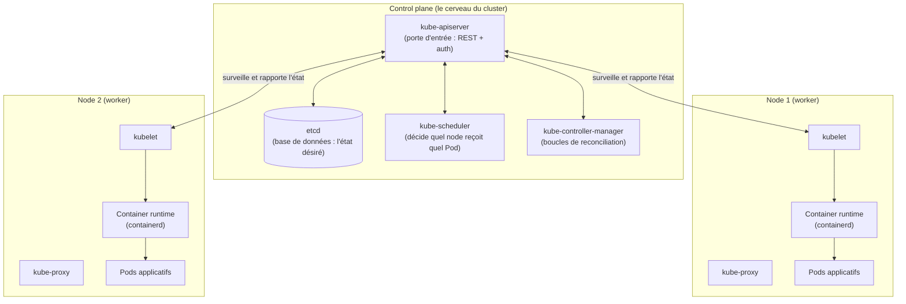

# Pourquoi Kubernetes (et ce qui change vraiment vs docker compose)

Tu sais déjà faire tourner une stack sérieuse avec `docker compose` : plusieurs services,
un réseau partagé, des volumes, Traefik devant pour router par labels. Ça marche très
bien — **sur une seule machine**. Kubernetes ne réinvente pas ce que tu sais déjà ; il
répond à une question que compose ne se pose jamais : **et si un service devait tourner
sur plusieurs machines, avec un self-healing réel et un scheduling automatique ?**

## Ce que `docker compose` ne fait pas

`docker compose up` lit ton `docker-compose.yml`, et le moteur Docker **local** crée les
conteneurs, réseaux et volumes décrits. Tout le raisonnement s'arrête à la frontière de
la machine :

- si la machine tombe, **toute la stack tombe** — rien ne la redémarre ailleurs ;
- tu ne peux pas dire « lance 5 répliques de `api`, réparties sur 3 serveurs » ;
- `docker compose` ne surveille pas en continu que l'état réel correspond à ce que tu as
  décrit — un `docker stop` manuel sur un conteneur ne le fait pas redémarrer tout seul
  (sauf `restart: always`, qui reste une politique locale, pas un contrôleur actif).

Kubernetes déplace ce raisonnement du **niveau machine** au **niveau cluster** : un
ensemble de machines (des **nodes**) est piloté par un cerveau central (le **control
plane**) qui décide en continu où et comment faire tourner tes conteneurs.

## Deux familles de machines dans un cluster



**Le control plane** — généralement 1 à 3 machines dédiées, jamais tes conteneurs
applicatifs :

| Composant | Rôle | Équivalent mental |
|---|---|---|
| `kube-apiserver` | Seul point d'entrée : toute lecture/écriture passe par lui (REST, authentifié) | Le `docker` CLI, mais en HTTP et partagé par tout le cluster |
| `etcd` | Base clé-valeur qui stocke **l'état désiré** (et l'état observé) de chaque objet | Ton `docker-compose.yml`, mais persistant et interrogeable |
| `kube-scheduler` | Décide, pour chaque nouveau Pod, **quel node** va l'exécuter (ressources dispo, contraintes) | N'a pas d'équivalent en compose (une seule machine = pas de choix) |
| `kube-controller-manager` | Fait tourner en continu les **boucles de reconciliation** (module suivant) | N'a pas d'équivalent : compose n'observe rien après le `up` |

**Les nodes (workers)** — les machines qui font tourner réellement tes conteneurs :

| Composant | Rôle | Équivalent mental |
|---|---|---|
| `kubelet` | Agent qui tourne sur chaque node, parle à l'API server, démarre/arrête les conteneurs demandés | Le démon Docker (`dockerd`) sur cette machine |
| `kube-proxy` | Programme les règles réseau qui font fonctionner les **Services** (module 2) | Un peu comme le réseau bridge Docker, mais valable **à travers tout le cluster** |
| Container runtime | Exécute réellement les conteneurs (`containerd`, le même standard OCI que Docker) | `dockerd`/`containerd` que tu connais déjà |

> **Repère —** un Pod applicatif ne tourne **jamais** sur le control plane (par défaut,
> il est même "tainted" pour l'en empêcher). Le control plane décide ; les nodes
> exécutent. C'est la première différence structurelle avec une seule machine `docker
> compose`, où décision et exécution sont confondues.

## Une vérification concrète

Ce parcours a été validé sur un vrai cluster (k3s, une distribution Kubernetes légère —
même API, même comportement qu'un cluster "complet"). Une seule commande confirme déjà
la distinction control plane / node :

```bash
kubectl get nodes -o wide
```

```
NAME           STATUS   ROLES           AGE   VERSION
edc866c3b003   Ready    control-plane   3m    v1.34.1+k3s1
```

Ici, une seule machine cumule les deux rôles (cluster de test à un seul node) — mais
`ROLES` affiche bien `control-plane` : c'est la même machine qui fait tourner
`kube-apiserver`, `etcd`, `kube-scheduler` **et** `kubelet`. Dans un cluster de
production, ce sont des machines distinctes.

## À retenir

- `docker compose` raisonne **par machine** ; Kubernetes raisonne **par cluster** — un
  ensemble de nodes piloté par un control plane.
- Le control plane (`kube-apiserver`, `etcd`, `kube-scheduler`,
  `kube-controller-manager`) décide **quoi** et **où** ; les nodes (`kubelet`,
  `kube-proxy`, container runtime) **exécutent**.
- Rien de tout ça ne remplace ce que tu sais de Docker : `containerd` sous le capot est
  le même standard. Ce qui change, c'est la couche d'orchestration au-dessus.
- La prochaine leçon aborde **comment** cette décision se prend : l'API déclarative et
  la reconciliation — le concept central de tout le reste du parcours.
