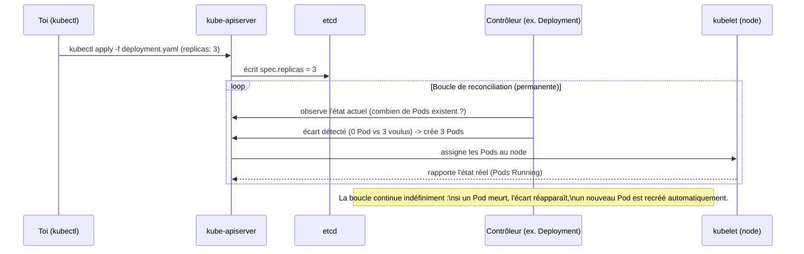

# L'API déclarative, la reconciliation, et kubectl essentiel

`docker compose up` est déjà « déclaratif » dans l'esprit : tu décris l'état voulu, pas
les étapes pour y arriver. Kubernetes pousse cette idée beaucoup plus loin, avec une
différence de taille : **le contrôle ne s'arrête jamais**.

## Desired state vs actual state

Chaque objet Kubernetes (Pod, Deployment, Service…) possède deux parties :

- `spec` : ce que **tu veux** (le desired state, écrit dans ton YAML) ;
- `status` : ce qui **existe réellement**, mis à jour en continu par les contrôleurs.

Quand tu envoies un YAML au cluster (`kubectl apply -f`), tu n'exécutes **aucune
action** directement — tu écris juste `spec` dans `etcd`, via l'API server. Ensuite, des
**boucles de contrôle** (control loops), qui tournent en permanence dans
`kube-controller-manager`, comparent `spec` et `status`, et agissent pour réduire l'écart.
C'est la **reconciliation**.



> **Repère —** ce n'est pas `kubectl apply` qui crée tes Pods. `kubectl apply` écrit
> juste une **intention**. Ce sont les contrôleurs qui, en observant en boucle l'écart
> entre `spec` et `status`, font le travail — encore et encore, sans jamais s'arrêter. Si
> tu supprimes un Pod géré par un Deployment à la main, il **réapparaît** en quelques
> secondes : la boucle a détecté l'écart et l'a corrigé. C'est tout l'objet du module 2.

## Ce que ça change concrètement par rapport à compose

Avec `docker compose`, si un conteneur meurt et que rien ne le relance, il reste mort
jusqu'à ce que tu tapes `docker compose up` toi-même. Avec Kubernetes, tant que le
control plane est vivant, **l'état désiré est activement maintenu** — sans action
humaine. C'est la base du self-healing : ce n'est pas une fonctionnalité isolée, c'est
une conséquence directe du modèle déclaratif + reconciliation continue.

## kubectl : parler à l'API, pas au conteneur

`kubectl` ne fait qu'une chose : envoyer des requêtes HTTP à `kube-apiserver`. Il ne
touche jamais un conteneur ou un node directement (contrairement à `docker exec`, qui
parle au démon local).

```bash
# Where does kubectl talk to? (cluster + context in use)
kubectl config get-contexts

# List every API group/version this cluster actually understands
kubectl api-versions
# apps/v1
# networking.k8s.io/v1
# autoscaling/v2
# batch/v1
# ...

# List every resource type (kind) and its short name
kubectl api-resources | head

# The four verbs you use 90% of the time
kubectl get pods                  # what exists right now (status)
kubectl describe pod my-pod       # full detail + Events (your #1 debugging tool)
kubectl apply -f manifest.yaml    # push a desired state (create OR update)
kubectl delete -f manifest.yaml   # remove the desired state (triggers cleanup)
```

> **Repère —** `kubectl describe <resource> <name>` affiche toujours une section
> **Events** en bas : c'est le journal des décisions prises par les contrôleurs
> (planification, échecs de pull d'image, probes qui échouent…). C'est le tout premier
> réflexe de débogage sur Kubernetes, avant même `kubectl logs`.

### Namespaces : une frontière logique, pas une machine

Un **namespace** partitionne les objets **au sein du même cluster** (pas une machine à
part : juste un espace de noms pour isoler des projets/équipes/environnements).

```bash
kubectl get namespaces
# default, kube-system, kube-public, kube-node-lease exist by default

kubectl get pods -n kube-system     # built-in cluster resources (DNS, etc.)
kubectl get pods --all-namespaces   # everything, across all namespaces
```

Sans précision de `-n`, `kubectl` cible le namespace **courant** du contexte (`default`
par défaut) — un piège classique en production : croire avoir vérifié un objet alors
qu'on regardait le mauvais namespace.

## À retenir

- Un objet Kubernetes a un `spec` (voulu) et un `status` (observé) ; les contrôleurs
  travaillent **en continu** à réduire l'écart entre les deux — jamais une exécution
  ponctuelle comme `docker compose up`.
- `kubectl apply` **n'exécute rien** directement : il écrit une intention dans `etcd` via
  l'API server. Le travail réel est fait par les boucles de reconciliation.
- `kubectl describe` (section **Events**) est le premier réflexe de débogage — bien avant
  `kubectl logs`.
- Un **namespace** isole logiquement des objets dans le même cluster — ce n'est pas une
  frontière machine ni réseau stricte par défaut (le module 4 nuance ça avec les
  NetworkPolicy).
