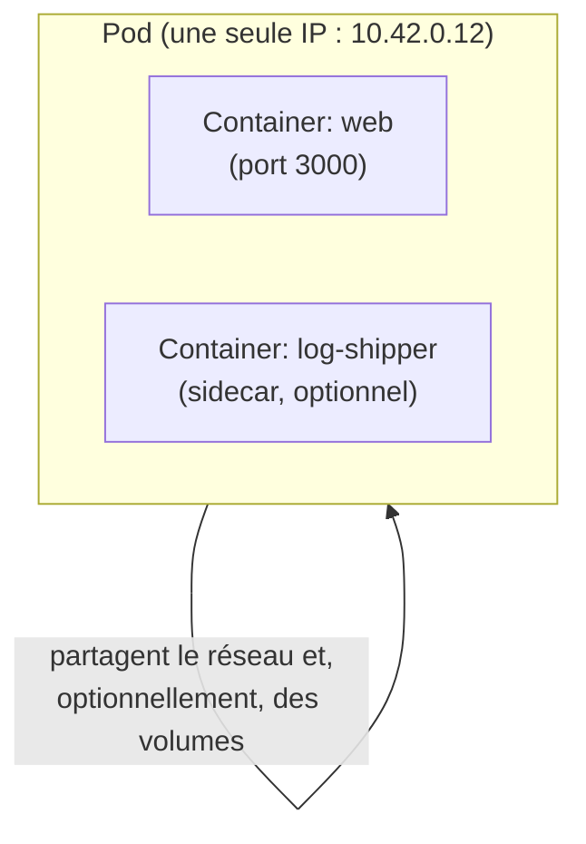

# Le Pod : pourquoi pas un conteneur nu

Première surprise pour qui vient de Docker : Kubernetes ne planifie jamais un
**conteneur** directement. L'unité la plus petite qu'on puisse déployer est le **Pod**.
Un Pod contient **un ou plusieurs conteneurs**, mais dans l'immense majorité des cas, un
seul — la question n'est donc pas "pourquoi plusieurs conteneurs", mais **pourquoi cette
couche d'indirection existe du tout**.

## Ce qu'un Pod garantit

Tous les conteneurs d'un même Pod partagent :

- le **même réseau** : même adresse IP, `localhost` commun entre eux (comme des
  processus sur la même machine) ;
- le **même cycle de vie de scheduling** : ils sont toujours placés **ensemble** sur le
  **même node**, jamais répartis ;
- optionnellement, des **volumes** communs.



> **Repère —** un Pod est l'équivalent d'un **groupe de processus co-localisés**, pas
> d'« un conteneur ». C'est la brique atomique que le scheduler place sur un node — il
> n'existe aucune façon de scheduler "juste un conteneur" indépendamment du reste du
> Pod qui le contient.

## Pourquoi cette indirection, concrètement

1. **Le scheduler a besoin d'une unité de placement claire.** Si deux conteneurs
   doivent absolument tourner ensemble (ex. une appli + un side-car qui exporte ses
   métriques), il faut une garantie qu'ils soient toujours sur le **même node**, avec le
   **même réseau**. C'est exactement ce que fournit le Pod — sans lui, il faudrait
   coordonner manuellement le placement de deux objets indépendants.
2. **Motif "sidecar".** Un Pod peut contenir un conteneur applicatif + un conteneur
   utilitaire (proxy, agent de logs, adaptateur…) qui partage son réseau et ses volumes.
   Le motif reste rare pour débuter, mais explique pourquoi le Pod est pluri-conteneur
   par conception, même si tu n'utiliseras au départ qu'un seul conteneur par Pod.
3. **Un Pod a un cycle de vie propre**, distinct du conteneur qu'il contient : un Pod a
   une IP, un nom, un statut (`Pending`, `Running`, `Succeeded`, `Failed`) — ce sont ces
   informations que tout le reste de Kubernetes (Services, probes, contrôleurs)
   manipule, jamais directement le conteneur runtime.

## Un Pod, en pratique

```yaml
# A single Pod: rarely created directly in real usage (see next lesson),
# but this is the smallest deployable unit in Kubernetes.
apiVersion: v1
kind: Pod
metadata:
  name: whoami
  labels:
    app: whoami
spec:
  containers:
    - name: whoami
      image: traefik/whoami:latest
      ports:
        - containerPort: 80
```

```bash
kubectl apply -f pod.yaml
kubectl get pod whoami -o wide
```

```
NAME     READY   STATUS    RESTARTS   AGE   IP           NODE
whoami   1/1     Running   0          11s   10.42.0.9    edc866c3b003
```

Une seule IP (`10.42.0.9`) est attribuée **au Pod**, pas au conteneur — si demain ce Pod
contenait un second conteneur sidecar, il partagerait cette même IP et pourrait
contacter le premier via `localhost`.

## Pourquoi tu ne créeras (presque) jamais un Pod nu

Un Pod créé directement, comme ci-dessus, n'a **aucune garantie de survie** : s'il
plante ou si le node est perdu, **rien ne le recrée**. C'est un objet correct
pédagogiquement, mais absent en pratique : en production, un Pod est toujours créé et
supervisé **indirectement**, via un contrôleur de plus haut niveau — un **Deployment** —
qui, lui, s'assure en continu que le nombre de Pods voulu existe réellement. C'est le
sujet de la prochaine leçon.

## À retenir

- Le Pod, pas le conteneur, est l'unité **atomique** de scheduling Kubernetes : une IP,
  un cycle de vie, un ou plusieurs conteneurs toujours co-localisés sur le même node.
- Cette indirection existe pour garantir que des conteneurs qui doivent tourner
  **ensemble** (motif sidecar) le fassent réellement, sans jamais être répartis sur des
  nodes différents.
- Un Pod créé seul n'a **aucun** self-healing : c'est le rôle du Deployment (module
  suivant), pas du Pod lui-même.
