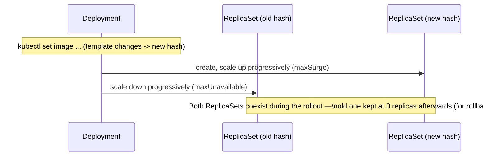

# ReplicaSet et Deployment : self-healing et rollout

Un Pod nu n'a aucune garantie de survie. Deux contrôleurs, empilés l'un sur l'autre,
résolvent ça : le **ReplicaSet** (maintient un nombre de répliques) et le **Deployment**
(gère des ReplicaSets successifs pour permettre mises à jour et rollback). En pratique,
tu ne manipules **presque jamais** un ReplicaSet directement — tu écris un Deployment, et
il crée le ReplicaSet pour toi.

## ReplicaSet : maintenir N répliques

Un ReplicaSet a un seul travail : s'assurer qu'**exactement N Pods** correspondant à un
`selector` existent en permanence. C'est la boucle de reconciliation vue au module 1,
appliquée concrètement.

```yaml
apiVersion: apps/v1
kind: Deployment
metadata:
  name: whoami
  labels:
    app: whoami
spec:
  replicas: 3
  selector:
    matchLabels:
      app: whoami          # must match template.metadata.labels below
  template:
    metadata:
      labels:
        app: whoami
    spec:
      containers:
        - name: whoami
          image: traefik/whoami:latest
          ports:
            - containerPort: 80
```

```bash
kubectl apply -f deployment.yaml
kubectl get deploy,rs,pods
```

```
NAME                     READY   UP-TO-DATE   AVAILABLE   SELECTOR
deployment.apps/whoami   3/3     3            3           app=whoami

NAME                                DESIRED   CURRENT   READY   SELECTOR
replicaset.apps/whoami-7c7f4944c6   3         3         3       app=whoami,pod-template-hash=7c7f4944c6

NAME                          READY   STATUS    RESTARTS
pod/whoami-7c7f4944c6-8xpjb   1/1     Running   0
pod/whoami-7c7f4944c6-ppb86   1/1     Running   0
pod/whoami-7c7f4944c6-wwbxq   1/1     Running   0
```

> **Repère —** remarque le suffixe `pod-template-hash` (`7c7f4944c6`) ajouté
> automatiquement au nom du ReplicaSet **et** au label de ses Pods. C'est ce hash — un
> hachage du `template` du Pod — qui permet au Deployment de savoir si un ReplicaSet
> correspond à la version **actuelle** du template ou à une **ancienne** version.

## Deployment : le rolling update expliqué par le hash

Quand tu changes l'image d'un Deployment, son `template` change, donc son hash change :
le Deployment ne modifie **jamais** un ReplicaSet existant, il en crée un **nouveau** et
bascule progressivement dessus.

```bash
kubectl set image deployment/whoami whoami=traefik/whoami:v1.10
kubectl rollout status deployment/whoami
```

```
Waiting for deployment "whoami" rollout to finish: 1 out of 3 new replicas have been updated...
Waiting for deployment "whoami" rollout to finish: 2 out of 3 new replicas have been updated...
Waiting for deployment "whoami" rollout to finish: 1 old replicas are pending termination...
deployment "whoami" successfully rolled out
```

```bash
kubectl get rs
```

```
NAME                DESIRED   CURRENT   READY   IMAGES
whoami-7c7f4944c6   0         0         0       traefik/whoami:latest    # old ReplicaSet, scaled to 0
whoami-b8d5c6bf7    3         3         3       traefik/whoami:v1.10     # new ReplicaSet, scaled to 3
```



L'ancien ReplicaSet **n'est pas supprimé** : il reste à 0 réplique, prêt à être
réactivé. C'est ce mécanisme qui rend le rollback instantané :

```bash
kubectl rollout undo deployment/whoami
kubectl rollout status deployment/whoami
kubectl get deploy whoami -o jsonpath='{.spec.template.spec.containers[0].image}'
# traefik/whoami:latest   <- back to the previous image, no rebuild needed
```

Un rollback ne fait **que** rebasculer les répliques entre ReplicaSets déjà existants —
aucune image n'est reconstruite, aucun Pod n'est créé "à froid" : c'est pour ça que
c'est quasi instantané.

> **Piège —** `kubectl rollout undo` revient à la révision **précédente**, pas
> forcément à celle que tu imagines si plusieurs déploiements se sont enchaînés.
> `kubectl rollout history deployment/whoami` liste les révisions ;
> `kubectl rollout undo deployment/whoami --to-revision=N` cible une révision précise.

## Pourquoi ne jamais créer un ReplicaSet directement

Tu **pourrais** écrire un `kind: ReplicaSet` toi-même — mais tu perdrais alors tout
l'historique de rollout et `kubectl rollout undo`, qui n'existent qu'au niveau
Deployment. Le ReplicaSet est un détail d'implémentation du Deployment : tu le lis pour
déboguer (`kubectl get rs`), tu ne l'écris jamais à la main.

## À retenir

- Le **ReplicaSet** garantit N répliques d'un Pod donné ; le **Deployment** gère une
  succession de ReplicaSets pour permettre update **et** rollback.
- Chaque changement de `template` crée un **nouveau** ReplicaSet (nouveau
  `pod-template-hash`) ; l'ancien reste à 0 réplique, prêt pour un rollback instantané.
- `kubectl rollout status` / `history` / `undo` sont les commandes du quotidien — elles
  n'existent **qu'au niveau Deployment**, jamais sur un ReplicaSet nu.
- En pratique : tu écris toujours un Deployment, jamais un ReplicaSet ou un Pod
  directement.
