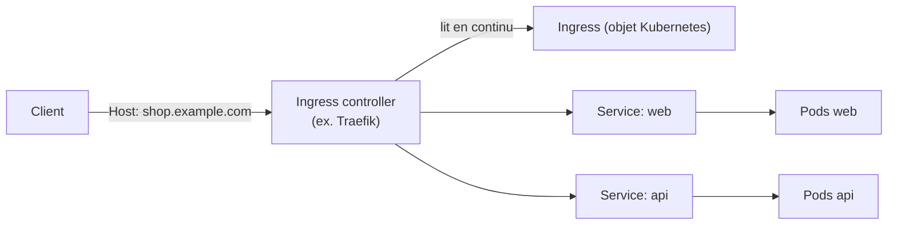

# Ingress et ingress controller : Traefik, en fait, tu le connais déjà

Bonne nouvelle : ce module ne t'apprend **aucun nouveau concept de routage HTTP**. Tu
connais déjà les entrypoints, les règles `Host`, les middlewares — Traefik. Ce qui
change sur Kubernetes, c'est **comment tu déclares** ces règles : plus de labels Docker,
mais un objet `Ingress` natif à l'API Kubernetes.

## L'Ingress est une ressource déclarative — pas un serveur

Un objet `Ingress` **ne fait rien tout seul**. C'est une déclaration ("route ce Host
vers ce Service") qu'un **ingress controller** — un vrai reverse proxy qui tourne dans
le cluster — lit et applique. Sans ingress controller installé, un Ingress créé reste
une déclaration morte, sans effet.



**Traefik peut être cet ingress controller.** C'est le même Traefik que tu as déployé en
conteneur Docker — sauf qu'ici, au lieu de lire des labels Docker sur des conteneurs, il
lit des objets `Ingress` via l'API Kubernetes. Le modèle mental EntryPoint → Router →
Middlewares → Service que tu maîtrises **reste identique** ; seule la source de
configuration change.

| | Traefik + Docker (parcours précédent) | Traefik ingress controller (Kubernetes) |
|---|---|---|
| Source de config | Labels sur les conteneurs, lus via l'API Docker | Objets `Ingress` (+ CRD `Middleware`), lus via l'API Kubernetes |
| Router créé par | `traefik.http.routers.*` en label | Un `rules.host` dans l'Ingress |
| Attacher un middleware | `traefik.http.routers.X.middlewares=...` | Annotation `traefik.ingress.kubernetes.io/router.middlewares` |
| EntryPoint | Config statique du conteneur Traefik | Toujours config statique — inchangé |

## Un Ingress, en pratique

```yaml
apiVersion: networking.k8s.io/v1
kind: Ingress
metadata:
  name: web
  annotations:
    traefik.ingress.kubernetes.io/router.entrypoints: web
spec:
  ingressClassName: traefik    # which ingress controller should handle this Ingress
  rules:
    - host: web.k8s-course.local
      http:
        paths:
          - path: /
            pathType: Prefix
            backend:
              service:
                name: web
                port:
                  number: 80
```

Vérifié en conditions réelles (cluster k3s, qui embarque Traefik comme ingress
controller par défaut) :

```bash
kubectl get ingress web
```

```
NAME   CLASS     HOSTS                  ADDRESS      PORTS
web    traefik   web.k8s-course.local   172.17.0.2   80
```

Une requête avec le bon `Host` traverse effectivement Traefik, qui ajoute ses propres
en-têtes `X-Forwarded-*` — la preuve directe que c'est bien Traefik qui a traité la
requête, pas un accès direct au Service :

```bash
curl -H "Host: web.k8s-course.local" http://<traefik-service-ip>
```

```
X-Forwarded-Host: web.k8s-course.local
X-Forwarded-Proto: http
X-Forwarded-Server: traefik-6f986b958c-5wn2s
```

## `IngressClass` : plusieurs ingress controllers possibles

Un cluster peut faire tourner **plusieurs** ingress controllers (Traefik, nginx-ingress,
nouveau venu...) simultanément. `ingressClassName` indique **lequel** doit traiter cet
Ingress précis :

```bash
kubectl get ingressclass
# NAME      CONTROLLER
# traefik   traefik.io/ingress-controller
```

Sans `ingressClassName` explicite (ni classe par défaut configurée), un Ingress reste
sans contrôleur assigné — **aucune route n'est créée**, silencieusement.

## Le middleware `stripPrefix`, exactement comme tu le connais

Router deux services sous un même `Host` (`/` vers `web`, `/api` vers `api`, avec le
préfixe retiré avant que la requête n'atteigne `api`) utilise **le même middleware**
`stripPrefix` que tu as déjà manipulé en label Docker — ici via la CRD native `Middleware`
de Traefik, référencée dans une annotation :

```yaml
apiVersion: traefik.io/v1alpha1
kind: Middleware
metadata:
  name: api-stripprefix
spec:
  stripPrefix:
    prefixes:
      - /api
---
apiVersion: networking.k8s.io/v1
kind: Ingress
metadata:
  name: shop
  annotations:
    traefik.ingress.kubernetes.io/router.middlewares: shop-api-stripprefix@kubernetescrd
spec:
  ingressClassName: traefik
  rules:
    - host: shop.k8s-course.local
      http:
        paths:
          - path: /api
            pathType: Prefix
            backend: { service: { name: api, port: { number: 80 } } }
          - path: /
            pathType: Prefix
            backend: { service: { name: web, port: { number: 80 } } }
```

Vérifié en conditions réelles : une requête sur `/api/orders` atteint bien le Pod `api`
avec `/orders` (préfixe retiré) — exactement le comportement du middleware Docker/label
équivalent :

```bash
curl -H "Host: shop.k8s-course.local" http://<traefik>/api/orders
```

```
GET /orders HTTP/1.1
Host: shop.k8s-course.local
```

> **Repère —** `@kubernetescrd` dans l'annotation précise que ce middleware est défini
> comme une **CRD Kubernetes** (`kind: Middleware`), pas comme une entrée de config
> statique Traefik classique — le suffixe change selon le provider, le concept de
> middleware reste identique.

## À retenir

- Un `Ingress` est une **déclaration** de routage HTTP ; sans **ingress controller** qui
  la lit et l'applique, rien ne se passe — Traefik peut être cet ingress controller.
- Le modèle mental Traefik (EntryPoint → Router → Middlewares → Service) ne change
  **pas** sur Kubernetes ; seule la source de configuration passe des labels Docker aux
  objets `Ingress` (+ CRD `Middleware`).
- `ingressClassName` désigne quel ingress controller doit traiter un Ingress donné —
  indispensable dès qu'un cluster en fait tourner plusieurs.
- Les mêmes middlewares (`stripPrefix`, `basicAuth`…) restent disponibles, référencés via
  une CRD native (`kind: Middleware`) plutôt que des labels.
