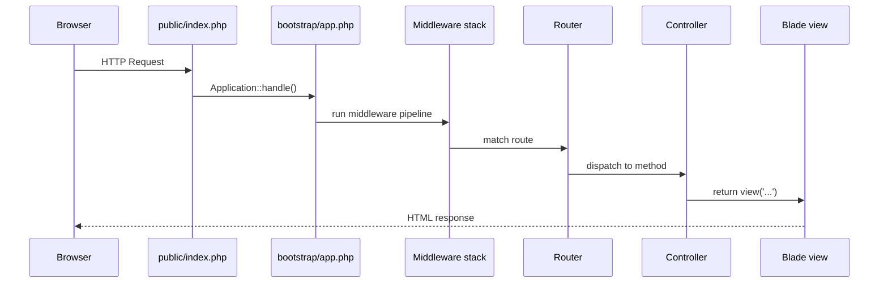

# Structure du projet et analogies Symfony

Après treize ans de Symfony, le premier `laravel new my-app` donne une impression
étrange : tout ressemble, mais rien n'est au même endroit. Ce chapitre établit la
carte de correspondance une fois pour toutes.

## Arborescence Laravel 13

```
my-app/
├── app/
│   ├── Console/         # Artisan commands (← src/Command/)
│   ├── Exceptions/      # Exception handler
│   ├── Http/
│   │   ├── Controllers/ # ← src/Controller/
│   │   ├── Middleware/  # ← src/EventSubscriber/ + kernel.php (request/response)
│   │   └── Requests/    # FormRequest (← src/Form/ + Validator)
│   ├── Models/          # Eloquent models (← src/Entity/)
│   ├── Jobs/            # Queue jobs (← src/Message/ + MessageHandler)
│   ├── Events/          # ← Symfony Event
│   ├── Listeners/       # ← Symfony EventSubscriber
│   ├── Policies/        # Authorization (← Voter)
│   └── Providers/       # Service providers (← Bundle/Extension)
├── bootstrap/
│   └── app.php          # Application kernel (← src/Kernel.php)
├── config/              # PHP config files (← config/*.yaml)
├── database/
│   ├── migrations/      # (← DoctrineMigrationsBundle)
│   ├── factories/       # Model factories (← Fixtures avec Foundry)
│   └── seeders/         # Database seeders
├── resources/
│   ├── views/           # Blade templates (← templates/*.twig)
│   └── js/ / css/
├── routes/
│   ├── web.php          # Browser routes
│   └── api.php          # API routes (← config/routes/api.yaml)
├── storage/             # Cache, logs, uploads (← var/)
├── tests/               # ← tests/
│   ├── Feature/         # ← tests/Functional/
│   └── Unit/            # ← tests/Unit/
└── artisan              # ← bin/console
```

## Table de correspondance complète

| Symfony | Laravel | Notes |
|---|---|---|
| `bin/console` | `php artisan` | même logique commandes |
| `src/Kernel.php` | `bootstrap/app.php` | wiring middlewares + providers |
| `config/*.yaml` | `config/*.php` | PHP au lieu de YAML |
| `src/Controller/` | `app/Http/Controllers/` | même rôle |
| `src/Entity/` | `app/Models/` | mais Active Record, pas Data Mapper |
| `src/Repository/` | méthodes `Model` + scopes | pas de classe dédiée obligatoire |
| `src/Form/` | `app/Http/Requests/` | FormRequest = Form + Validator |
| `templates/` (Twig) | `resources/views/` (Blade) | syntaxe proche |
| `services.yaml` | `app/Providers/` | binding DI manuel dans `register()` |
| Bundle / Extension | Service Provider | même intention |
| `src/Message/` | `app/Jobs/` | queue workers |
| `src/EventSubscriber/` | `app/Listeners/` + `EventServiceProvider` | |
| Voter | Policy | `can()` / Gate |
| `.env` | `.env` | identique |
| `var/` | `storage/` | cache, logs, uploads |
| `tests/Functional/` | `tests/Feature/` | HTTP tests avec `$this->get()` |

## Le cycle de vie d'une requête HTTP



C'est le même pipeline que Symfony (`HttpKernel::handle` → listeners → router →
controller), simplement nommé différemment.

> **Repère —** la différence fondamentale n'est pas structurelle mais philosophique :
> Symfony favorise la **configuration explicite** (YAML, attributs PHP, service wiring);
> Laravel favorise les **conventions** (namespace → auto-discovery, nom de fichier →
> classe, etc.). Les deux approches marchent ; Laravel vous fait écrire moins, au prix
> d'une magie parfois difficile à tracer.
