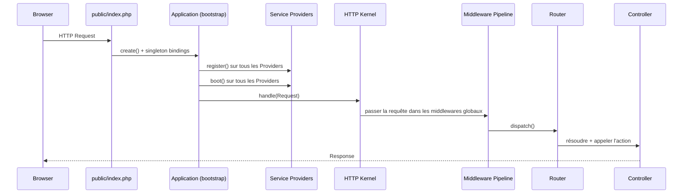
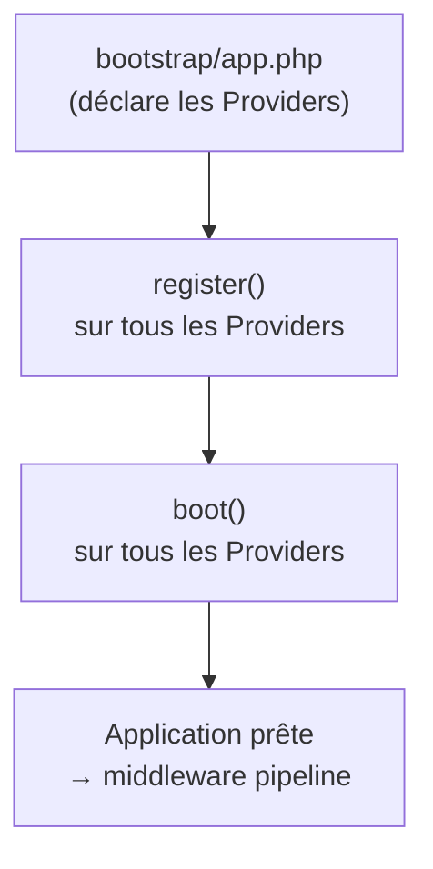
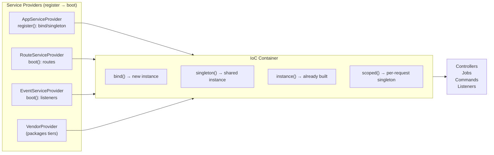

# Service Container et Service Providers

## Cycle de vie d'une requête Laravel

Avant de plonger dans le container, il est utile de voir où il intervient dans la vie d'une requête. Tout démarre dans `public/index.php` et passe par le kernel avant d'atteindre le controller.



Deux points clés pour un développeur Symfony : il n'y a **pas de kernel compile** (le container est construit à chaque requête, mais PHP OPcache rend cela négligeable), et les Providers jouent le rôle de l'ensemble Extension + CompilerPass + Bundle.

## Le container : une API quasi identique à Symfony

Laravel et Symfony partagent la même idée : un **container d'injection de dépendances**
qui construit les objets et résout leurs dépendances. Les API sont proches.

```php
// Symfony — services.yaml
// App\Service\InvoiceMailer:
//     arguments: ['@mailer', '@twig']

// Laravel — everything is done in PHP, inside a Provider
$this->app->bind(InvoiceMailer::class, function ($app) {
    return new InvoiceMailer(
        $app->make(Mailer::class),
        $app->make(Factory::class)
    );
});
```

## Mapping Symfony → Laravel : ce qui change réellement

| Concept Symfony | Équivalent Laravel | Différence clé |
|---|---|---|
| `services.yaml` | Pas de fichier YAML | Tout est PHP dans les Providers |
| `autowire: true` | Actif par défaut | Toute classe `app/` est auto-résolue |
| `public: false` (privé) | Pas de notion de privé | Toutes les classes sont résolvables |
| Alias d'interface | `$this->app->bind(Interface::class, Impl::class)` | Même concept, syntaxe PHP |
| `shared: false` | `$this->app->bind(...)` | Instance par résolution |
| `shared: true` (défaut) | `$this->app->singleton(...)` | Une instance par requête |
| Bundle + Extension | Service Provider (`register()`) | Un seul concept fusionné |
| CompilerPass | Service Provider (`boot()`) | Accès au container complet |
| `bin/console debug:container` | `php artisan tinker` + `app()->make(X::class)` | Exploration interactive |

En pratique, vous n'avez **presque jamais besoin** d'écrire ce binding manuellement :
Laravel **auto-résout** toute classe du namespace `App\` par reflection, exactement
comme Symfony avec `autowire: true`.

```php
// app/Http/Controllers/InvoiceController.php
class InvoiceController extends Controller
{
    public function __construct(
        private readonly InvoiceRepository $invoices,
        private readonly PdfGenerator $pdf,
    ) {}
    // Laravel instanciates InvoiceRepository and PdfGenerator automatically
}
```

> **Piège Symfony :** vous êtes habitué à déclarer chaque service. En Laravel,
> **toute classe instanciable dans `app/` est déjà un service** — pas de déclaration
> dans un YAML. Le binding explicite ne sert que pour les interfaces.

> **⚠️ Piège agence — injection dans les commandes Artisan** : contrairement à Symfony,
> la DI dans une commande Artisan ne se fait pas dans le constructeur mais dans la méthode
> `handle()`. Injecter dans `__construct()` fonctionne mais peut provoquer des effets de
> bord lors du bootstrap du container (ex. accès à la config avant le boot d'un Provider).

## Lier une interface à une implémentation

C'est le cas d'usage le plus courant du binding manuel :

```php
// app/Providers/AppServiceProvider.php
use App\Contracts\PaymentGateway;
use App\Services\StripeGateway;

public function register(): void
{
    $this->app->bind(PaymentGateway::class, StripeGateway::class);
}
```

Maintenant `PaymentGateway` peut être injecté partout, et Laravel injecte `StripeGateway`.
En Symfony, c'était :

```yaml
# services.yaml (Symfony)
App\Contracts\PaymentGateway:
    alias: App\Services\StripeGateway
```

### Cas concret d'agence : plusieurs passerelles de paiement

Dans un SaaS de facturation, vous gérez des clients dont certains paient par Stripe,
d'autres par PayPlug. L'interface reste stable, l'implémentation est choisie à la
résolution.

```php
// app/Providers/AppServiceProvider.php
public function register(): void
{
    $this->app->bind(PaymentGateway::class, function ($app) {
        // choose driver from .env or tenant config
        return match(config('payment.driver')) {
            'payplug' => $app->make(PayPlugGateway::class),
            default   => $app->make(StripeGateway::class),
        };
    });
}
```

```php
// app/Http/Controllers/CheckoutController.php
class CheckoutController extends Controller
{
    // Always receives the right implementation, no if/else here
    public function __construct(private readonly PaymentGateway $payment) {}

    public function store(CheckoutRequest $request): RedirectResponse
    {
        $charge = $this->payment->charge($request->validated());
        return redirect()->route('invoices.show', $charge->invoiceId());
    }
}
```

## Les Service Providers : l'équivalent des Bundles/Extensions

Un Service Provider est la **porte d'entrée** d'un paquet ou d'une fonctionnalité. Il
remplace le duo Bundle + CompilerPass de Symfony.

```php
// app/Providers/AppServiceProvider.php
namespace App\Providers;

use Illuminate\Support\ServiceProvider;

class AppServiceProvider extends ServiceProvider
{
    /**
     * register() — DI bindings, no access to other services yet
     * Equivalent: Bundle::build() or Extension::load() in Symfony
     */
    public function register(): void
    {
        $this->app->singleton(PdfGenerator::class, function ($app) {
            return new PdfGenerator(config('pdf.engine'));
        });
    }

    /**
     * boot() — everything is resolved, services are available
     * Equivalent: CompilerPass or EventSubscriber booted after the container
     */
    public function boot(): void
    {
        // Ex. : enregistrer un macro, un observer Eloquent...
        \Blade::directive('money', fn ($amt) => "<?php echo money_format($amt); ?>");
    }
}
```



## Architecture DI / Providers : vue d'ensemble



## Scopes de binding

| Méthode | Cycle de vie | Équivalent Symfony |
|---|---|---|
| `bind()` | nouvelle instance à chaque résolution | `shared: false` |
| `singleton()` | une seule instance par requête | `shared: true` (défaut Symfony) |
| `instance()` | injecte l'objet existant | passer un objet déjà créé |
| `scoped()` | singleton dans le scope d'une requête (Octane) | — |

## Tips de productivité

```bash
# Inspecter le container : tout ce qui est résolvable
php artisan tinker
>>> app()->make(\App\Services\PdfGenerator::class)

# Lister les bindings enregistrés dans l'app
php artisan tinker
>>> app()->getBindings()

# Créer un Provider personnalisé
php artisan make:provider BillingServiceProvider

# Créer un contrat + implémentation (structure recommandée)
# app/Contracts/InvoiceRepository.php (interface)
# app/Repositories/EloquentInvoiceRepository.php (implémentation)
# → binder dans AppServiceProvider::register()
```

> **À retenir —** `register()` pour les bindings purs (pas d'appel à `app()->make()`
> vers d'autres services), `boot()` pour tout ce qui dépend d'autres services déjà
> résolus. Cette distinction évite les erreurs d'initialisation circulaire.
