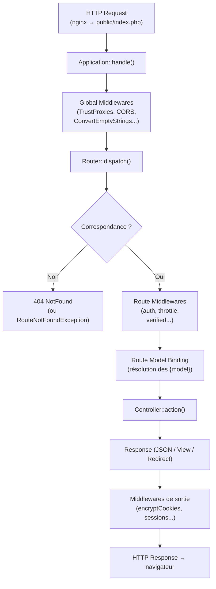

# Routing : routes/web.php vs config/routes.yaml

## Pipeline d'une requête HTTP dans Laravel

Avant d'examiner la syntaxe des routes, visualisons la mécanique complète. En Symfony
vous connaissez le système d'événements (`kernel.request`, `kernel.controller`...). Laravel
utilise un **pipeline de middlewares** linéaire plus proche de PSR-15.



> Repère Symfony : les middlewares globaux correspondent aux `kernel.request` listeners,
> les middlewares de route aux `is_granted()` / `AccessListener`. La différence clé :
> tout est déclaré en PHP, pas en `security.yaml`.

## La différence fondamentale

En Symfony, les routes sont (principalement) des **attributs PHP sur les controllers**
ou des fichiers YAML/XML. En Laravel, les routes sont déclarées **dans des fichiers PHP
dédiés**, explicitement, dans l'ordre de priorité.

```php
// routes/web.php — routes pour le navigateur (session, CSRF, cookies)
use App\Http\Controllers\InvoiceController;
use Illuminate\Support\Facades\Route;

Route::get('/invoices', [InvoiceController::class, 'index'])->name('invoices.index');
Route::get('/invoices/{invoice}', [InvoiceController::class, 'show'])->name('invoices.show');
Route::post('/invoices', [InvoiceController::class, 'store'])->name('invoices.store');
```

```php
// routes/api.php — routes API (sans session, préfixe /api)
Route::middleware('auth:sanctum')->group(function () {
    Route::apiResource('invoices', InvoiceController::class);
});
```

Equivalent Symfony :

```php
// Symfony — attribut sur le controller
#[Route('/invoices', name: 'invoices_index', methods: ['GET'])]
public function index(): Response { ... }
```

## Tableau comparatif : déclaration de routes

| | Symfony | Laravel |
|---|---|---|
| Déclaration | Attribut `#[Route]` sur la méthode | Fichier `routes/web.php` ou `routes/api.php` |
| Fichiers de routes | `config/routes.yaml` / attributs / annotations | `routes/*.php` chargés dans `RouteServiceProvider` |
| CRUD automatique | Pas natif (EasyAdminBundle le fait) | `Route::resource()` / `Route::apiResource()` |
| Préfixe groupe | `#[Route('/admin', name: 'admin_')]` sur la classe | `Route::prefix('admin')->name('admin.')` |
| Contrainte de paramètre | `requirements: {id: '\d+'}` | `->where('id', '[0-9]+')` ou `->whereNumber('id')` |
| Paramètre optionnel | `{year<\d+>?2025}` | `{year?}` + valeur par défaut |
| Model auto-résolu | `#[MapEntity]` / `ParamConverter` | Route Model Binding natif (aucun config) |
| Nommage | `name: 'invoice_show'` | `->name('invoices.show')` (point comme séparateur) |
| Génération d'URL | `$urlGenerator->generate('invoice_show', ['id' => 1])` | `route('invoices.show', $invoice)` |

## Ressource CRUD en une ligne

Laravel dispose d'un raccourci pour les 7 actions CRUD classiques :

```php
// Génère : index, create, store, show, edit, update, destroy
Route::resource('products', ProductController::class);

// Pour une API (sans create/edit qui rendent des formulaires HTML)
Route::apiResource('products', ProductController::class);
```

```bash
# Verify the generated routes
php artisan route:list

# Filter by name or URI (very useful on large projects)
php artisan route:list --name=invoices
php artisan route:list --path=api/invoices
```

| Méthode | URL | Action | Nom |
|---|---|---|---|
| GET | `/products` | `index` | `products.index` |
| POST | `/products` | `store` | `products.store` |
| GET | `/products/{product}` | `show` | `products.show` |
| PUT/PATCH | `/products/{product}` | `update` | `products.update` |
| DELETE | `/products/{product}` | `destroy` | `products.destroy` |

## Paramètres de route et contraintes

```php
// Paramètre simple (équivalent {id} Symfony)
Route::get('/products/{id}', [ProductController::class, 'show']);

// Contrainte regex (équivalent requirements: en Symfony)
Route::get('/products/{id}', [ProductController::class, 'show'])
    ->where('id', '[0-9]+');

// Contrainte helper
Route::get('/products/{id}', [ProductController::class, 'show'])
    ->whereNumber('id');

// Paramètre optionnel
Route::get('/reports/{year?}', [ReportController::class, 'index']);
```

## Groupes de routes

```php
// Group with prefix, middleware and naming (typical agency architecture)
Route::prefix('admin')
    ->middleware(['auth', 'can:access-admin'])
    ->name('admin.')
    ->group(function () {
        Route::resource('users', Admin\UserController::class);
        Route::resource('invoices', Admin\InvoiceController::class);
        Route::resource('clients', Admin\ClientController::class);
    });

// Equivalent in Symfony:
// config/routes/admin.yaml with prefix: /admin
// + security.yaml with access_control: [{ path: ^/admin, roles: ROLE_ADMIN }]
```

> **⚠️ Piège agence — `routes/api.php` n'est pas chargé automatiquement en Laravel 11+.**
> Depuis Laravel 11, ce fichier doit être explicitement activé dans `bootstrap/app.php` via
> `->withRouting(api: __DIR__.'/../routes/api.php')`. Si vos routes API semblent introuvables
> après une mise à jour, c'est souvent ce qui manque.

## Route Model Binding : le super-pouvoir de Laravel

```php
// Sans Route Model Binding (style Symfony classique)
public function show(int $id): View
{
    $invoice = Invoice::findOrFail($id);
    return view('invoices.show', compact('invoice'));
}

// Avec Route Model Binding (Laravel)
public function show(Invoice $invoice): View
{
    // Laravel a déjà résolu Invoice::find($id) et renvoyé 404 si introuvable
    return view('invoices.show', compact('invoice'));
}
```

Le nom du paramètre de route doit correspondre au nom du paramètre de méthode. Laravel
effectue la requête automatiquement. C'est l'équivalent d'un `ParamConverter` Symfony
(ou `#[MapEntity]`), mais sans annotation ni configuration.

```php
// Binding by a column other than id (useful for public-facing URLs)
Route::get('/invoices/{invoice:uuid}', [InvoiceController::class, 'show']);
// → Invoice::where('uuid', $value)->firstOrFail()

// Custom resolution logic (override in the model)
class Invoice extends Model
{
    public function resolveRouteBinding($value, $field = null): ?self
    {
        // Example: also search by legacy reference number
        return $this->where($field ?? 'id', $value)
                    ->orWhere('reference', $value)
                    ->firstOrFail();
    }
}
```

> **⚠️ Piège agence — Route Model Binding et soft deletes.** Par défaut, si votre modèle
> utilise `SoftDeletes`, un enregistrement supprimé renvoie une 404 silencieuse. Pour
> inclure les enregistrements supprimés dans la résolution, surchargez `resolveRouteBinding()`
> ou utilisez `->withTrashed()` dans la requête.

## Tips de productivité : commandes Artisan pour les routes

```bash
# List all routes with middleware details
php artisan route:list -v

# Clear route cache (mandatory after adding/removing routes in production)
php artisan route:clear
php artisan route:cache   # cache for production (routes become static)

# Generate a resourceful controller + form requests in one shot
php artisan make:controller ClientController --resource --model=Client

# Generate the full set: model + migration + factory + controller + resource + seeder
php artisan make:model Invoice -mfcr
# -m = migration, -f = factory, -c = controller, -r = resource controller
```

> **À retenir —** le Route Model Binding évite de répéter `findOrFail()` dans chaque
> controller. C'est la convention à adopter dès le premier jour sur un projet Laravel.
> En production, toujours `route:cache` après un déploiement : gain de ~30 % sur les
> temps de dispatching.
