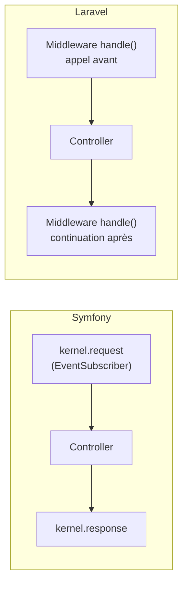

# Middleware vs Kernel Events Symfony

## Deux approches du même problème

Symfony intercepte les requêtes via des **EventSubscribers** sur `kernel.request`,
`kernel.response`, `kernel.exception`. Laravel utilise un **pipeline de Middleware**
(inspiré de PSR-15, mais antérieur).



## Anatomie d'un Middleware Laravel

```bash
php artisan make:middleware EnsureClientHasActiveSubscription
```

```php
// app/Http/Middleware/EnsureClientHasActiveSubscription.php
namespace App\Http\Middleware;

use Closure;
use Illuminate\Http\Request;
use Symfony\Component\HttpFoundation\Response;

class EnsureClientHasActiveSubscription
{
    /**
     * @param Closure(Request): Response $next
     */
    public function handle(Request $request, Closure $next): Response
    {
        // Code exécuté AVANT le controller (équiv. kernel.request)
        if (! $request->user()?->hasActiveSubscription()) {
            return redirect()->route('subscription.expired');
        }

        $response = $next($request); // appelle le prochain middleware ou le controller

        // Code exécuté APRÈS le controller (équiv. kernel.response)
        $response->headers->set('X-Subscription-Valid', 'true');

        return $response;
    }
}
```

Équivalent Symfony :

```php
// Symfony EventSubscriber équivalent
public function onKernelRequest(RequestEvent $event): void
{
    $request = $event->getRequest();
    if (! $this->subscriptionChecker->isActive($request->getUser())) {
        $event->setResponse(new RedirectResponse('/subscription/expired'));
    }
}
```

## Enregistrement d'un Middleware

```php
// bootstrap/app.php — Laravel 13
use App\Http\Middleware\EnsureClientHasActiveSubscription;

->withMiddleware(function (Middleware $middleware) {
    // Middleware global (toutes les requêtes)
    $middleware->append(\App\Http\Middleware\LogAllRequests::class);

    // Alias (pour les utiliser dans les routes par nom court)
    $middleware->alias([
        'subscribed' => EnsureClientHasActiveSubscription::class,
    ]);

    // Groupe web ou api
    $middleware->web(append: [
        \App\Http\Middleware\TrackLastSeen::class,
    ]);
})
```

```php
// Utilisation dans les routes
Route::get('/premium', [PremiumController::class, 'index'])
    ->middleware('subscribed');

// Ou directement dans le controller
public function __construct()
{
    $this->middleware('subscribed')->only(['premium', 'download']);
}
```

## Middleware avec paramètres

```php
// Définition
public function handle(Request $request, Closure $next, string $role): Response
{
    if (! $request->user()?->hasRole($role)) {
        abort(403);
    }
    return $next($request);
}

// Utilisation (syntaxe colon comme Symfony security roles)
Route::get('/admin', [AdminController::class, 'index'])
    ->middleware('role:admin');
```

## Middlewares intégrés utiles

| Alias | Rôle | Équivalent Symfony |
|---|---|---|
| `auth` | Authentification requise | `IS_AUTHENTICATED_FULLY` |
| `guest` | Redirige si déjà connecté | guard `anonymous` |
| `verified` | Email vérifié requis | — |
| `throttle:60,1` | Rate limiting (60 req/min) | RateLimiter component |
| `can:update,post` | Autorisation (Policy) | `#[IsGranted('EDIT', 'post')]` |
| `signed` | URL signée vérifiée | — |

> **Repère —** la différence principale avec Symfony : le middleware Laravel encapsule
> les deux phases (avant/après) dans **une seule méthode** via la closure `$next`.
> En Symfony, ce sont deux listeners séparés (`onRequest` / `onResponse`). Les deux
> permettent la même chose ; le middleware Laravel est souvent plus lisible.
