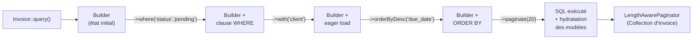

# Active Record vs Data Mapper : le changement de paradigme

C'est **la** différence fondamentale, source de la plupart des pièges pour un
développeur Symfony/Doctrine. Comprendre ce point une fois pour toutes vous évitera
des heures de débogage.

## Pipeline Eloquent : comment une requête se construit

Avant de voir la syntaxe, comprendre le pipeline interne aide à éviter les pièges de
performance. Chaque appel de méthode sur un modèle retourne un `Builder` qui accumule
des contraintes avant d'exécuter la requête SQL.



> Repère : tant que vous chaînez des méthodes, **aucune requête n'est émise**. La
> requête se déclenche uniquement avec un `get()`, `first()`, `paginate()`, `count()`,
> `exists()`, ou un foreach sur le builder. C'est identique au `QueryBuilder` Doctrine.

## Data Mapper (Doctrine/Symfony)

Dans Doctrine, vos **entités sont des POPO** (Plain Old PHP Objects) : elles ne savent
rien de la base de données. C'est le rôle du `EntityManager` et des `Repository`.

```php
// Doctrine Entity (POPO)
#[ORM\Entity]
class Invoice
{
    #[ORM\Id, ORM\Column, ORM\GeneratedValue]
    private int $id;

    #[ORM\Column]
    private float $amount;

    // Getters / setters — l'entité ne touche pas la DB
}

// Symfony : tout passe par l'EntityManager (Repository)
$invoice = new Invoice();
$invoice->setAmount(150.00);
$em->persist($invoice);
$em->flush(); // INSERT ici

$invoices = $em->getRepository(Invoice::class)->findBy(['status' => 'pending']);
```

L'entité et la persistance sont **découplées**. C'est excellent pour les tests
unitaires : une entité peut être testée sans base de données.

## Active Record (Eloquent/Laravel)

Dans Eloquent, le modèle **est** à la fois l'entité et le repository. Il contient les
méthodes de persistance directement.

```php
// Eloquent Model
namespace App\Models;

use Illuminate\Database\Eloquent\Model;

class Invoice extends Model
{
    // Table: 'invoices' (convention: pluriel snake_case du nom de classe)
    // Clé primaire: 'id' (convention)
    // Timestamps: created_at, updated_at (automatiques)

    protected $fillable = ['client_id', 'amount', 'due_date', 'status'];
}

// Utilisation — tout passe par le modèle lui-même
$invoice = new Invoice(['amount' => 150.00, 'client_id' => 1]);
$invoice->save(); // INSERT

$invoice->amount = 200.00;
$invoice->save(); // UPDATE

Invoice::create(['amount' => 150.00, 'client_id' => 1]); // INSERT direct

$invoices = Invoice::where('status', 'pending')->get();
$invoice  = Invoice::find(42);        // SELECT WHERE id = 42
$invoice  = Invoice::findOrFail(42);  // + throw 404 si introuvable
```

## Tableau comparatif complet

| | Doctrine (Symfony) | Eloquent (Laravel) |
|---|---|---|
| Pattern | Data Mapper | Active Record |
| Entité | POPO (pas de superclasse) | Hérite de `Model` |
| Persistance | via `EntityManager` | méthodes sur le modèle |
| Queries | `QueryBuilder` / DQL | méthodes statiques fluentes |
| Repository | classe dédiée | méthodes statiques du modèle + scopes |
| Tests unitaires | entité testable sans DB | model nécessite une DB (ou mock) |
| Couplage | faible (POPO) | fort (hérite de Model) |
| Boilerplate | élevé (Entity + Repository) | minimal |
| Flexibilité | très haute | bonne mais conventions fortes |

## Créer un modèle agence complet : la commande à retenir

```bash
# Generate everything at once: model + migration + factory + controller (resource) + seeder
php artisan make:model Invoice -mfcr
# Creates:
#   app/Models/Invoice.php
#   database/migrations/xxxx_create_invoices_table.php
#   database/factories/InvoiceFactory.php
#   database/seeders/InvoiceSeeder.php
#   app/Http/Controllers/InvoiceController.php  (with 7 CRUD actions)
```

```php
// app/Models/Invoice.php — minimal but complete for an agency billing app
class Invoice extends Model
{
    use SoftDeletes; // adds deleted_at (equivalent of Doctrine's @SoftDeleteable)

    protected $fillable = [
        'client_id',
        'reference',
        'amount',
        'tax_rate',
        'status',   // draft | sent | paid | overdue
        'due_date',
        'paid_at',
        'notes',
    ];

    // Automatic type casting (no need for getters/setters like in Doctrine)
    protected $casts = [
        'due_date' => 'date',
        'paid_at'  => 'datetime',
        'amount'   => 'decimal:2',
        'tax_rate' => 'float',
    ];

    // Computed attribute (equivalent of a virtual getter in Doctrine)
    public function getTotalWithTaxAttribute(): float
    {
        return $this->amount * (1 + $this->tax_rate);
    }
}
```

## Le piège de la masse d'assignation (Mass Assignment)

Eloquent protège par défaut contre la sur-attribution. Deux approches :

```php
// Approche 1 : $fillable (liste blanche) — recommandé
class Invoice extends Model
{
    protected $fillable = ['client_id', 'amount', 'due_date', 'status'];
    // Seuls ces champs peuvent être passés à Invoice::create() ou fill()
}

// Approche 2 : $guarded (liste noire)
class Invoice extends Model
{
    protected $guarded = ['id', 'created_at', 'updated_at'];
    // Tous les champs sauf ceux-là sont mass-assignable
}
```

```php
// Safe: only creates with fields declared in $fillable
Invoice::create($request->validated());

// DANGEROUS: avoid — passes the raw array from the request
Invoice::create($request->all());
```

> **⚠️ Piège agence — `$request->all()` vs `$request->validated()`** : c'est l'un des
> pièges les plus fréquents lors de la migration depuis Symfony. En Symfony, le
> `form->handleRequest()` + `$form->isValid()` filtre implicitement les champs. En
> Laravel, `$request->all()` contient **tous les paramètres de la requête**, y compris
> ceux que vous n'avez pas validés (token CSRF, champs cachés malicieux, etc.).
> La règle d'or : **toujours** passer par une `FormRequest` et utiliser `$request->validated()`.

> **⚠️ Piège agence — `$guarded = []` dans les tutoriels.** Beaucoup de tutoriels
> utilisent `protected $guarded = []` pour aller plus vite. En production, cela signifie
> que **tous les champs** sont mass-assignables, y compris `is_admin`, `email_verified_at`,
> etc. Sur un projet client, préférez toujours `$fillable` explicite.

## Explorer avec Tinker

`tinker` est l'équivalent de `bin/console doctrine:query:dql` mais en mode interactif
REPL. Il charge toute l'application Laravel et permet de tester des requêtes en direct.

```bash
php artisan tinker
```

```php
// Inside tinker:

// Create a test invoice without touching the test suite
$invoice = \App\Models\Invoice::factory()->create(['amount' => 1500.00]);

// Check what SQL a scope generates
\DB::enableQueryLog();
\App\Models\Invoice::where('status', 'draft')->with('client')->get();
\DB::getQueryLog(); // shows all executed queries

// Test a relationship
$client = \App\Models\Client::find(1);
$client->invoices()->pending()->count();

// Test a computed attribute
$invoice->total_with_tax; // triggers getTotalWithTaxAttribute()
```

> **Repère —** définissez toujours `$fillable` (jamais `$guarded = []`). Cela
> s'associe naturellement à `$request->validated()` : les deux couches ensemble
> garantissent que seuls les champs attendus atteignent la base de données.
