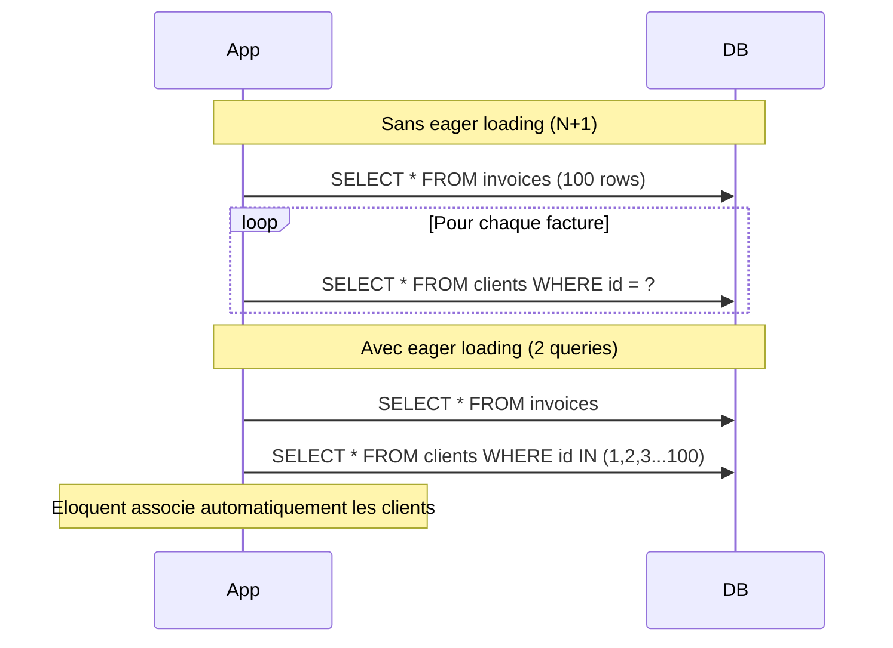
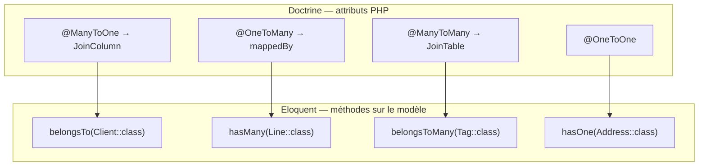

# Relations Eloquent et Migrations

## Relations : syntaxe fluente vs attributs Doctrine

Doctrine déclare les relations via des **attributs PHP** sur les propriétés de
l'entité. Eloquent les déclare via des **méthodes** sur le modèle.

```php
// Doctrine — propriété avec attribut
#[ORM\ManyToOne(targetEntity: Client::class)]
#[ORM\JoinColumn(name: 'client_id')]
private Client $client;

#[ORM\OneToMany(targetEntity: InvoiceLine::class, mappedBy: 'invoice')]
private Collection $lines;
```

```php
// Eloquent — méthodes sur le modèle
class Invoice extends Model
{
    // ManyToOne: an invoice belongs to a client
    public function client(): BelongsTo
    {
        return $this->belongsTo(Client::class);
        // Inferred foreign key: client_id (convention: relation_name_id)
    }

    // OneToMany: an invoice has many lines
    public function lines(): HasMany
    {
        return $this->hasMany(InvoiceLine::class);
        // Inferred foreign key on InvoiceLine: invoice_id
    }

    // ManyToMany: an invoice has many tags
    public function tags(): BelongsToMany
    {
        return $this->belongsToMany(Tag::class);
        // Inferred pivot table: invoice_tag (alphabetical order)
    }
}

class Client extends Model
{
    // OneToMany inverse
    public function invoices(): HasMany
    {
        return $this->hasMany(Invoice::class);
    }
}
```

## Chargement des relations : N+1, le piège classique

Le problème N+1 existe aussi en Doctrine sans `JOIN FETCH`, mais Eloquent le rend plus
**silencieux** : aucune exception, aucune alerte en développement par défaut.

```php
// PROBLEM: N+1 queries (silent in Eloquent by default!)
$invoices = Invoice::all(); // 1 query: SELECT * FROM invoices
foreach ($invoices as $invoice) {
    echo $invoice->client->name; // 1 query PER invoice → 100 invoices = 101 queries!
}

// SOLUTION: Eager loading (equivalent of JOIN FETCH in Doctrine)
$invoices = Invoice::with('client')->get();              // 2 queries total
$invoices = Invoice::with(['client', 'lines'])->get();  // 3 queries total

// Nested eager loading (client with its address)
$invoices = Invoice::with('client.address')->get();

// Lazy eager loading: already have the collection, load relations after
$invoices->load('client');
$invoices->loadMissing('lines'); // only loads if not already loaded
```

> **⚠️ Piège agence — N+1 silencieux.** Contrairement à Doctrine en mode debug qui peut
> vous avertir des requêtes excessives via la barre Symfony, Eloquent ne dit rien par
> défaut. En développement, activez la détection N+1 dans `AppServiceProvider::boot()` :
>
> ```php
> // app/Providers/AppServiceProvider.php
> public function boot(): void
> {
>     if (app()->isLocal()) {
>         \Illuminate\Database\Eloquent\Model::preventLazyLoading();
>         // throws LazyLoadingViolationException if you access a relation
>         // that was not eager-loaded — similar to Doctrine's EXTRA_LAZY trap
>     }
> }
> ```

```php
// Alternative: Laravel Telescope (dedicated package for dev profiling)
// Shows every query, its duration, and the calling stack trace
// composer require laravel/telescope --dev
// php artisan telescope:install && php artisan migrate
// → http://your-app.test/telescope
```



## Scopes : remplacer les méthodes de Repository

En Symfony, vous créez des méthodes dans un `InvoiceRepository`. En Laravel, vous
utilisez des **Scopes** Eloquent directement sur le modèle.

| | Symfony `InvoiceRepository` | Eloquent Scope |
|---|---|---|
| Déclaration | Méthode dans la classe Repository | Méthode `scopeXxx()` dans le modèle |
| Chainable | Via `QueryBuilder` Doctrine | Directement chainable sur le modèle |
| Réutilisation | Import de la classe Repository | Disponible partout via le modèle |
| Surcharge | `EntityRepository::findBy()` | `Global Scope` (automatique) ou `Local Scope` |

```php
// Symfony InvoiceRepository
public function findPendingByClient(Client $client): array
{
    return $this->createQueryBuilder('i')
        ->where('i.client = :client')
        ->andWhere('i.status = :status')
        ->setParameters(['client' => $client, 'status' => 'pending'])
        ->getQuery()->getResult();
}
```

```php
// Eloquent — Local Scopes on the model
class Invoice extends Model
{
    // Reusable scope: Invoice::pending()
    public function scopePending(Builder $query): Builder
    {
        return $query->where('status', 'pending');
    }

    // Scope with parameter: Invoice::olderThan(30)
    public function scopeOlderThan(Builder $query, int $days): Builder
    {
        return $query->where('due_date', '<', now()->subDays($days));
    }

    // Scope combining multiple conditions (replaces a Repository method)
    public function scopeForClient(Builder $query, Client $client): Builder
    {
        return $query->where('client_id', $client->id);
    }

    // Global scope: automatically applied to all queries (equivalent of Doctrine filters)
    protected static function booted(): void
    {
        // Example: only show invoices for the current tenant in a multi-tenant app
        static::addGlobalScope('tenant', function (Builder $query) {
            if (auth()->check()) {
                $query->where('tenant_id', auth()->user()->tenant_id);
            }
        });
    }
}

// Usage — perfectly chainable (like Doctrine's QueryBuilder)
$invoices = Invoice::pending()
    ->olderThan(30)
    ->forClient($client)
    ->with('client')
    ->orderByDesc('due_date')
    ->paginate(20);
```

> **⚠️ Piège agence — Global Scopes et Tinker.** Si vous avez un Global Scope sur le
> tenant, les requêtes dans `tinker` le respecteront aussi (car `auth()->check()` est
> `false` en CLI). Pour déboguer sans contrainte de scope, utilisez
> `Invoice::withoutGlobalScopes()->get()`.

## Migrations Laravel vs DoctrineMigrations

```bash
php artisan make:migration create_invoices_table
php artisan make:migration add_status_to_invoices_table
php artisan migrate
php artisan migrate:rollback
php artisan migrate:status
```

```php
// database/migrations/2024_01_15_000000_create_invoices_table.php
return new class extends Migration
{
    public function up(): void
    {
        Schema::create('invoices', function (Blueprint $table) {
            $table->id();                    // BIGINT AUTO_INCREMENT (PK)
            $table->foreignId('client_id')
                  ->constrained()            // FK to clients.id + index
                  ->cascadeOnDelete();
            $table->decimal('amount', 10, 2);
            $table->string('status', 20)->default('draft');
            $table->date('due_date')->nullable();
            $table->text('notes')->nullable();
            $table->timestamps();            // created_at + updated_at
            $table->softDeletes();           // deleted_at (soft delete)
        });
    }

    public function down(): void
    {
        Schema::dropIfExists('invoices');
    }
};
```

Différence clé avec Doctrine : Laravel ne génère **pas** les migrations depuis les
modèles. Il n'y a pas de `doctrine:migrations:diff`. Les migrations sont **toujours
écrites à la main** (ou générées partiellement avec `--create`).

| | Doctrine Migrations | Laravel Migrations |
|---|---|---|
| Génération | `doctrine:migrations:diff` (depuis les entités) | Manuelle (ou `make:migration`) |
| Référence | Entités PHP (annotations/attributs) | Migrations elles-mêmes |
| Rollback | `doctrine:migrations:execute --down` | `php artisan migrate:rollback` |
| Statut | `doctrine:migrations:status` | `php artisan migrate:status` |
| Colonnes | Types Doctrine (`string`, `text`, `decimal`) | Blueprint fluent (`string()`, `decimal()`) |
| FK | `@JoinColumn` en PHP | `->constrained()` dans Blueprint |
| Index | `@Index` en PHP | `->index()` / `->unique()` dans Blueprint |

> **⚠️ Piège agence — pas de `migrate:diff`.** Si vous modifiez un modèle Eloquent,
> Laravel **ne détecte pas le changement** automatiquement. Vous devez créer une nouvelle
> migration avec `php artisan make:migration add_discount_to_invoices_table`. Ne jamais
> modifier une migration déjà exécutée en production : créez toujours une nouvelle.

## API Resources : transformer les modèles pour l'API

```bash
php artisan make:resource InvoiceResource
php artisan make:resource InvoiceCollection --collection
```

```php
// app/Http/Resources/InvoiceResource.php
class InvoiceResource extends JsonResource
{
    public function toArray(Request $request): array
    {
        return [
            'id'         => $this->id,
            'amount'     => $this->amount,
            'status'     => $this->status,
            'client'     => new ClientResource($this->whenLoaded('client')),
            'created_at' => $this->created_at->toISOString(),
            // $this->when() to include conditionally
            'discount'   => $this->when($this->discount > 0, $this->discount),
        ];
    }
}

// Dans le controller
return InvoiceResource::collection(
    Invoice::with('client')->paginate(20)
);
```

> **À retenir —** `whenLoaded('client')` évite de forcer le chargement de la relation
> si elle n'a pas été eager-loadée. Le Resource retourne `null` pour cette clé plutôt
> que de déclencher une requête N+1.

## Récapitulatif : relations Doctrine → Eloquent


