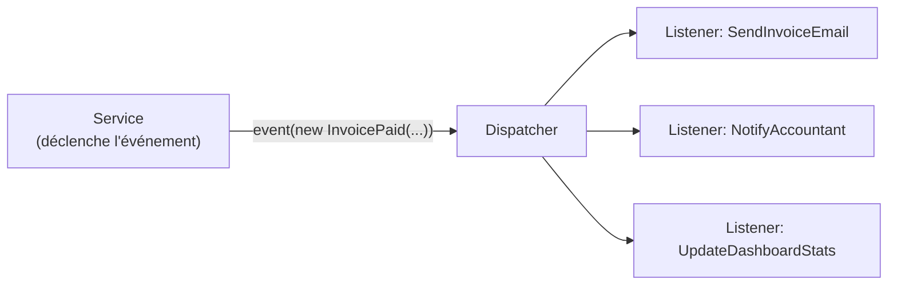

# Events & Listeners vs EventSubscriber Symfony

## Le système d'événements : même philosophie

Laravel et Symfony proposent tous les deux un dispatcher d'événements pour découpler
les effets de bord (envoi d'email, notifications, logs…) de la logique métier. La
mécanique est identique ; la syntaxe diffère légèrement.



## Créer un Event et un Listener

```bash
php artisan make:event InvoicePaid
php artisan make:listener SendInvoiceEmail --event=InvoicePaid
php artisan make:listener NotifyAccountant --event=InvoicePaid
```

```php
// app/Events/InvoicePaid.php
namespace App\Events;

use App\Models\Invoice;
use Illuminate\Foundation\Events\Dispatchable;
use Illuminate\Queue\SerializesModels;

class InvoicePaid
{
    use Dispatchable, SerializesModels;

    public function __construct(
        public readonly Invoice $invoice,
        public readonly float $amountPaid,
    ) {}
}
```

```php
// app/Listeners/SendInvoiceEmail.php
namespace App\Listeners;

use App\Events\InvoicePaid;
use App\Mail\InvoicePaidMailable;
use Illuminate\Support\Facades\Mail;

class SendInvoiceEmail
{
    public function handle(InvoicePaid $event): void
    {
        Mail::to($event->invoice->client->email)
            ->send(new InvoicePaidMailable($event->invoice));
    }
}
```

Équivalent Symfony :

```php
// Symfony Event + EventSubscriber
class InvoicePaidEvent
{
    public function __construct(public readonly Invoice $invoice) {}
}

#[AsEventListener(event: InvoicePaidEvent::class)]
class SendInvoiceEmailListener
{
    public function __invoke(InvoicePaidEvent $event): void
    {
        $this->mailer->send(new InvoicePaidEmail($event->invoice));
    }
}
```

## Enregistrement des Listeners

En Symfony, les listeners sont découverts automatiquement par auto-wiring. En Laravel,
il faut les déclarer dans `EventServiceProvider` (Laravel <= 11) ou via l'auto-discovery.

```php
// Laravel 13 : auto-discovery activé par défaut dans AppServiceProvider
// Aucune configuration requise si les classes suivent les conventions

// Si besoin de mapper manuellement (app/Providers/EventServiceProvider.php)
protected $listen = [
    InvoicePaid::class => [
        SendInvoiceEmail::class,
        NotifyAccountant::class,
    ],
];
```

## Dispatcher un événement

```php
// Dans un service ou controller
use App\Events\InvoicePaid;

// Trois syntaxes équivalentes
event(new InvoicePaid($invoice, $amount));    // helper global
InvoicePaid::dispatch($invoice, $amount);     // méthode statique (Dispatchable trait)
Event::dispatch(new InvoicePaid($invoice, $amount)); // Facade
```

## Listeners asynchrones (queue)

```php
// Rendre un listener asynchrone : implémenter ShouldQueue
use Illuminate\Contracts\Queue\ShouldQueue;

class SendInvoiceEmail implements ShouldQueue
{
    public string $queue = 'emails'; // file dédiée
    public int $tries = 3;           // nombre de tentatives
    public int $backoff = 60;        // délai entre tentatives (secondes)

    public function handle(InvoicePaid $event): void
    {
        // Exécuté par le queue worker en arrière-plan
        Mail::to($event->invoice->client->email)
            ->send(new InvoicePaidMailable($event->invoice));
    }
}
```

Équivalent Symfony Messenger : `class SendInvoiceEmailMessage implements AsyncMessageInterface`
avec un handler + transport configuré.

> **À retenir —** `ShouldQueue` est l'interrupteur qui bascule un listener de synchrone
> à asynchrone. Pas de changement d'architecture, pas de nouvelle classe : ajoutez
> l'interface et le listener s'exécute en arrière-plan via la queue configurée.
