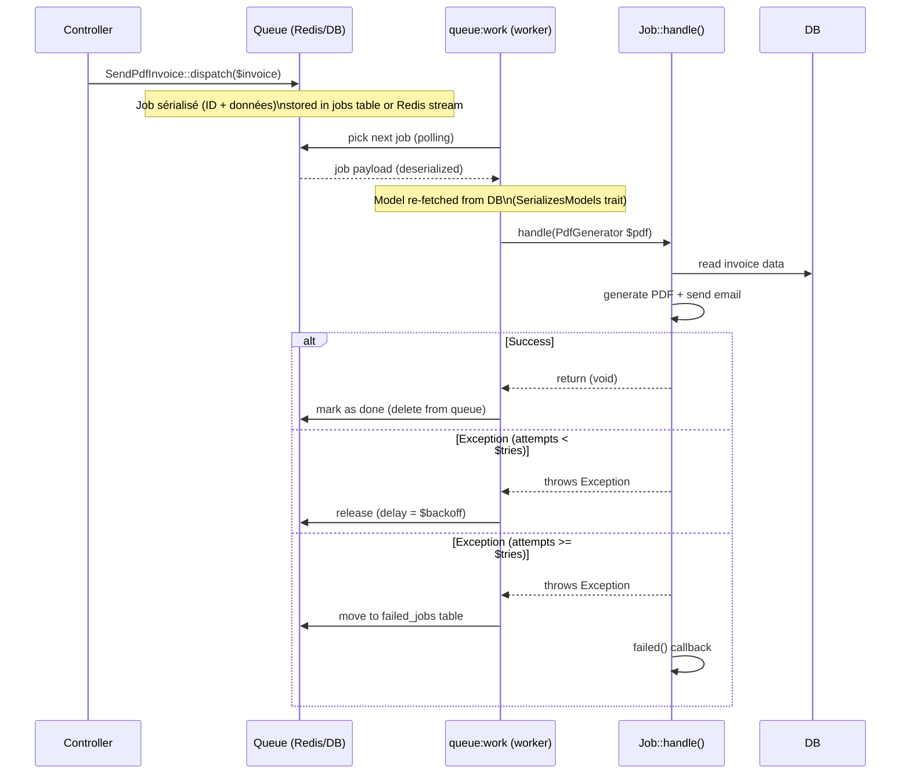

# Jobs & Queues vs Symfony Messenger

## Flux de vie d'un Job en queue

Comprendre ce diagramme permet d'éviter les pièges les plus courants (modèles
sérialisés périmés, jobs qui tournent en boucle, workers zombies).



> **Repère —** le trait `SerializesModels` ne sérialise pas l'objet entier : il
> ne stocke que la **classe + l'ID**. Quand le worker prend le job, il re-fetche le
> modèle depuis la DB. Si la facture a été supprimée entre le dispatch et l'exécution,
> le job reçoit un modèle `null` — à gérer dans `handle()`.

## Messenger vs Queue Laravel : comparaison directe

| | Symfony Messenger | Laravel Queue |
|---|---|---|
| Message | `class SmsMessage` | `class SendSmsJob implements ShouldQueue` |
| Handler | `class SmsMessageHandler` | méthode `handle()` dans le Job |
| Dispatch | `$bus->dispatch(new SmsMessage(...))` | `SendSmsJob::dispatch(...)` |
| Transport config | `messenger.yaml` (DSN) | `config/queue.php` + `.env QUEUE_CONNECTION` |
| Worker | `bin/console messenger:consume` | `php artisan queue:work` |
| Failed messages | `messenger:failed:show` | `php artisan queue:failed` |
| Retry | `messenger:failed:retry` | `php artisan queue:retry <id>` |

## Mapping Symfony Messenger → Laravel Queue

| | Symfony Messenger | Laravel Queue |
|---|---|---|
| **Définition** | `class SmsMessage` (DTO) + `class SmsHandler` | `class SendSmsJob` (tout-en-un) |
| **Séparation** | Message et Handler = 2 classes | Message + Handler = 1 seule classe |
| **Bus** | `$messageBus->dispatch(new SmsMessage(...))` | `SendSmsJob::dispatch(...)` |
| **Transports** | `messenger.yaml` (DSN : amqp/redis/doctrine) | `config/queue.php` + `.env QUEUE_CONNECTION` |
| **Worker** | `bin/console messenger:consume async` | `php artisan queue:work redis` |
| **Retry** | `messenger.yaml` : `max_retries`, `delay` | `$tries`, `$backoff` dans le Job |
| **Échecs** | `messenger:failed:show` / `messenger:failed:retry` | `queue:failed` / `queue:retry all` |
| **Middleware** | `HandlersLocator` + stamps | `Middleware` tableau dans le Job |
| **Batch** | `(n/a)` | `Bus::batch([...])` natif |
| **Horizon** | Messenger n'a pas d'équivalent GUI natif | Laravel Horizon (dashboard Redis) |

## Créer et dispatcher un Job

```bash
php artisan make:job SendPdfInvoice
```

```php
// app/Jobs/SendPdfInvoice.php
namespace App\Jobs;

use App\Models\Invoice;
use App\Services\PdfGenerator;
use Illuminate\Bus\Queueable;
use Illuminate\Contracts\Queue\ShouldQueue;
use Illuminate\Foundation\Bus\Dispatchable;
use Illuminate\Queue\InteractsWithQueue;
use Illuminate\Queue\SerializesModels;

class SendPdfInvoice implements ShouldQueue
{
    use Dispatchable, InteractsWithQueue, Queueable, SerializesModels;

    public int $tries = 3;       // max attempts
    public int $timeout = 120;   // timeout in seconds
    public int $backoff = 30;    // delay between attempts

    public function __construct(
        private readonly Invoice $invoice,
    ) {}

    public function handle(PdfGenerator $pdf): void
    {
        // DI works in handle() exactly like in a Controller
        // PdfGenerator is resolved from the container at job execution time

        // Guard: invoice may have been deleted since dispatch
        if (! $this->invoice->exists) {
            $this->fail(new \RuntimeException("Invoice #{$this->invoice->id} no longer exists."));
            return;
        }

        $pdfContent = $pdf->generateForInvoice($this->invoice);

        \Storage::put("invoices/invoice-{$this->invoice->id}.pdf", $pdfContent);

        \Mail::to($this->invoice->client->email)
             ->send(new \App\Mail\InvoiceReadyMailable($this->invoice));
    }

    public function failed(\Throwable $exception): void
    {
        // Called after ALL attempts are exhausted (equivalent of Messenger's FailedMessageHandlingEvent)
        \Log::error('SendPdfInvoice failed after all retries', [
            'invoice_id' => $this->invoice->id,
            'error'      => $exception->getMessage(),
        ]);
        // Optionally notify the client manager
        \Notification::send(
            \App\Models\User::managers()->get(),
            new \App\Notifications\InvoiceGenerationFailed($this->invoice)
        );
    }
}
```

```php
// Dispatch the job from a controller
SendPdfInvoice::dispatch($invoice);

// With delay (equivalent to delay() in Messenger)
SendPdfInvoice::dispatch($invoice)->delay(now()->addMinutes(5));

// On a specific queue
SendPdfInvoice::dispatch($invoice)->onQueue('pdf-generation');

// In batch (multiple parallel jobs, callback when all done)
use Illuminate\Bus\Batch;
use Illuminate\Support\Facades\Bus;

$batch = Bus::batch([
    new SendPdfInvoice($invoice1),
    new SendPdfInvoice($invoice2),
    new SendPdfInvoice($invoice3),
])->then(function (Batch $batch) {
    // All jobs succeeded
    \Log::info('All invoices generated');
})->catch(function (Batch $batch, \Throwable $e) {
    // At least one job failed
    \Log::error('Batch failed', ['error' => $e->getMessage()]);
})->dispatch();
```

> **⚠️ Piège agence — SerializesModels et données périmées.** Le Job sérialise l'ID du
> modèle, pas ses données. Si le worker traite le job 5 minutes après le dispatch, il
> re-fetche le modèle : la facture peut avoir changé de statut entre temps. C'est un
> comportement voulu (vous travaillez toujours avec les données les plus récentes), mais
> il peut surprendre si vous supposez que l'état au moment du dispatch est figé.

## Configuration des drivers de queue

```dotenv
# .env
QUEUE_CONNECTION=redis     # redis / database / sqs / sync / null
REDIS_HOST=127.0.0.1
REDIS_PORT=6379
```

```php
// config/queue.php — extrait
'connections' => [
    'redis' => [
        'driver'     => 'redis',
        'connection' => 'default',
        'queue'      => env('REDIS_QUEUE', 'default'),
        'retry_after' => 90,
        'block_for'  => null,
    ],
    'database' => [
        'driver' => 'database',
        'table'  => 'jobs',           // table to create via migrate
        'queue'  => 'default',
        'retry_after' => 90,
    ],
],
```

## Lancer le worker

```bash
# Worker consuming continuously (equivalent of messenger:consume async)
php artisan queue:work redis --queue=pdf-generation,default

# Process a single job then stop (useful for cron-based workers)
php artisan queue:work --once

# Restart workers gracefully after a deploy (they finish the current job then stop)
# Add this to your deploy script:
php artisan queue:restart

# Failed jobs management
php artisan queue:failed          # list all failed jobs
php artisan queue:retry all       # retry all failed jobs
php artisan queue:retry 42        # retry specific job by ID
php artisan queue:forget 42       # delete specific failed job
php artisan queue:flush            # delete ALL failed jobs

# Create the jobs table (database driver — simpler than Redis for small projects)
php artisan queue:table && php artisan migrate
php artisan queue:failed-table && php artisan migrate  # table for failed jobs
```

> **⚠️ Piège agence — workers et déploiement.** Comme Symfony Messenger, les workers
> Laravel gardent le code en mémoire. Après un déploiement, les workers doivent être
> redémarrés pour charger le nouveau code. `php artisan queue:restart` envoie un signal
> de redémarrage gracieux. En production avec Supervisor, configurez `stopasgroup=true`
> pour redémarrer proprement. Sans ça, vos workers exécutent l'ancien code indéfiniment.

## Artisan Commands : bin/console en Laravel

```bash
php artisan make:command SendMonthlyReport
```

```php
// app/Console/Commands/SendMonthlyReport.php
class SendMonthlyReport extends Command
{
    // Signature equivalent to configure() + addArgument/addOption in Symfony
    protected $signature = 'report:monthly
                            {--month= : Month to generate (YYYY-MM, defaults to last month)}
                            {--dry-run : Preview without sending}';

    protected $description = 'Generate and send the monthly activity report';

    public function handle(ReportService $reportService): int
    {
        $month  = $this->option('month') ?? now()->subMonth()->format('Y-m');
        $dryRun = $this->option('dry-run');

        $this->info("Generating report for $month...");

        $report = $reportService->generate($month);

        if ($dryRun) {
            $this->table(['Metric', 'Value'], $report->toTableRows());
            return Command::SUCCESS;
        }

        $reportService->sendToManagers($report);
        $this->info('Report sent successfully.');

        return Command::SUCCESS;
    }
}
```

```bash
php artisan report:monthly --month=2025-06
php artisan report:monthly --dry-run
```

> **Repère —** contrairement à Symfony, une commande Artisan n'a pas besoin d'être
> enregistrée dans `services.yaml` : elle est auto-découverte dans `app/Console/Commands/`.
> La DI fonctionne dans `handle()` exactement comme dans un Controller.

## Scheduler : l'équivalent du cron Symfony

Laravel dispose d'un scheduler intégré qui remplace la déclaration de multiples entrées
cron dans la crontab système. Une seule entrée cron suffit :

```bash
# Add ONE line to crontab (runs every minute)
* * * * * cd /var/www/html && php artisan schedule:run >> /dev/null 2>&1
```

```php
// app/Console/Kernel.php (Laravel 10) or bootstrap/app.php (Laravel 11+)
protected function schedule(Schedule $schedule): void
{
    // Run the monthly report every 1st of the month at 8:00 AM
    $schedule->command('report:monthly')
             ->monthlyOn(1, '08:00')
             ->emailOutputOnFailure('dev@agence.fr');

    // Run invoice reminder every weekday at 9 AM
    $schedule->job(new SendOverdueReminders())
             ->weekdays()
             ->at('09:00');

    // Prune old telescope records every day
    $schedule->command('telescope:prune --hours=48')->daily();
}
```

```bash
# Test the scheduler locally without waiting for cron
php artisan schedule:run

# List scheduled tasks with their next run time
php artisan schedule:list
```
