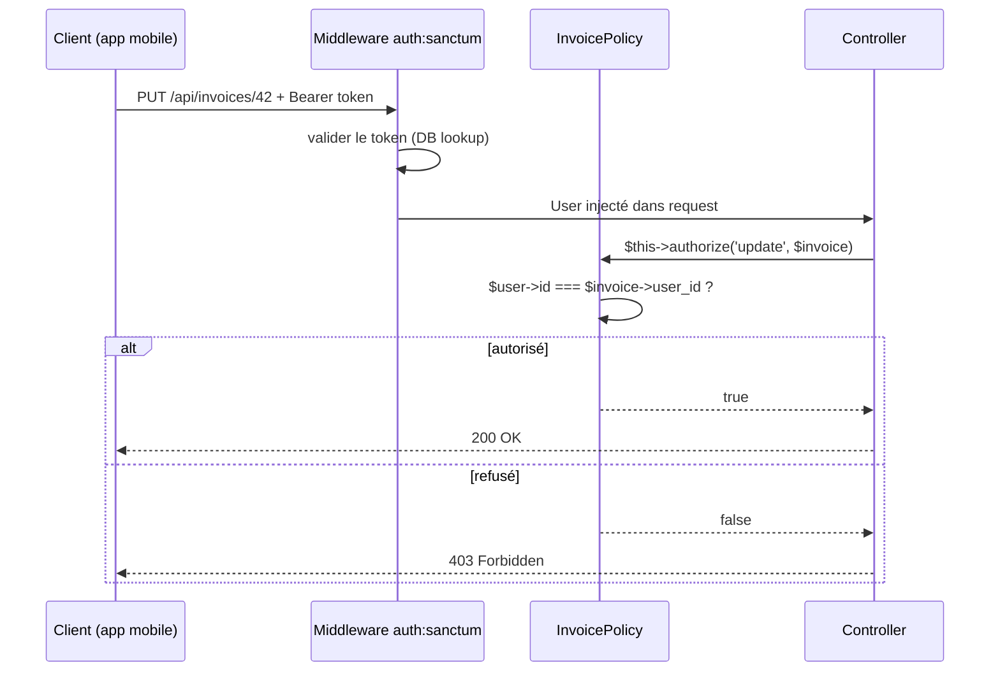

# Authentification : Sanctum / Passport vs Security Symfony

## Panorama des solutions d'auth Laravel

| Besoin | Laravel | Symfony |
|---|---|---|
| Auth web classique (session + cookie) | Guards intégrés | Security component + form_login |
| API tokens simples (SPA, mobile) | **Sanctum** | LexikJWT / API Platform JWT |
| OAuth2 complet (serveur d'autorisation) | **Passport** | League OAuth2 / KnpUOAuth2 |
| Scaffolding complet (vues + reset) | Breeze / Jetstream | SecurityBundle + EasyAdmin |

## Sanctum : le choix pour les missions d'agence

Sanctum est la solution recommandée pour **les SPA et les apps mobiles** qui
s'authentifient contre un backend Laravel. Il supporte deux modes :

1. **Cookies de session** (SPA same-domain) — sécurisé, pas de token à gérer côté JS
2. **API tokens** (mobile, scripts) — tokens opaques stockés en base

```bash
composer require laravel/sanctum
php artisan vendor:publish --provider="Laravel\Sanctum\SanctumServiceProvider"
php artisan migrate
```

## Mode API Token (le plus courant en mission)

```php
// app/Models/User.php — activer Sanctum
use Laravel\Sanctum\HasApiTokens;

class User extends Authenticatable
{
    use HasApiTokens, HasFactory, Notifiable;
}
```

```php
// routes/api.php
Route::post('/auth/login', [AuthController::class, 'login']);
Route::middleware('auth:sanctum')->group(function () {
    Route::post('/auth/logout', [AuthController::class, 'logout']);
    Route::get('/me', [AuthController::class, 'me']);
    Route::apiResource('invoices', InvoiceController::class);
});
```

```php
// app/Http/Controllers/AuthController.php
class AuthController extends Controller
{
    public function login(Request $request): JsonResponse
    {
        $credentials = $request->validate([
            'email'    => ['required', 'email'],
            'password' => ['required'],
        ]);

        if (! Auth::attempt($credentials)) {
            return response()->json(['message' => 'Invalid credentials'], 401);
        }

        $user  = Auth::user();
        // Revoke old tokens (optional)
        $user->tokens()->delete();

        $token = $user->createToken(
            name: 'api-token',
            abilities: ['invoices:read', 'invoices:write'],
            expiresAt: now()->addDays(30),
        )->plainTextToken;

        return response()->json(['token' => $token]);
    }

    public function logout(Request $request): JsonResponse
    {
        $request->user()->currentAccessToken()->delete();
        return response()->json(['message' => 'Logged out']);
    }

    public function me(Request $request): JsonResponse
    {
        return response()->json(new UserResource($request->user()));
    }
}
```

## Authorization : Policies et Gates

Laravel utilise des **Policies** (équivalent des Voters Symfony) pour l'autorisation
fine au niveau des ressources.

```bash
php artisan make:policy InvoicePolicy --model=Invoice
```

```php
// app/Policies/InvoicePolicy.php
class InvoicePolicy
{
    // Equivalent of Vote::ACCESS_GRANTED / ACCESS_DENIED in a Symfony Voter
    public function view(User $user, Invoice $invoice): bool
    {
        return $user->id === $invoice->user_id
            || $user->hasRole('accountant');
    }

    public function update(User $user, Invoice $invoice): bool
    {
        return $user->id === $invoice->user_id
            && $invoice->status === 'draft';
    }

    public function delete(User $user, Invoice $invoice): bool
    {
        return $user->id === $invoice->user_id
            || $user->hasRole('admin');
    }
}
```

```php
// Usage in a controller
public function update(UpdateInvoiceRequest $request, Invoice $invoice): JsonResponse
{
    $this->authorize('update', $invoice); // throws 403 if Policy returns false

    $invoice->update($request->validated());
    return response()->json(new InvoiceResource($invoice));
}
```

```php
// Or in a FormRequest
public function authorize(): bool
{
    $invoice = $this->route('invoice');
    return $this->user()->can('update', $invoice);
}
```

```php
// Route middleware
Route::put('/invoices/{invoice}', [InvoiceController::class, 'update'])
    ->middleware('can:update,invoice'); // 'invoice' = route parameter
```



> **Repère —** La Policy Laravel couvre les mêmes cas que le Voter Symfony, avec une
> syntaxe plus directe : pas de `supportsClass()`, pas de `voteOnAttribute()`, pas de
> constantes `ACCESS_*`. Une méthode = une permission = un retour booléen.
