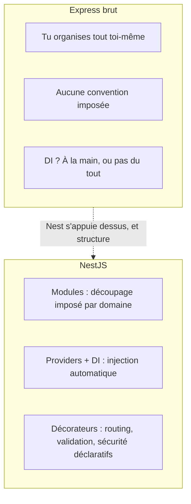

## Tu sais déjà router à la main

Dans le parcours Node.js précédent, tu as vu qu'un serveur HTTP natif
(`node:http`) t'oblige à tout écrire toi-même : comparer `req.url`, parser le
body, enchaîner des middlewares « à la main » (`(req, res, next) => ...`).
**Express** industrialise une partie de ça (routing déclaratif, middlewares
prêts à l'emploi), mais reste volontairement **minimaliste** : il ne t'impose
ni structure de dossiers, ni façon d'organiser tes dépendances.

```ts
// A perfectly valid, but UNSTRUCTURED, Express app.
// Everything lives in one file, nothing enforces organization.
import express from "express"

const app = express()
app.use(express.json())

// The database connection, business logic and HTTP handling
// are all mixed together, with no imposed boundary.
const users: { id: number; name: string }[] = []

app.get("/users", (req, res) => {
  res.json(users)
})

app.post("/users", (req, res) => {
  // Validation? Error handling? Where does this logic even belong?
  const user = { id: users.length + 1, name: req.body.name }
  users.push(user)
  res.status(201).json(user)
})

app.listen(3000)
```

Sur un petit script, ça va très bien. Sur une application de dix, vingt,
cinquante routes, avec plusieurs développeurs, ce fichier explose : rien
n'empêche de mélanger accès aux données, validation et logique HTTP dans le
même handler, et rien ne dit comment organiser le projet. **Chaque équipe
invente sa propre convention.**

> **Symfony → NestJS.** Tu as déjà vécu cette tension côté PHP : **Silex**
> (ou Slim) laissait la même liberté totale — un micro-framework qui route
> des requêtes, point. **Symfony**, lui, est un framework **structurant** :
> il impose une organisation (`src/Controller`, `src/Entity`,
> `src/Repository`), un conteneur de services avec autowiring, une
> configuration centralisée (`services.yaml`, `config/packages/`). NestJS
> joue exactement ce rôle **au-dessus** d'Express (ou de Fastify) : il ne
> remplace pas le serveur HTTP, il lui ajoute une **architecture**.

## NestJS : Express (ou Fastify) + une architecture imposée

NestJS n'invente pas un nouveau serveur HTTP : par défaut, il utilise
**Express en interne** (remplaçable par Fastify pour la performance, sans
changer ton code métier). Ce qu'il ajoute, c'est une couche d'organisation
empruntée à **Angular** : modules, injection de dépendances, décorateurs.



Concrètement, la même intention ci-dessus, en NestJS :

```ts
// users.controller.ts — HTTP concerns ONLY: routes, status codes
import { Body, Controller, Get, Post } from "@nestjs/common"
import { UsersService } from "./users.service"
import { CreateUserDto } from "./create-user.dto"

@Controller("users")
export class UsersController {
  // The service is INJECTED, never instantiated by hand here.
  constructor(private readonly usersService: UsersService) {}

  @Get()
  findAll() {
    return this.usersService.findAll()
  }

  @Post()
  create(@Body() dto: CreateUserDto) {
    return this.usersService.create(dto)
  }
}
```

```ts
// users.service.ts — business logic ONLY, no knowledge of HTTP
import { Injectable } from "@nestjs/common"

@Injectable()
export class UsersService {
  private users: { id: number; name: string }[] = []

  findAll() {
    return this.users
  }

  create(data: { name: string }) {
    const user = { id: this.users.length + 1, name: data.name }
    this.users.push(user)
    return user
  }
}
```

Chaque fichier a **une responsabilité claire** : le contrôleur ne connaît que
HTTP (routes, codes de statut), le service ne connaît que la logique métier.
C'est exactement la séparation `Controller` / `Service` que tu pratiques déjà
en Symfony.

> **Réflexe à prendre.** Face à du code NestJS, pose-toi la même question
> qu'en Symfony : « est-ce que ce bout de logique répond à une requête HTTP
> (→ contrôleur), ou est-ce une règle métier réutilisable (→ service) ? »
> Le réflexe est identique, seule la syntaxe change.

## Ce que ça t'apporte concrètement

- **Testabilité** : `UsersService` se teste seul, sans monter de serveur HTTP
  (comme un service Symfony testé sans `WebTestCase`).
- **Cohérence d'équipe** : la structure est imposée par le framework, pas
  négociée projet par projet.
- **Écosystème intégré** : validation (`class-validator`), ORM (TypeORM,
  Prisma), tests (`@nestjs/testing`), configuration (`@nestjs/config`) — tous
  pensés pour s'emboîter, comme les composants officiels de Symfony
  (`symfony/validator`, `symfony/security-bundle`, Doctrine).

> ⚠️ **Erreur fréquente — croire que Nest remplace Node/Express.** NestJS
> est une **surcouche** : au démarrage (`main.ts`), Nest crée en interne une
> application Express (ou Fastify) tout à fait normale. Tu peux toujours,
> si besoin, accéder à l'instance Express sous-jacente. Nest structure,
> il ne remplace rien de ce que tu as appris sur Node.

## À retenir

- Express (comme Silex/Slim côté PHP) route des requêtes **sans imposer de
  structure** : pratique pour un script, ingérable en équipe sur un vrai
  projet.
- NestJS s'appuie **sur** Express (ou Fastify) et ajoute, façon Angular, une
  architecture par **modules**, une **injection de dépendances**, et des
  **décorateurs** déclaratifs — le même rôle que joue Symfony au-dessus du
  HTTP brut.
- Le réflexe Symfony **contrôleur (HTTP) / service (métier)** se transpose
  directement en NestJS : `@Controller` d'un côté, `@Injectable` de l'autre.
