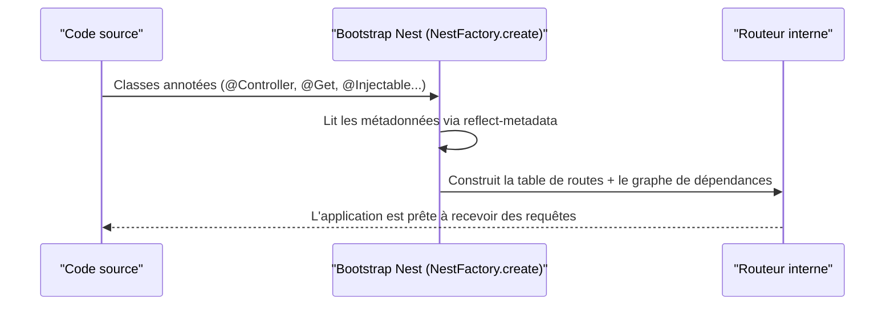

## Un concept que tu connais déjà, sous un autre nom

Un **décorateur** TypeScript est une fonction spéciale, préfixée par `@`,
posée sur une classe, une méthode, une propriété ou un paramètre. Il
n'exécute (en général) rien « en direct » : il **attache une métadonnée**
que le framework ira lire plus tard, au démarrage.

```ts
@Controller("products")   // metadata: "this class handles /products"
export class ProductsController {
  @Get(":id")              // metadata: "this method handles GET /products/:id"
  findOne(@Param("id") id: string) {   // metadata: "inject the :id route param here"
    return { id }
  }
}
```

> **Symfony → NestJS.** C'est **exactement** l'esprit des attributs PHP 8
> que tu utilises tous les jours :
>
> ```php
> #[Route('/products/{id}', methods: ['GET'])]
> public function findOne(string $id): Response { /* ... */ }
> ```
>
> `#[Route(...)]` n'exécute rien à la ligne où il est écrit : c'est une
> **métadonnée** que le routeur Symfony lit au chargement du kernel pour
> construire sa table de routes. `@Get(":id")` fait **rigoureusement la
> même chose** côté Nest, lu par le module de routing au bootstrap.

Tu as même **déjà vu des décorateurs** si tu as touché à Angular :
`@Component`, `@Injectable`, `@Input`. NestJS **reprend volontairement** le
même système de décorateurs qu'Angular (les deux s'appuient sur
`reflect-metadata`) — logique, puisque Nest a été pensé, dès le départ,
comme « **Angular côté serveur** ».

## Comment ça marche « sous le capot »

Un décorateur est une fonction qui reçoit la cible qu'il décore et enregistre
une métadonnée dessus (via `Reflect.defineMetadata`, fourni par le paquet
`reflect-metadata`). Voici, très simplifié, l'idée derrière `@Controller` :

```ts
// SIMPLIFIED illustration of what @Controller roughly does internally.
// You never write this yourself: it is provided by @nestjs/common.
function Controller(prefix: string) {
  return function (target: Function) {
    Reflect.defineMetadata("path", prefix, target)
  }
}
```

Au démarrage, Nest **parcourt** toutes les classes marquées `@Controller`,
lit leurs métadonnées (préfixe de route, méthodes HTTP, paramètres à
injecter...) et construit sa table de routing — un mécanisme très proche de
la **compilation du conteneur de services** Symfony, qui lit les attributs
`#[Route]`, `#[AsEventListener]` ou la config `services.yaml` pour bâtir son
propre graphe au démarrage (mise en cache en environnement de prod).



> ⚠️ **Erreur fréquente — croire qu'un décorateur « exécute » du code métier.**
> `@Get("/users")` ne traite pas la requête : il **déclare** que la méthode
> en dessous **doit** être appelée quand une requête `GET /users` arrive.
> Le vrai traitement se passe dans le **corps de la méthode**, exactement
> comme `#[Route]` ne fait que déclarer un chemin vers une action Symfony.

## Les décorateurs que tu vas croiser tout le temps

| Décorateur Nest | Rôle | Équivalent Symfony |
|---|---|---|
| `@Module({...})` | Déclare un module (providers, controllers, imports) | Un *bundle*, ou le regroupement logique d'un `services.yaml` |
| `@Injectable()` | Marque une classe comme provider injectable | Service déclaré (autowire par défaut) |
| `@Controller('path')` | Déclare un contrôleur et son préfixe de route | `#[Route('/path')]` sur une classe |
| `@Get()`, `@Post()`, `@Put()`, `@Delete()`, `@Patch()` | Méthode HTTP + chemin d'une route | `#[Route(..., methods: ['GET'])]` |
| `@Body()`, `@Param()`, `@Query()`, `@Headers()` | Injecte une partie de la requête dans un paramètre | `Request $request`, ou un `ParamConverter` |
| `@UseGuards(...)` | Protège une route/un contrôleur | Voter de sécurité / `#[IsGranted]` |
| `@UsePipes(...)` | Transforme/valide une entrée avant le handler | Validator + transformation de type |
| `@Injectable()` + `@Inject(TOKEN)` | Injection par jeton explicite | Alias de service dans `services.yaml` |

Tu n'as pas besoin de mémoriser ce tableau maintenant : chaque module de ce
parcours en détaille une partie, avec des exemples. Retiens surtout **le
principe** : un décorateur = une métadonnée déclarative, lue par Nest au
démarrage.

> 💡 **À retenir.** Les décorateurs ne sont pas une bizarrerie propre à
> Nest : c'est le **même mécanisme** que les attributs PHP 8 (`#[Route]`,
> `#[ORM\Entity]`) et que les décorateurs Angular (`@Component`,
> `@Injectable`). Une fois ce pont fait, la syntaxe Nest cesse d'être
> « magique ».

## À retenir

- Un décorateur (`@Xxx`) attache une **métadonnée** à une classe/méthode/
  paramètre ; il ne l'exécute pas directement — le framework la **lit** au
  démarrage.
- C'est l'exact équivalent des **attributs PHP 8** (`#[Route]`,
  `#[ORM\Column]`) : même idée, syntaxe différente.
- NestJS **reprend le système de décorateurs d'Angular** : si tu as déjà vu
  `@Component`/`@Injectable`, tu connais déjà la moitié du chemin.
- Retiens le tableau des décorateurs courants comme une carte de repères ;
  chaque module suivant en creuse un sous-ensemble en détail.
