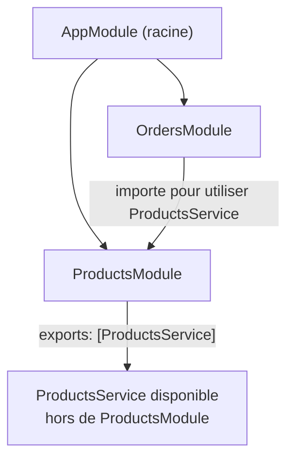

## Le module, unité de découpage de l'application

Une application NestJS est un **arbre de modules**. Chaque module regroupe
ce qui appartient à un même domaine fonctionnel : ses contrôleurs (routes
HTTP), ses providers (services), et ce qu'il souhaite rendre disponible aux
autres modules.

```ts
// products.module.ts
import { Module } from "@nestjs/common"
import { ProductsController } from "./products.controller"
import { ProductsService } from "./products.service"

@Module({
  imports: [],                          // other modules this one depends on
  controllers: [ProductsController],    // routes owned by this module
  providers: [ProductsService],         // injectable services owned by this module
  exports: [ProductsService],           // what OTHER modules importing this one can use
})
export class ProductsModule {}
```

| Clé de `@Module` | Rôle |
|---|---|
| `imports` | Autres modules dont celui-ci a besoin (leurs `exports` deviennent utilisables ici) |
| `controllers` | Contrôleurs HTTP appartenant à ce module |
| `providers` | Services injectables, visibles **dans ce module uniquement**, sauf `exports` |
| `exports` | Sous-ensemble des `providers` rendu disponible aux modules qui **importent** celui-ci |

> **Symfony → NestJS.** Un module Nest correspond, dans l'esprit, à un
> regroupement de services dans `services.yaml` (voire à un **bundle**
> Symfony pour les modules réutilisables entre projets) : on déclare quels
> services existent. Nuance importante : en Symfony, un service est
> **autowirable globalement** — pas de notion d'encapsulation par module,
> n'importe quel service peut être injecté partout dans l'application
> (que le service soit public ou privé ne change que l'accès direct via
> `$container->get(...)`, pas l'autowiring). Nest fait l'inverse : il
> **encapsule**. Un provider n'est visible que dans son propre module, sauf
> s'il est explicitement listé dans `exports` — cette barrière de visibilité
> par module n'a pas d'équivalent natif en Symfony.

## Modules « feature » et module racine

Sur un vrai projet, on ne met **jamais** tout dans `AppModule` : chaque
domaine (produits, commandes, utilisateurs...) a son propre module, importé
par le module racine.

```ts
// app.module.ts
import { Module } from "@nestjs/common"
import { ProductsModule } from "./products/products.module"
import { OrdersModule } from "./orders/orders.module"

@Module({
  imports: [ProductsModule, OrdersModule],
})
export class AppModule {}
```



> **Réflexe à prendre.** Découpe par **domaine métier** (produits,
> commandes, facturation...), pas par couche technique. C'est la même
> logique qu'organiser `src/` par *bundle* fonctionnel plutôt que de tout
> entasser dans un seul `src/Service/` géant.

## Un provider veut être utilisé ailleurs ? Il doit être exporté

Si `OrdersModule` a besoin de `ProductsService` (pour vérifier qu'un produit
existe avant de créer une commande), **deux conditions** sont nécessaires :

1. `ProductsModule` doit lister `ProductsService` dans `exports`.
2. `OrdersModule` doit lister `ProductsModule` dans `imports`.

```ts
// orders.module.ts
import { Module } from "@nestjs/common"
import { ProductsModule } from "../products/products.module"
import { OrdersController } from "./orders.controller"
import { OrdersService } from "./orders.service"

@Module({
  imports: [ProductsModule],     // unlocks access to ProductsService
  controllers: [OrdersController],
  providers: [OrdersService],
})
export class OrdersModule {}
```

> ⚠️ **Erreur fréquente — oublier `exports`.** Sans `exports`, un provider
> reste **privé** à son module : l'injecter ailleurs lève une erreur
> explicite au démarrage (« Nest can't resolve dependencies... »). C'est
> voulu : ça t'oblige à décider consciemment ce qu'un module rend public,
> plutôt que de tout exposer par défaut.

## À retenir

- `@Module({ imports, controllers, providers, exports })` est l'unité de
  base de l'organisation Nest — pense-le comme un regroupement de services
  par domaine, pas par couche technique.
- Un provider est **privé à son module** par défaut ; il faut l'`export`er
  explicitement pour qu'un autre module l'utilise (après l'avoir `import`é).
- L'application entière est un **arbre de modules**, assemblé depuis
  `AppModule` — le graphe que Nest résout entièrement au démarrage.
