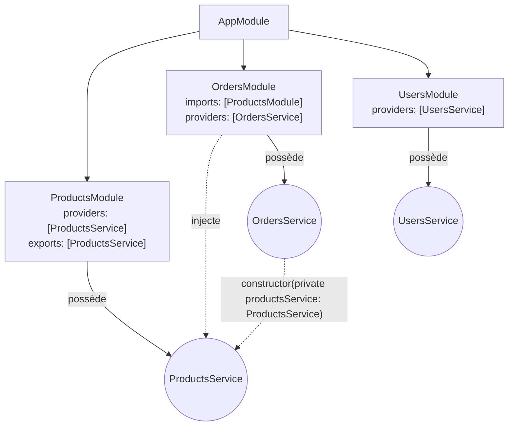

## Comment Nest construit l'application au démarrage

Quand tu appelles `NestFactory.create(AppModule)`, Nest ne devine rien : il
**parcourt** récursivement tout l'arbre de modules déclaré, module après
module, en résolvant chaque dépendance de constructeur.



Ce que ce schéma illustre :

- Chaque **module** possède ses providers (`ProductsService`,
  `OrdersService`, `UsersService`).
- `OrdersService` **injecte** `ProductsService` dans son constructeur : Nest
  résout cette dépendance en cherchant, dans l'ordre, (1) les providers du
  module courant, puis (2) ceux **exportés** par les modules importés.
- `UsersModule` n'importe pas `ProductsModule` : il ne peut **pas** injecter
  `ProductsService` — l'encapsulation par module est stricte.

> **Symfony → NestJS.** C'est exactement le graphe que Symfony construit et
> **compile en cache** (`var/cache/.../*Container.php`, visible en dev via
> `bin/console debug:container`) : chaque service connaît ses dépendances
> déclarées (constructeur typé, autowiring), et le conteneur les résout une
> fois, dans le bon ordre topologique.

## L'ordre de résolution, concrètement

1. Nest lit `AppModule`, découvre ses `imports`.
2. Pour chaque module importé, il répète l'opération (récursivement) : ses
   propres `imports`, `providers`, `exports`.
3. Une fois tous les modules « connus », Nest instancie les **providers**
   dans l'ordre de leurs dépendances : un provider n'est construit
   **qu'une fois** toutes ses dépendances de constructeur elles-mêmes
   construites.
4. Enfin, les **contrôleurs** sont instanciés (avec leurs propres
   dépendances injectées), et le routeur HTTP est assemblé.

> 💡 **À retenir.** Tu peux inspecter ce graphe : `bin/console
> debug:container` en Symfony trouve son écho, côté Nest, dans les logs de
> démarrage (`[NestFactory] ProductsModule dependencies initialized`) ou
> dans la CLI de debug de Nest. En cas d'erreur d'injection, Nest **nomme
> précisément** le provider et le module en cause — lis toujours ce message
> en premier avant de chercher plus loin.

## Le piège des dépendances circulaires

Deux services qui s'injectent mutuellement créent un cycle que Nest ne peut
pas résoudre naïvement (impossible de construire A avant B si B a besoin
de A, et inversement) :

```ts
// ❌ Circular dependency: NestJS throws at startup
@Injectable()
export class OrdersService {
  constructor(private readonly usersService: UsersService) {}
}

@Injectable()
export class UsersService {
  constructor(private readonly ordersService: OrdersService) {}
}
```

Nest fournit un échappatoire explicite, `forwardRef`, pour les cas où le
cycle est réellement nécessaire (rare — c'est souvent le signe qu'un
découpage de domaine est à revoir) :

```ts
import { Inject, forwardRef, Injectable } from "@nestjs/common"

@Injectable()
export class OrdersService {
  constructor(
    @Inject(forwardRef(() => UsersService))
    private readonly usersService: UsersService,
  ) {}
}
```

> ⚠️ **Erreur fréquente — traiter `forwardRef` comme la solution par
> défaut.** `forwardRef` **contourne** le problème, il ne le résout pas
> proprement. Une dépendance circulaire signale souvent une **frontière de
> domaine mal placée** : le bon réflexe est d'abord de se demander si une
> partie de la logique ne devrait pas être extraite dans un **troisième
> module**, dont les deux premiers dépendraient — exactement le réflexe
> qu'on a en Symfony face à deux services qui s'appellent mutuellement.

## À retenir

- Nest résout **tout le graphe de dépendances au démarrage** : modules
  importés, providers, contrôleurs — dans cet ordre, récursivement.
- Un provider n'est visible que dans son module, sauf export explicite
  (rappel du module précédent) : l'arbre de modules **encapsule**.
- Une dépendance circulaire lève une erreur explicite ; `forwardRef` est un
  échappatoire, pas une solution de confort — préfère revoir le découpage
  en modules.
- En cas d'erreur d'injection au démarrage, **le message d'erreur nomme le
  provider et le module fautifs** : c'est le point de départ du debug.
