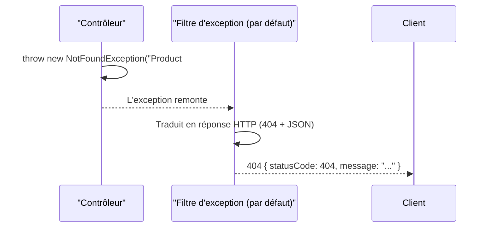

## Un `return` devient automatiquement une réponse JSON

```ts
@Get(":id")
findOne(@Param("id") id: string) {
  // Returning a plain object/array: Nest serializes it to JSON automatically,
  // sets Content-Type: application/json, and responds 200 OK.
  return { id, name: "Mechanical Keyboard", price: 89 }
}
```

> **Symfony → NestJS.** Tu n'as pas besoin d'appeler explicitement
> `new JsonResponse(...)` ou `$this->json(...)` à chaque route : Nest le
> fait pour toi dès que la valeur retournée n'est ni un flux, ni déjà un
> objet de réponse. C'est plus proche du comportement d'un `#[Route]` API
> Platform, qui sérialise automatiquement la ressource retournée.

## Signaler une erreur : les exceptions HTTP intégrées

Plutôt que de construire une réponse d'erreur à la main, Nest fournit des
**exceptions préconstruites**, chacune associée à un code de statut :

```ts
import { Controller, Get, NotFoundException, Param } from "@nestjs/common"

@Controller("products")
export class ProductsController {
  constructor(private readonly productsService: ProductsService) {}

  @Get(":id")
  findOne(@Param("id") id: string) {
    const product = this.productsService.findOne(Number(id))
    if (!product) {
      // Throwing this: Nest catches it and responds 404 with a JSON body
      // { "statusCode": 404, "message": "Product #42 not found" }
      throw new NotFoundException(`Product #${id} not found`)
    }
    return product
  }
}
```

| Exception Nest | Code HTTP | Équivalent Symfony |
|---|---|---|
| `BadRequestException` | 400 | `throw new BadRequestHttpException(...)` |
| `UnauthorizedException` | 401 | `throw new AccessDeniedException(...)` (non authentifié) |
| `ForbiddenException` | 403 | `throw new AccessDeniedException(...)` (authentifié, pas autorisé) |
| `NotFoundException` | 404 | `throw new NotFoundHttpException(...)`, `throw $this->createNotFoundException(...)` |
| `ConflictException` | 409 | Exception métier custom + status 409 |
| `InternalServerErrorException` | 500 | Toute exception non attrapée en Symfony |

> **Symfony → NestJS.** Le mécanisme est identique : lever une exception
> **interrompt** l'exécution normale, et un mécanisme central (le
> `HttpExceptionFilter` par défaut de Nest, l'`ExceptionListener` du kernel
> HTTP côté Symfony) la traduit en réponse HTTP appropriée. Tu n'écris
> jamais toi-même le code qui construit la réponse d'erreur : tu lèves une
> exception **sémantique**, et le framework se charge du reste.



> 💡 **À retenir.** Le module 5 (Pipes, Guards, Interceptors, Middleware,
> Exception filters) détaille comment **personnaliser** ce comportement
> avec un `@Catch()` custom — pour l'instant, retiens que les exceptions
> intégrées suffisent à 90 % des besoins courants.

## À retenir

- Un `return` d'objet/tableau devient automatiquement une réponse JSON
  `200 OK` (ou `201` pour un `@Post()`) — pas de sérialisation manuelle.
- Les exceptions HTTP intégrées (`NotFoundException`,
  `BadRequestException`...) traduisent automatiquement une erreur métier en
  réponse HTTP correcte — le pendant des `HttpException` Symfony.
- Ce mécanisme s'appuie sur un **filtre d'exception** central, personnalisable
  (vu en détail au module 5).
