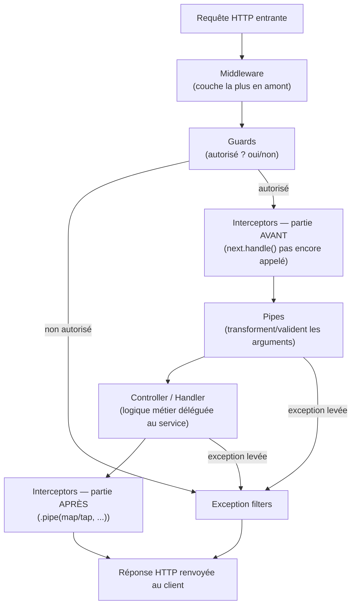

## Exception filters : personnaliser la traduction erreur → réponse

Tu as vu (module 3) que Nest traduit automatiquement une exception HTTP
(`NotFoundException`, `BadRequestException`...) en réponse JSON adaptée,
via un **filtre d'exception par défaut**. Un filtre **custom** permet de
personnaliser ce comportement — format de réponse, log centralisé, etc.

```ts
import { ArgumentsHost, Catch, ExceptionFilter, HttpException } from "@nestjs/common"
import { Request, Response } from "express"

@Catch(HttpException)   // only handles exceptions of this type (or a subclass)
export class HttpExceptionFilter implements ExceptionFilter {
  catch(exception: HttpException, host: ArgumentsHost) {
    const context = host.switchToHttp()
    const response = context.getResponse<Response>()
    const request = context.getRequest<Request>()
    const status = exception.getStatus()

    response.status(status).json({
      statusCode: status,
      path: request.url,
      timestamp: new Date().toISOString(),
      message: exception.message,
    })
  }
}
```

```ts
@Get(":id")
@UseFilters(HttpExceptionFilter)   // or app.useGlobalFilters(...) in main.ts
findOne(@Param("id", ParseIntPipe) id: number) {
  // ...
}
```

> **Symfony → NestJS.** C'est l'équivalent direct de l'`ExceptionListener`
> du kernel HTTP Symfony (l'écoute de l'événement `kernel.exception`) : un
> point central où **toute** exception non gérée est traduite en réponse
> HTTP cohérente, avec un format de log/JSON personnalisable une bonne
> fois pour toutes.

## Le cycle de vie complet d'une requête Nest

Chaque brique vue dans ce module (Middleware, Guards, Interceptors, Pipes,
Exception filters) a sa place dans un **ordre précis**, qu'il est essentiel
de mémoriser :



| Étape | Peut arrêter la chaîne ? | Rôle | Équivalent Symfony |
|---|---|---|---|
| **Middleware** | Oui (ex. CORS preflight) | Le plus en amont, avant le routing | `kernel.request` |
| **Guards** | Oui (`403` si refusé) | Autorisation binaire | Voters / `#[IsGranted]` |
| **Interceptors (avant)** | Non (mais peut enrichir le contexte) | Logging, timing | `kernel.controller` |
| **Pipes** | Oui (`400` si transformation/validation échoue) | Transformer/valider un argument | ParamConverter / Validator |
| **Controller / Handler** | Oui (exception métier) | Logique HTTP, délègue au service | Action de contrôleur |
| **Interceptors (après)** | Non (transforme la réponse) | Enveloppe, cache, mapping de réponse | `kernel.view` / `kernel.response` |
| **Exception filters** | — (point d'arrivée des erreurs) | Traduit toute exception en réponse HTTP | `kernel.exception` |

> ⚠️ **Erreur fréquente — confondre l'ordre Guards / Pipes.** Les **Guards**
> s'exécutent **avant** les Pipes : Nest vérifie d'abord *le droit
> d'accès*, avant même de perdre du temps à transformer/valider les
> arguments d'une requête qui, de toute façon, sera refusée. Retiens l'ordre
> dans ce sens précis : **Middleware → Guards → Interceptors (avant) →
> Pipes → Handler → Interceptors (après) → Exception filters**.

> 💡 **À retenir.** Ce diagramme est la carte mentale la plus utile de tout
> ce module : à chaque bug (« pourquoi mon token n'est pas vérifié avant la
> validation du body ? », « pourquoi ma transformation de réponse
> n'inclut-elle pas les erreurs ? »), reviens à cet ordre précis pour savoir
> **où** intervenir.

## À retenir

- Le cycle de vie d'une requête Nest suit un ordre fixe : **Middleware →
  Guards → Interceptors (avant) → Pipes → Controller/Handler →
  Interceptors (après) → Exception filters**.
- Un `@Catch(...)` custom personnalise la traduction erreur → réponse HTTP,
  l'équivalent d'un `ExceptionListener` sur `kernel.exception` en Symfony.
- Chaque brique de ce module a un rôle **précis et non interchangeable** :
  connaître leur ordre d'exécution évite l'essentiel des bugs de plomberie
  transverse.
