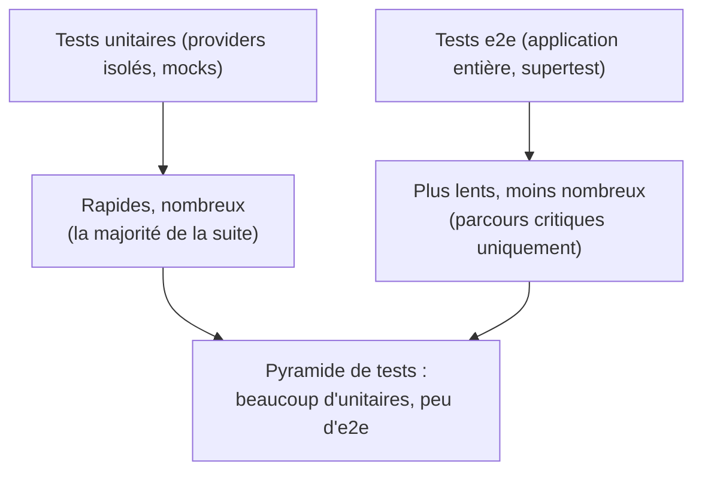

## Tester l'application entière, en vraies requêtes HTTP

Un test **e2e** (*end-to-end*) démarre l'application Nest **en entier**
(vrai routing, vrais Guards, vraie `ValidationPipe`...) et lui envoie de
vraies requêtes HTTP, via la librairie **supertest** — sans jamais ouvrir un
port réseau réel.

```ts
// test/products.e2e-spec.ts
import { INestApplication, ValidationPipe } from "@nestjs/common"
import { Test, TestingModule } from "@nestjs/testing"
import * as request from "supertest"
import { AppModule } from "../src/app.module"

describe("Products (e2e)", () => {
  let app: INestApplication

  beforeAll(async () => {
    const moduleFixture: TestingModule = await Test.createTestingModule({
      imports: [AppModule],   // the WHOLE application, wired exactly like in production
    }).compile()

    app = moduleFixture.createNestApplication()
    app.useGlobalPipes(new ValidationPipe({ whitelist: true }))   // mirrors main.ts
    await app.init()
  })

  afterAll(async () => {
    await app.close()
  })

  it("GET /products returns the product list", () => {
    return request(app.getHttpServer())
      .get("/products")
      .expect(200)
      .expect((res) => {
        expect(Array.isArray(res.body)).toBe(true)
      })
  })

  it("POST /products rejects an invalid body", () => {
    return request(app.getHttpServer())
      .post("/products")
      .send({ name: "A" })   // missing/invalid fields: too short, no price
      .expect(400)
  })

  it("POST /products creates a product with a valid body", () => {
    return request(app.getHttpServer())
      .post("/products")
      .send({ name: "Mechanical Keyboard", price: 89 })
      .expect(201)
      .expect((res) => {
        expect(res.body.name).toBe("Mechanical Keyboard")
      })
  })
})
```

> **Symfony → NestJS.** C'est l'équivalent direct d'un test
> `WebTestCase` Symfony : `$client->request('GET', '/products')` +
> `$this->assertResponseIsSuccessful()` deviennent
> `request(app.getHttpServer()).get('/products').expect(200)`. Les deux
> démarrent une **vraie** application (routing, middlewares, validation
> compris) sans passer par un vrai serveur réseau écoutant un port.

## Unitaire vs e2e : quand utiliser lequel ?



| Test | Vérifie | Vitesse | Équivalent Symfony |
|---|---|---|---|
| **Unitaire** (`*.spec.ts`) | La logique d'**un** provider, en isolation | Millisecondes | `PHPUnit\Framework\TestCase` / `KernelTestCase` |
| **e2e** (`*.e2e-spec.ts`) | Le comportement HTTP **réel** de bout en bout | Plus lent (centaines de ms) | `WebTestCase` |

> ⚠️ **Erreur fréquente — ne tester qu'en e2e.** Tout vérifier via des
> requêtes HTTP complètes est tentant (« ça teste vraiment tout ! ») mais
> lent et fragile (un test e2e casse pour des raisons parfois sans rapport
> avec ce qu'il est censé vérifier). Réserve l'e2e aux **parcours
> critiques** (créer une commande, s'authentifier...) ; couvre la logique
> métier fine avec des tests **unitaires**, rapides et ciblés.

## À retenir

- Un test e2e démarre l'application **entière** (`Test.createTestingModule
  ({ imports: [AppModule] })`) et l'interroge via `supertest` — le pendant
  d'un `WebTestCase` Symfony.
- Réplique dans le test ce que fait vraiment `main.ts` (ex.
  `app.useGlobalPipes(...)`), sinon le test e2e ne reflète pas le
  comportement réel de production.
- Privilégie une **pyramide de tests** : beaucoup d'unitaires rapides, peu
  d'e2e réservés aux parcours critiques.
