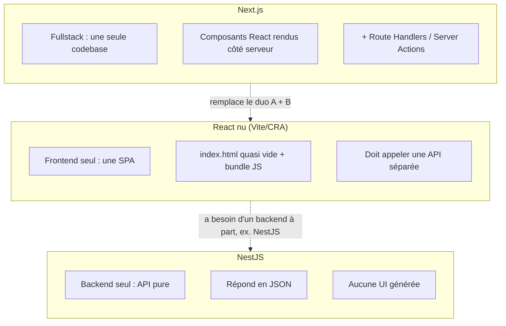

## Tu connais React. Next.js ajoute quoi ?

Tu maîtrises déjà les composants, le JSX et les hooks (`useState`, `useEffect`...) via le parcours React — ce cours ne les réexplique **pas**. Next.js ne remplace rien de tout ça : il **encadre** React avec trois choses que React, seul, n'a jamais fournies :

1. Un **routing par fichiers** (l'arborescence de dossiers *devient* les URLs — pas de `<Route path="...">` à écrire).
2. Un **rendu côté serveur par défaut** (le HTML arrive déjà rempli au navigateur, avant même que le JS ne s'exécute).
3. Un **backend intégré, dans la même codebase** (des routes d'API, des mutations serveur) — Next.js est **fullstack**.

> **Réflexe à prendre.** Quand tu vois « Next.js », ne pense pas « React amélioré », pense « **framework fullstack** dont React n'est qu'une brique (le rendu de vue) ».

## Le piège : Next.js n'est PAS backend pur (contrairement à NestJS)

Tu viens de voir NestJS : un framework **backend pur**, qui ne rend **aucune UI** — il répond en JSON, point. C'est le parallèle direct d'une API Symfony consommée par un frontend séparé (une SPA React, une app mobile...).

Next.js joue dans une **autre catégorie** :



> **NestJS vs Next.js.** NestJS = **backend pur** (comme une API Symfony) : tu écris tes contrôleurs/services, un frontend *séparé* (React, mobile...) l'appelle en HTTP. Next.js = **fullstack** : le composant React qui affiche une page et le code qui va chercher les données en base peuvent vivre **dans le même fichier**. Ce n'est plus « frontend qui appelle un backend », c'est une seule application qui fait les deux.

## Pourquoi pas React nu (Vite/CRA) pour la plupart des apps ?

Un projet Vite/CRA reste une **SPA** (*Single Page Application*) : le serveur ne renvoie qu'un `index.html` presque vide, et **tout** — routing, rendu, données — se passe dans le navigateur après le chargement du bundle JS. Conséquences concrètes :

- Le premier affichage attend que le JS soit téléchargé **et** exécuté (mauvais pour le SEO, mauvais sur mobile/réseau lent).
- Aucune donnée n'est disponible avant que le composant ne se monte et ne lance un `useEffect` + `fetch`.

Next.js peut envoyer un **HTML déjà rempli** (rendu sur le serveur), avec les données déjà dedans — le navigateur n'a plus qu'à afficher, puis « brancher » l'interactivité par-dessus (l'*hydratation*, vue en détail au module 2).

> **Symfony → Next.js.** Une app Symfony classique fait déjà du rendu serveur (Twig génère le HTML avant de l'envoyer), mais sans aucune interactivité riche côté client sans JS additionnel. Une SPA React fait l'inverse : tout côté client, rien côté serveur. **Next.js fait les deux à la fois** : HTML rendu serveur (comme Twig) **et** interactivité riche côté client (comme React) — sur les *mêmes* composants.

## Comment démarrer un projet

```bash
# Scaffolds a new Next.js app (App Router is the default choice today)
npx create-next-app@latest my-app
cd my-app
npm run dev
```

Le CLI propose TypeScript, ESLint et le App Router par défaut : accepte les valeurs par défaut, elles correspondent à l'usage moderne (2026).

## À retenir

- Next.js n'est **pas** « React en mieux » : c'est un **framework fullstack** qui ajoute routing par fichiers, rendu serveur et backend intégré autour de React.
- **NestJS = backend pur** (comme une API Symfony) ; **Next.js = fullstack** (front + back dans la même codebase). Ce ne sont pas des concurrents, ce sont deux catégories différentes.
- Une SPA React nue (Vite/CRA) fait tout côté client ; Next.js peut envoyer du HTML déjà rendu, comme le ferait Twig — puis l'enrichit avec l'interactivité React.
