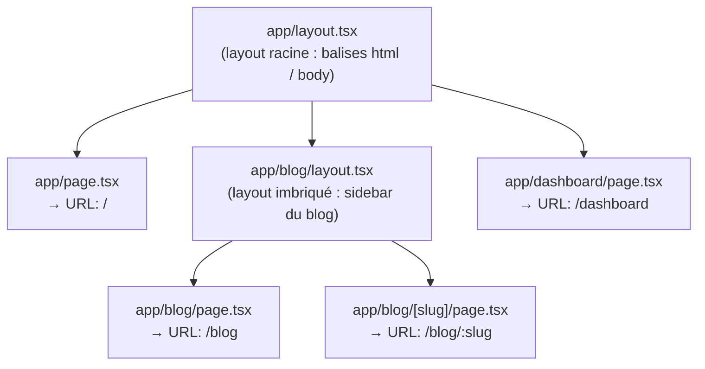

## Le routing n'est plus déclaré : il est déduit du système de fichiers

Avec React Router (vu au parcours React), tu déclares explicitement chaque route (`<Route path="/blog/:slug" element={...} />`). Avec l'**App Router** de Next.js, il n'y a **rien à déclarer** : l'URL est déduite directement du chemin du fichier dans le dossier `app/`.

| Fichier | URL |
|---|---|
| `app/page.tsx` | `/` |
| `app/blog/page.tsx` | `/blog` |
| `app/blog/[slug]/page.tsx` | `/blog/:slug` (segment dynamique) |
| `app/dashboard/settings/page.tsx` | `/dashboard/settings` |

Seuls certains **noms de fichiers réservés** ont un rôle spécial dans un dossier de `app/` :

- `page.tsx` : le contenu affiché pour ce segment d'URL.
- `layout.tsx` : une **enveloppe partagée**, qui persiste entre les navigations à l'intérieur du segment (et de ses enfants).
- `loading.tsx` / `error.tsx` : états de chargement / erreur automatiques pour le segment (pas de détail ici — retiens juste qu'ils existent).

> **Symfony → Next.js.** Tu passes d'un routing **déclaratif** (`#[Route('/blog/{slug}')]` sur une méthode de contrôleur) à un routing **par convention de fichiers**. C'est le même changement de logique que d'aller d'une config de routing YAML explicite vers un système où le nom/emplacement du fichier *est* la route — aucune ligne de configuration à maintenir en synchro avec le code.

## Les layouts : une enveloppe qui s'imbrique

Un `layout.tsx` entoure sa `page.tsx` **et tous les layouts de ses sous-dossiers**. Le layout **racine** (`app/layout.tsx`) est **obligatoire** : c'est lui qui définit les balises `html` et `body` de tout le site.



```tsx
// app/layout.tsx — the ROOT layout: mandatory, defines <html>/<body>
export default function RootLayout({
  children,
}: {
  children: React.ReactNode
}) {
  return (
    <html lang="en">
      <body>
        <header>My App</header>
        {children}
      </body>
    </html>
  )
}
```

```tsx
// app/blog/layout.tsx — a NESTED layout: only wraps everything under /blog
export default function BlogLayout({
  children,
}: {
  children: React.ReactNode
}) {
  return (
    <div className="blog-layout">
      <aside>Blog categories...</aside>
      <main>{children}</main>
    </div>
  )
}
```

> 💡 **À retenir.** Naviguer de `/blog` vers `/blog/my-post` **ne re-rend pas** `app/layout.tsx` ni `app/blog/layout.tsx` : seule la `page.tsx` change. C'est une optimisation automatique de l'App Router (pas d'équivalent direct côté Twig, où chaque requête régénère tout le template).

## Segments dynamiques : `[slug]`

Un dossier entre crochets capture un paramètre d'URL, exactement comme `{slug}` dans une route Symfony.

```tsx
// app/blog/[slug]/page.tsx
export default async function BlogPostPage({
  params,
}: {
  params: Promise<{ slug: string }>
}) {
  // In Next.js 15, `params` is a Promise: it must be awaited.
  const { slug } = await params

  return <article>Post: {slug}</article>
}
```

> ⚠️ **Erreur fréquente — oublier que `params` est une `Promise`.** Depuis Next.js 15, `params` (et `searchParams`) sont asynchrones dans les Server Components — un changement voulu pour permettre à Next de streamer la page avant même de connaître ces valeurs. Oublier le `await` donne un objet `Promise` au lieu de la valeur attendue.

## À retenir

- Dans `app/`, **l'emplacement du fichier définit l'URL** : pas de table de routing à maintenir à part.
- `page.tsx` = le contenu du segment ; `layout.tsx` = une enveloppe partagée, imbriquable, qui persiste entre navigations.
- `app/layout.tsx` (racine) est **obligatoire** et porte les balises `html`/`body`.
- `[slug]` capture un segment dynamique — comme `{slug}` dans une route Symfony — mais `params` est une `Promise` à `await` (Next.js 15).
