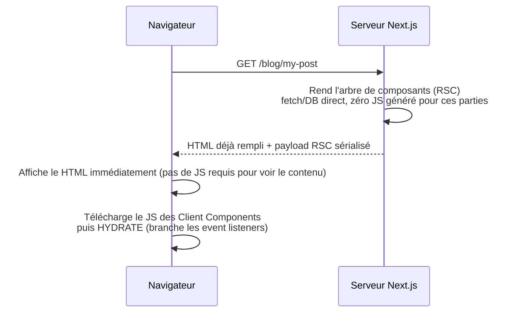

## Deux systèmes de routing, un seul à retenir en 2026

Next.js a eu, historiquement, un premier système de routing : le **Pages Router** (dossier `pages/`, depuis 2016). Depuis Next.js 13, un second système existe : l'**App Router** (dossier `app/`), qui est devenu **le choix par défaut et recommandé** pour tout nouveau projet — c'est celui que ce cours enseigne exclusivement.

| | Pages Router (`pages/`) | App Router (`app/`) |
|---|---|---|
| Statut en 2026 | ancien — maintenance de code existant | **par défaut, recommandé** |
| Rendu par défaut | SSR au 1ᵉʳ rendu puis tout hydraté côté client (pas de notion Server/Client Component) | **Server Component** (rendu serveur, zéro JS envoyé sauf besoin) |
| Data fetching | `getServerSideProps` / `getStaticProps` | `async`/`await` direct dans le composant |
| Layouts imbriqués | non natif (à bricoler soi-même) | natif (`layout.tsx`) |
| Streaming / Suspense | non | oui |

> ⚠️ **Erreur fréquente — apprendre `getServerSideProps`/`getStaticProps`.** Tu croiseras ces noms dans de vieux articles ou d'anciens projets : c'était l'**ancienne façon** (Pages Router) de faire du data fetching serveur. Dans l'App Router, cette logique disparaît : un Server Component fait directement `await fetch(...)` dans son corps (module 3). Ne les apprends pas comme méthode courante — retiens juste qu'ils existent si tu tombes sur du code legacy.

## Le vrai changement de fond : React Server Components

Ce qui distingue vraiment l'App Router, ce n'est pas juste « un dossier différent » : c'est que Next.js y adopte les **React Server Components** (RSC), une capacité de React lui-même (pas propre à Next). Par défaut, **tout composant dans `app/` est rendu sur le serveur**, jamais envoyé comme JS au navigateur — sauf ceux marqués explicitement `"use client"` (détaillé au module 2).

Voici, dans les grandes lignes, ce qui se passe pour une requête App Router :

- Le **HTML arrive déjà rempli** : l'utilisateur voit le contenu avant même que le JavaScript ne soit chargé.
- L'**hydratation** ne concerne que les parties interactives (les Client Components) : le reste de la page n'a **aucun** JS à télécharger ni exécuter.

> **Symfony → Next.js.** L'étape « le serveur rend l'arbre et renvoie du HTML » ressemble à Twig qui génère une page complète. La différence : Next envoie **en plus** un payload qui permet au navigateur de réconcilier le futur DOM interactif avec ce HTML, sans tout re-générer — Twig, lui, s'arrête après avoir produit le HTML.

## À retenir

- **App Router = le défaut moderne** ; le Pages Router n'est à connaître que pour lire du code existant.
- `getServerSideProps`/`getStaticProps` appartiennent à l'**ancienne** façon (Pages Router) — ne les utilise pas dans du code neuf.
- Dans l'App Router, tout composant est un **Server Component par défaut** : rendu côté serveur, jamais expédié comme JS.
- Une requête App Router suit le flux : **rendu serveur (RSC) → HTML rempli envoyé → hydratation des seules parties interactives**.
