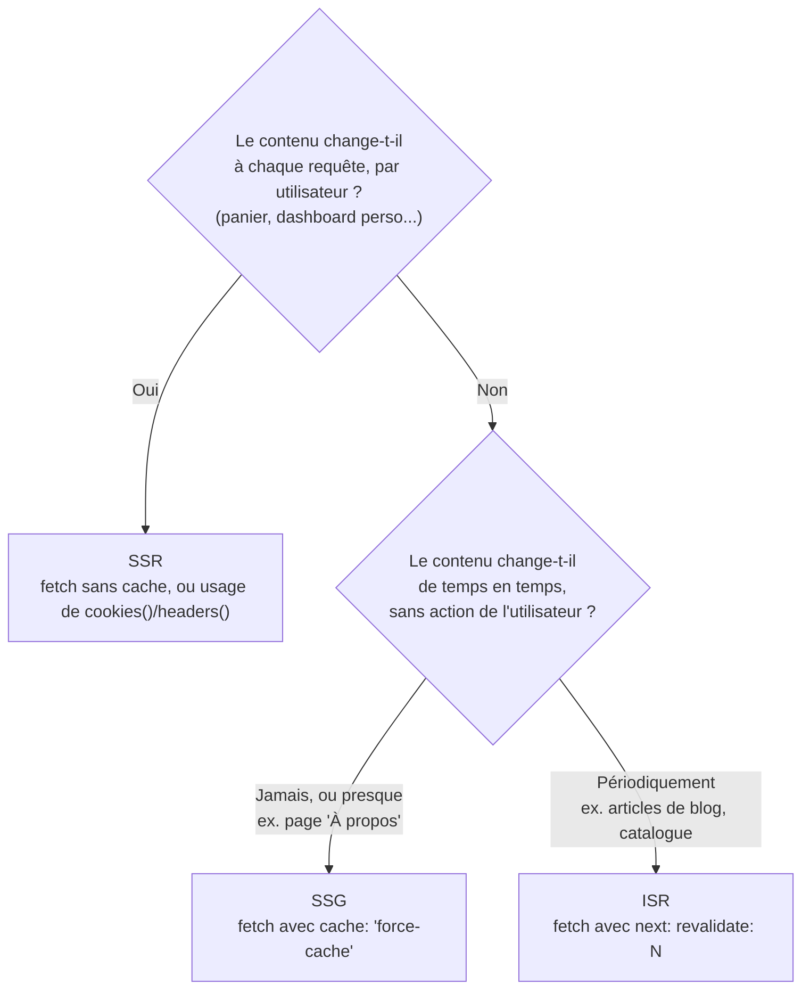

## Trois façons de produire le HTML, une seule question à se poser

Un Server Component est toujours rendu côté serveur — mais **quand**, exactement ? Next.js décide automatiquement entre trois stratégies, selon la façon dont tu récupères tes données :

- **SSR** (*Server-Side Rendering*) : le composant est rendu **à chaque requête**. Toujours frais, mais le serveur travaille à chaque visite.
- **SSG** (*Static Site Generation*) : le composant est rendu **une fois, au build**, puis servi comme HTML statique (le plus rapide possible). Les données datent du dernier build.
- **ISR** (*Incremental Static Regeneration*) : comme le SSG, mais avec une **revalidation périodique** — le meilleur compromis rapidité/fraîcheur pour la majorité des sites de contenu.



## SSR : rendu à chaque requête

Dès qu'un Server Component utilise une donnée liée à **cette requête précise** (cookies, en-têtes, ou un `fetch` explicitement non caché), Next le rend dynamiquement, à chaque visite.

```tsx
// app/dashboard/page.tsx — rendered fresh on EVERY request (SSR)
import { cookies } from "next/headers"

export default async function DashboardPage() {
  const sessionId = (await cookies()).get("session_id")?.value
  const res = await fetch(`https://api.example.com/me?session=${sessionId}`, {
    cache: "no-store", // explicitly opt OUT of any caching
  })
  const user = await res.json()

  return <p>Welcome, {user.name}</p>
}
```

## SSG : rendu une fois, au build

Pour du contenu qui ne dépend d'aucun utilisateur ni requête (une page « À propos », des conditions générales), le rendu peut avoir lieu **une seule fois**, au moment du build — le résultat est du HTML pur, aussi rapide qu'un fichier statique.

```tsx
// app/about/page.tsx — rendered ONCE at build time (SSG)
async function getCompanyInfo() {
  const res = await fetch("https://api.example.com/company", {
    cache: "force-cache", // explicitly opt IN to indefinite caching
  })
  return res.json()
}

export default async function AboutPage() {
  const info = await getCompanyInfo()
  return <p>{info.description}</p>
}
```

## ISR : statique, mais qui se rafraîchit

Un catalogue produit ou une liste d'articles change, mais pas à chaque requête : l'ISR rend une version statique **et** la régénère automatiquement après un délai.

```tsx
// app/blog/page.tsx — static, but revalidated every 60 seconds (ISR)
async function getPosts() {
  const res = await fetch("https://api.example.com/posts", {
    next: { revalidate: 60 }, // regenerate at most once every 60s
  })
  return res.json()
}

export default async function BlogPage() {
  const posts = await getPosts()
  return (
    <ul>
      {posts.map((post: { id: string; title: string }) => (
        <li key={post.id}>{post.title}</li>
      ))}
    </ul>
  )
}
```

> **Symfony → Next.js.** L'ISR ressemble à un **cache HTTP avec un `max-age`** devant une app Symfony (un reverse proxy comme Varnish, ou le cache HTTP intégré de Symfony) : la page servie peut être légèrement périmée, mais jamais plus de `N` secondes — sans jamais refaire tout le travail de rendu à chaque requête.

## Le streaming en bref : ne pas attendre le plus lent

Une page peut contenir une partie rapide (le titre, la nav) et une partie lente (une requête DB coûteuse). Enrober la partie lente dans un `<Suspense>` permet à Next d'**envoyer le HTML de la partie rapide immédiatement**, puis de streamer la suite dès qu'elle est prête — plutôt que de faire attendre toute la page pour la partie la plus lente.

```tsx
// app/dashboard/page.tsx
import { Suspense } from "react"
import SlowStats from "./slow-stats" // a Server Component with a slow fetch

export default function DashboardPage() {
  return (
    <div>
      <h1>Dashboard</h1> {/* sent immediately */}
      <Suspense fallback={<p>Loading stats...</p>}>
        <SlowStats /> {/* streamed in once ready */}
      </Suspense>
    </div>
  )
}
```

> 💡 **À retenir.** Le fichier spécial `loading.tsx` (vu au module 1) applique automatiquement ce même principe de `<Suspense>` à **tout un segment** de route — pas besoin de l'écrire à la main pour le cas le plus courant (afficher un état de chargement pendant que la `page.tsx` du segment se rend).

## À retenir

- **SSR** : rendu à chaque requête (données par utilisateur/session) ; **SSG** : rendu une fois au build (contenu quasi-figé) ; **ISR** : statique + revalidation périodique (le compromis le plus courant pour du contenu).
- La stratégie n'est **pas** un choix explicite « SSR ou SSG » à déclarer à part : elle découle des options passées à `fetch` (`no-store`, `force-cache`, `next: { revalidate }`) — détaillé au module 3.
- Le `<Suspense>` (ou `loading.tsx`) permet de **streamer** une page : afficher tout de suite ce qui est prêt, sans attendre la partie la plus lente.
