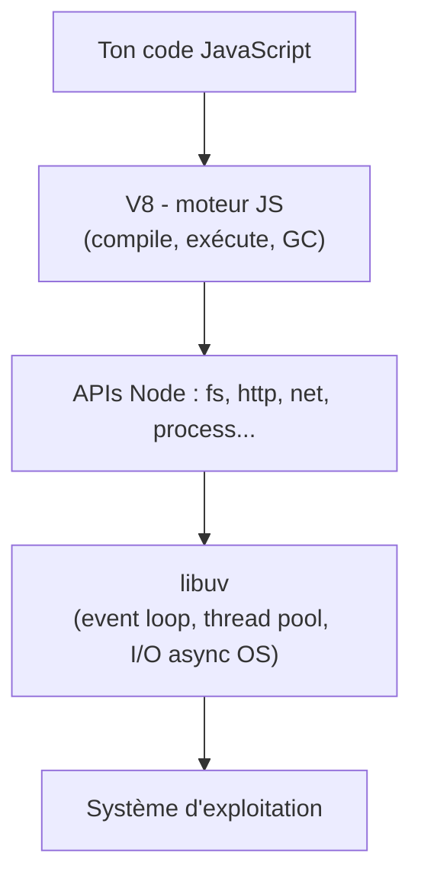
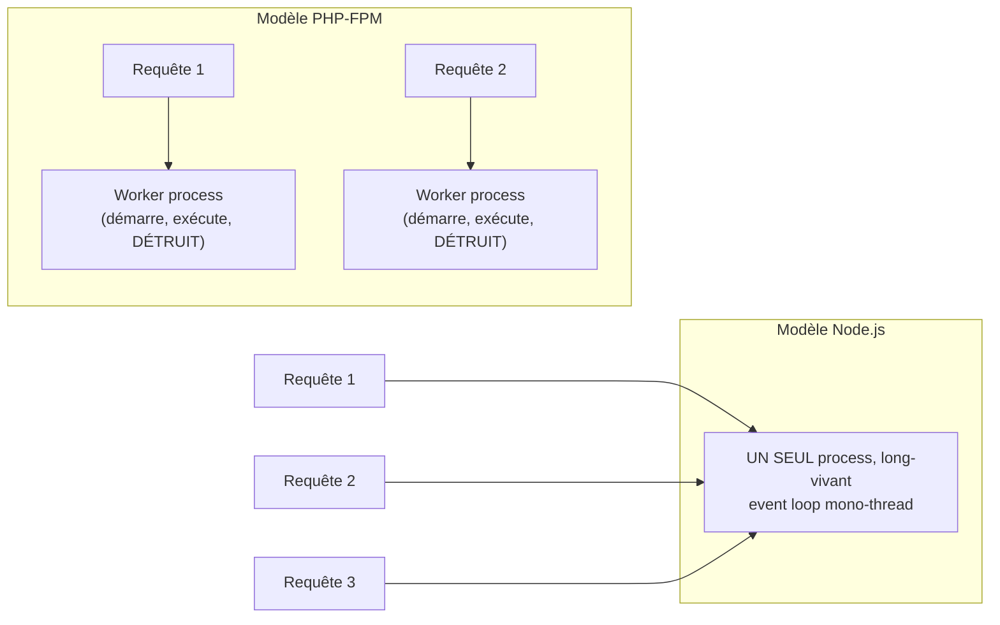

## Node, ce n'est pas « juste du JavaScript côté serveur »

Node.js est un **runtime** : un programme écrit en C++ qui embarque deux briques.

- **V8** : le moteur JavaScript de Chrome. Il compile ton code JS en code machine
  (JIT), gère la mémoire (garbage collector), et fournit les objets de base
  (`Object`, `Array`, `Promise`…).
- **libuv** : une bibliothèque C qui fournit l'**event loop**, un **pool de threads**
  (pour les opérations qui ne peuvent pas être asynchrones nativement au niveau OS,
  comme certains appels fichiers), et l'accès aux primitives d'I/O asynchrone du
  système d'exploitation (epoll sur Linux, kqueue sur macOS, IOCP sur Windows).

V8 ne sait exécuter que du JavaScript « pur » : il ne sait pas lire un fichier ou
ouvrir une socket TCP. Ce sont `fs`, `net`, `http`… — les **modules natifs** de
Node, implémentés en C++/JS — qui font le pont entre ton code JS et libuv.



> **Passerelle PHP/Symfony.** Le Zend Engine exécute ton PHP ; les extensions
> (`pdo`, `curl`, `opcache`…) font le pont vers le système. Node a la même
> logique en deux couches (V8 = moteur, libuv + modules natifs = accès système),
> sauf que PHP redémarre ce moteur à **chaque requête** (voir plus bas), alors
> que Node le garde en mémoire, actif en continu.

## Le changement de mental model : un process qui *vit*

C'est ici que se situe la vraie rupture avec ton expérience PHP. En PHP-FPM :

1. Une requête HTTP arrive.
2. Un **worker process** (déjà démarré, dans un pool) exécute ton script PHP
   **du début à la fin**, de façon synchrone.
3. La réponse part, et **le worker jette tout son état** (variables, connexions
   non persistées…) — prêt à traiter une requête suivante, potentiellement
   différente, comme si de rien n'était.

En Node, tu lances un **seul process** (`node server.js`) qui démarre une bonne
fois pour toutes et **ne s'arrête jamais** entre deux requêtes. Il garde son état
en mémoire (variables globales, connexions DB ouvertes, caches en mémoire...) et
traite toutes les requêtes qui arrivent, une par une au niveau du thread principal,
mais en **entrelaçant** leur exécution grâce à l'event loop (détaillé dans la
prochaine leçon).



> **Passerelle PHP/Symfony.** En Symfony, une variable globale, un singleton mal
> pensé, une fuite mémoire : au pire, ça pollue **une** requête, le prochain
> worker repart d'un état propre (ou presque, avec OPcache pour le bytecode
> compilé, mais pas l'état applicatif). En Node, un état mal géré (une variable
> globale qui grossit, un `Map` jamais vidé, une connexion oubliée) **s'accumule
> pendant toute la vie du process** — potentiellement des jours. C'est la
> première classe de bugs à laquelle un dev PHP n'est pas habitué : les **fuites
> mémoire long terme**.

> ⚠️ **Erreur fréquente — croire que chaque requête « repart de zéro ».** Une
> variable déclarée en dehors d'une fonction de handler (donc au niveau module)
> est **partagée entre toutes les requêtes**, tout le temps que le serveur tourne.
> Ce n'est ni du `$_SESSION`, ni une variable de requête PHP : c'est un état
> **global et persistant** du process. Utile (caches, pools de connexions) mais
> dangereux si utilisé par erreur pour stocker des données propres à un visiteur.

```js
// This counter is shared by EVERY request handled by this process,
// for as long as the process lives — nothing like a PHP request-scoped variable.
let requestCount = 0

function handleRequest(req, res) {
  requestCount++ // accumulates across ALL requests, forever
  res.end(`This is request number ${requestCount}`)
}
```

## Pourquoi cette architecture existe

Node a été créé (Ryan Dahl, 2009) pour un objectif précis : gérer **beaucoup de
connexions concurrentes** (typiquement des I/O réseau — API, WebSockets, proxys)
sans payer le coût mémoire d'un thread ou d'un process par connexion. Le pari :
un seul thread qui ne bloque jamais sur de l'I/O peut servir des milliers de
clients simultanément, tant qu'il ne fait pas de calcul lourd de façon
synchrone.

> 💡 **À retenir — le bon cas d'usage.** Node excelle sur des charges **I/O-bound**
> (attendre une base de données, une API tierce, un fichier) où le thread ne fait
> qu'attendre. Il est **moins bon** sur des charges **CPU-bound** (calculs lourds,
> traitement d'image, crypto intensive) qui **bloquent** l'unique thread — sujet
> détaillé dans la prochaine leçon.

## À retenir

- Node = **V8** (exécute le JS) + **libuv** (event loop, thread pool, I/O
  asynchrone système).
- **Un seul process, long-vivant** : il démarre une fois et tourne en continu,
  contrairement au cycle démarrage/destruction de chaque worker PHP-FPM.
- L'état déclaré hors d'un handler est **global à tout le process**, partagé par
  toutes les requêtes tant que le serveur vit — source de bugs inédits pour un
  dev PHP (fuites mémoire, état qui fuit d'une requête à l'autre).
- Architecture pensée pour des charges **I/O-bound** à haute concurrence, pas
  pour du calcul CPU intensif synchrone.
