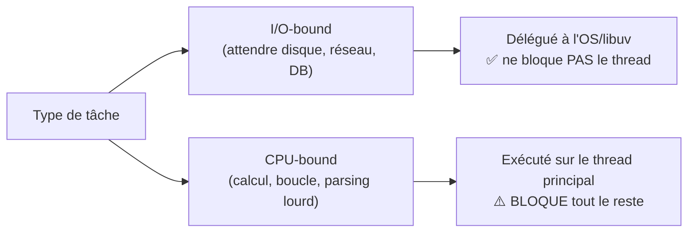

## Une seule règle, mais absolue

> ⚠️ **La règle la plus importante de tout ce cours : ne JAMAIS bloquer le
> thread principal.** Tout le reste de cette formation (async/await, streams,
> event loop) découle de cette contrainte unique.

Node exécute ton code JavaScript sur **un seul thread**. Ce même thread doit
gérer **toutes** les requêtes en cours, tous les timers, tous les callbacks
réseau. Si ce thread est occupé à calculer quelque chose de façon **synchrone**,
**rien d'autre ne peut se passer** pendant ce temps : aucune autre requête
n'est traitée, aucun timer ne se déclenche, le process semble figé.

```js
// A synchronous CPU-heavy loop FREEZES the entire server —
// not just "this request", ALL of them, for every connected client.
function blockEventLoop() {
  const start = Date.now()
  while (Date.now() - start < 5000) {
    // busy-wait for 5 seconds: nothing else can run during this time
  }
}
```

> **Passerelle PHP/Symfony.** En PHP-FPM, un `sleep(5)` ou une boucle lourde dans
> une requête ne bloque **que le worker qui traite cette requête** — les autres
> workers du pool continuent de répondre normalement aux autres visiteurs. En
> Node, il n'y a **pas de pool de workers** par défaut : un seul thread traite
> tout le monde. Bloquer ce thread, c'est bloquer **littéralement tous les
> utilisateurs connectés**, pas juste celui qui a déclenché le calcul.

## Non-bloquant : comment Node s'en sort

Pour les opérations d'**I/O** (lire un fichier, interroger une base de données,
appeler une API HTTP), Node ne fait *jamais* attendre le thread principal. Il
délègue l'opération à l'OS ou au pool de threads de libuv, **continue** à
exécuter la suite du programme, et revient exécuter un **callback** quand le
résultat est prêt.

```js
import fs from "node:fs"

console.log("1. Start reading the file")

fs.readFile("data.json", "utf8", (err, content) => {
  // This callback runs LATER, once the file is actually read,
  // without ever blocking the main thread in the meantime.
  console.log("3. File content received:", content)
})

console.log("2. This line runs BEFORE the file is read")

// Output order: 1, 2, 3 — NOT 1, 3, 2, even though readFile is written first!
```

> **Passerelle PHP/Symfony.** En PHP, `file_get_contents("data.json")` est
> **bloquant par nature** : la ligne suivante n'exécute qu'une fois le fichier
> entièrement lu — c'est le modèle synchrone que tu connais par cœur. En Node,
> l'équivalent asynchrone (`fs.readFile`) **rend la main immédiatement** et
> exécute son callback plus tard. Ce renversement de logique (« je lance, je
> continue, je serai notifié ») est la porte d'entrée de tout ce module.

## CPU-bound vs I/O-bound : le distinguo qui compte



- **I/O-bound** (le point fort de Node) : requêtes réseau, lecture de fichiers,
  appels de base de données. Le thread ne fait qu'**attendre** une réponse
  externe — Node en profite pour traiter d'autres tâches pendant l'attente.
- **CPU-bound** (le point faible de Node) : boucles lourdes, tri de gros
  volumes, traitement d'image, hashing intensif. Le thread **calcule
  activement** : impossible de faire autre chose en parallèle sur ce même
  thread.

> 💡 **À retenir.** Pour du CPU-bound réellement lourd, Node propose les
> [`worker_threads`](https://nodejs.org/api/worker_threads.html) (de vrais
> threads séparés) ou le découpage du travail (`setImmediate` entre chaque
> lot) pour laisser respirer l'event loop. Hors du périmètre de ce cours, mais
> bon réflexe à connaître : « ce calcul est-il assez lourd pour justifier un
> worker thread ? »

## Les pièges classiques d'un dev qui découvre Node

> ⚠️ **Erreur fréquente — utiliser les variantes `*Sync` en production.** Le
> module `fs` propose `fs.readFileSync`, qui **bloque** le thread jusqu'à la fin
> de la lecture (comme le ferait PHP). Pratique en script ponctuel ou au tout
> démarrage de l'app (charger une config une fois), **catastrophique** dans un
> handler de requête HTTP qui tourne des milliers de fois par seconde.

```js
import fs from "node:fs"

// ❌ BAD in a request handler: blocks the whole server for every request
function readConfigBad() {
  return fs.readFileSync("config.json", "utf8")
}

// ✅ GOOD: does not block the event loop, other requests keep flowing
async function readConfigGood() {
  const { readFile } = await import("node:fs/promises")
  return readFile("config.json", "utf8")
}
```

> **Réflexe à prendre.** Face à une API Node, demande-toi toujours : « est-ce la
> version synchrone (bloquante) ou asynchrone (non bloquante) ? ». Un nom qui
> se termine par `Sync` (`readFileSync`, `execSync`…) est un **signal
> d'alarme** dans du code qui répond à des requêtes.

## À retenir

- Node exécute ton JS sur **un seul thread** : bloquer ce thread bloque
  **tout le monde**, pas seulement la requête en cours (contrairement à
  PHP-FPM et son pool de workers isolés).
- Les opérations **I/O** sont déléguées (OS/libuv) et ne bloquent jamais le
  thread ; les opérations **CPU-bound** synchrones, elles, le bloquent.
- Une fonction dont le nom finit par `Sync` est bloquante : à réserver au
  démarrage du process, jamais dans un handler de requête.
- C'est cette contrainte unique qui justifie l'omniprésence de l'asynchrone en
  Node (prochain module).
