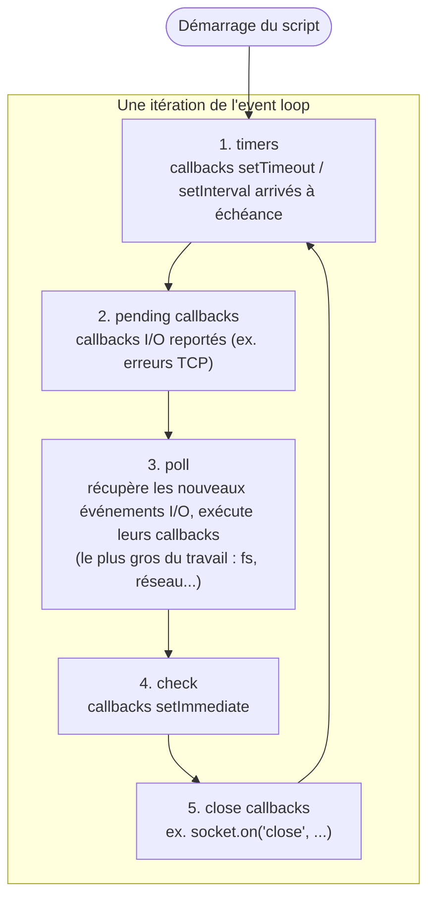
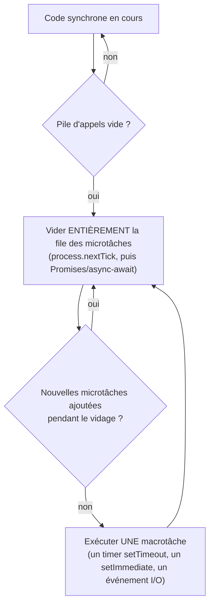

## L'event loop, pas une boucle magique : des phases précises

L'**event loop** est la boucle que libuv exécute en continu tant que le process
Node tourne. Ce n'est pas une simple file d'attente unique : c'est une
succession de **phases**, chacune avec sa propre file de callbacks à exécuter.
Tant qu'il reste du travail (une phase non vide, un timer en attente, un
serveur qui écoute), la boucle continue de tourner.



- **timers** : exécute les callbacks `setTimeout`/`setInterval` dont le délai
  est écoulé (pas de garantie de précision à la milliseconde près : c'est un
  délai *minimum*, pas exact).
- **pending callbacks** : certains callbacks système reportés d'un tour.
- **poll** : la phase centrale — Node y récupère les événements I/O (une
  lecture de fichier terminée, une réponse réseau reçue) et exécute leurs
  callbacks. S'il n'y a rien à traiter et aucun timer à venir, Node peut
  **attendre** ici (le process ne consomme pas de CPU pour rien).
- **check** : exécute les callbacks `setImmediate`, juste après la phase poll.
- **close callbacks** : callbacks de fermeture (`close` sur une socket, un
  stream…).

> **Passerelle PHP/Symfony.** Rien de comparable en PHP-FPM : il n'y a pas de
> « boucle » qui tourne entre les requêtes, chaque requête est un aller simple
> (start → traiter → répondre → mourir). L'event loop est le mécanisme qui
> permet à Node de **rester vivant** et de traiter des événements arrivant à
> des moments imprévisibles (une réponse réseau, un fichier lu, un timer) sans
> jamais créer de nouveau process.

## `setTimeout` vs `setImmediate` vs `process.nextTick`

Trois façons de dire « exécute ce code plus tard », avec des ordonnancements
différents :

| API | Quand s'exécute-t-elle ? |
|---|---|
| `process.nextTick(fn)` | **avant** de passer à la phase suivante de l'event loop — la plus prioritaire, s'exécute juste après le code synchrone en cours |
| `Promise.resolve().then(fn)` | juste après `process.nextTick`, avant toute phase de l'event loop (voir microtâches ci-dessous) |
| `setTimeout(fn, 0)` | à la phase **timers** du prochain tour (dès que le délai — ici quasi 0 — est écoulé) |
| `setImmediate(fn)` | à la phase **check**, juste après la phase **poll** du tour courant |

```js
console.log("1. synchronous code")

setTimeout(() => console.log("4. setTimeout"), 0)
setImmediate(() => console.log("5. setImmediate"))

process.nextTick(() => console.log("2. process.nextTick"))
Promise.resolve().then(() => console.log("3. Promise (microtask)"))

console.log("1b. still synchronous code")

// Typical output order:
// 1. synchronous code
// 1b. still synchronous code
// 2. process.nextTick
// 3. Promise (microtask)
// 4. setTimeout       (order vs setImmediate can vary depending on context)
// 5. setImmediate
```

> ⚠️ **Erreur fréquente — croire que `setTimeout(fn, 0)` s'exécute « tout de
> suite ».** Un délai de `0` ne veut PAS dire immédiatement : ça veut dire « dès
> que possible, à la prochaine phase timers », donc **toujours après** le code
> synchrone en cours **et** après toutes les microtâches en attente
> (`process.nextTick`, promesses). C'est une erreur de lecture très fréquente
> chez qui découvre Node.

## Microtâches vs macrotâches

C'est la distinction la plus utile à retenir au quotidien, car elle explique
**tout** ordre d'exécution asynchrone que tu verras avec des promesses.



- **Microtâches** : callbacks `.then()`/`.catch()`/`.finally()` d'une promesse,
  code après un `await`, `queueMicrotask()`, et `process.nextTick` (encore plus
  prioritaire que les promesses). **Toute la file de microtâches est vidée
  avant de passer à la macrotâche suivante** — y compris les nouvelles
  microtâches ajoutées en cours de route.
- **Macrotâches** : un callback `setTimeout`/`setInterval`, un `setImmediate`,
  un événement I/O (fichier lu, requête réseau reçue). Une seule macrotâche est
  traitée par tour de boucle, puis on revide la file de microtâches avant la
  macrotâche suivante.

```js
console.log("A: sync")

setTimeout(() => console.log("D: macrotask (setTimeout)"), 0)

Promise.resolve()
  .then(() => console.log("B: microtask 1"))
  .then(() => console.log("C: microtask 2 (chained from B)"))

console.log("A2: sync")

// Output: A, A2, B, C, D
// Both microtasks (B and C) run BEFORE the macrotask (D),
// even though C is only enqueued once B has already started running.
```

> 💡 **À retenir.** Les microtâches sont **toujours** exécutées avant la
> prochaine macrotâche, même s'il y en a plusieurs qui s'enchaînent. C'est
> pourquoi une chaîne de `.then()` (ou une suite de lignes après plusieurs
> `await`) se termine toujours avant qu'un `setTimeout(fn, 0)` posé au même
> moment ne se déclenche.

> **Réflexe à prendre.** Face à un bug d'ordre d'exécution en Node, pose-toi
> deux questions : (1) est-ce une microtâche (promesse/await) ou une macrotâche
> (timer/I/O) ? (2) dans quel ordre ont-elles été **enfilées**, pas dans quel
> ordre elles semblent « logiques » à lire ?

## À retenir

- L'event loop tourne en **phases** ordonnées : timers → pending callbacks →
  poll (I/O) → check (`setImmediate`) → close callbacks, en boucle.
- `process.nextTick` > microtâches (promesses) > macrotâches (`setTimeout`,
  `setImmediate`, I/O) en termes de priorité d'exécution.
- **Toute** la file de microtâches est vidée avant de passer à la macrotâche
  suivante — même celles ajoutées pendant le vidage.
- `setTimeout(fn, 0)` ne s'exécute jamais avant le code synchrone ni les
  microtâches en attente : « 0 ms » veut dire « dès que possible », pas
  « immédiatement ».
