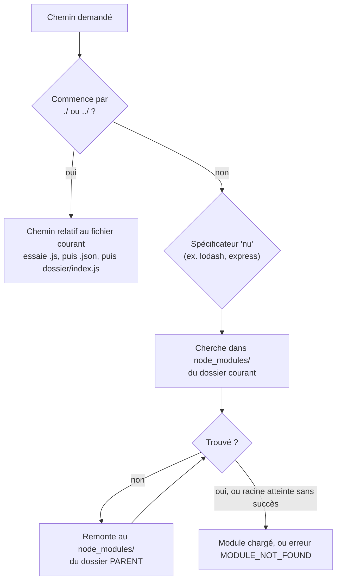
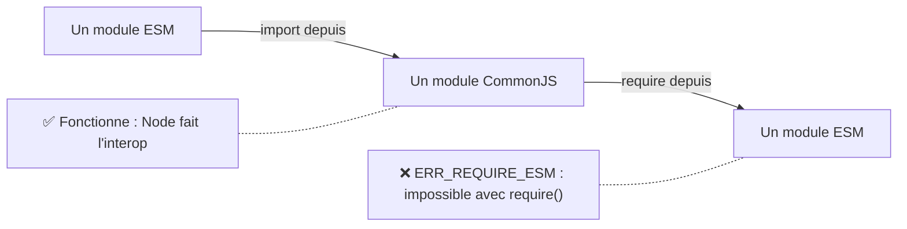

## Comment Node retrouve un module

Quand tu écris `require("./utils")` ou `import "lodash"`, Node suit un
**algorithme de résolution** précis selon la forme du chemin.



- **Chemin relatif** (`./math.js`, `../utils`) : résolu par rapport au fichier
  qui fait l'import — jamais par rapport au dossier où tu lances `node`.
- **Spécificateur nu** (`lodash`, `express`) : Node cherche dans
  `node_modules/` du dossier courant, puis **remonte** dossier par dossier
  (`../node_modules/`, `../../node_modules/`...) jusqu'à la racine du disque.

> **Passerelle Composer/PSR-4.** Composer calcule un **mapping** explicite
> namespace → dossier (déclaré dans `composer.json`, matérialisé dans
> `vendor/composer/autoload_psr4.php` après `composer dump-autoload`) : la
> résolution d'une classe est en O(1), un lookup dans une table déjà calculée.
> Node, lui, **remonte l'arborescence à chaque résolution** (mise en cache
> ensuite) : pas de mapping global précalculé, juste un algorithme de
> recherche par dossier. Deux philosophies : configuration explicite
> (Composer) vs convention + recherche (Node).

## Le `package.json` : les champs qui pilotent le chargement

```json
{
  "name": "my-app",
  "version": "1.0.0",
  "type": "module",
  "main": "./dist/index.js",
  "exports": {
    ".": "./dist/index.js",
    "./utils": "./dist/utils.js"
  }
}
```

- **`type`** : `"module"` (ESM par défaut pour les `.js` de ce paquet) ou
  `"commonjs"` (par défaut si le champ est absent).
- **`main`** : le fichier chargé quand on fait `require("my-app")` ou
  `import "my-app"` — le point d'entrée historique.
- **`exports`** : la carte **moderne** et **restrictive** des points d'entrée
  publics d'un paquet. Si `exports` est défini, **seuls** les chemins qui y
  sont listés sont importables de l'extérieur — impossible d'importer un
  fichier interne non exposé (`my-app/dist/internal-helper.js` échouerait).

> **Passerelle Composer/PSR-4.** `main`/`exports` jouent un rôle proche de la
> clé `autoload` de `composer.json` (quels dossiers/fichiers sont exposés), en
> plus strict : `exports` peut carrément **interdire** l'accès aux fichiers
> internes d'un paquet, ce que PSR-4 ne fait pas nativement (tout namespace
> mappé reste accessible).

## Interopérabilité CommonJS ↔ ESM : les pièges

C'est le point qui surprend le plus en pratique, une fois qu'un projet mélange
les deux mondes (fréquent, car une bonne partie de l'écosystème npm est encore
en CommonJS).



- **ESM peut importer du CommonJS** : `import pkg from "some-cjs-package"`
  fonctionne — Node expose `module.exports` comme un export par défaut.
- **CommonJS ne peut PAS `require()` un module ESM** : ça lève
  `ERR_REQUIRE_ESM`. Il faut utiliser l'import dynamique asynchrone
  (`const mod = await import("./esm-file.mjs")`), car ESM est fondamentalement
  asynchrone (leçon précédente) et `require()` est fondamentalement synchrone
  — les deux modèles sont incompatibles à cet endroit précis.

```js
// From a CommonJS file, trying to load an ESM-only package:
// const esmOnly = require("esm-only-package") // ❌ ERR_REQUIRE_ESM

// The workaround: dynamic import (always returns a Promise)
async function loadEsmOnlyPackage() {
  const esmOnly = await import("esm-only-package")
  return esmOnly.default
}
```

> ⚠️ **Erreur fréquente — mélanger les extensions sans le champ `type`.**
> Sans `"type": "module"` dans le `package.json`, tous les `.js` restent
> CommonJS par défaut, même si tu y écris `import`/`export` : tu obtiens un
> `SyntaxError` à l'exécution. Le réflexe : fixe explicitement `type` dans le
> `package.json`, ou utilise les extensions `.mjs`/`.cjs` pour lever toute
> ambiguïté fichier par fichier.

## À retenir

- Chemin **relatif** (`./`, `../`) = résolu depuis le fichier courant ;
  spécificateur **nu** (`lodash`) = recherche en remontant les
  `node_modules/`, du dossier courant jusqu'à la racine.
- `package.json` : `type` (CJS/ESM par défaut), `main` (point d'entrée
  historique), `exports` (carte moderne et **restrictive** des points
  d'entrée publics).
- **ESM peut `import` du CommonJS**, mais **CommonJS ne peut pas `require()`
  de l'ESM** (utiliser l'`import()` dynamique, asynchrone).
- Contrairement à l'autoload PSR-4 de Composer (mapping précalculé), Node
  **recherche** dans l'arborescence à chaque résolution (mise en cache
  ensuite).
