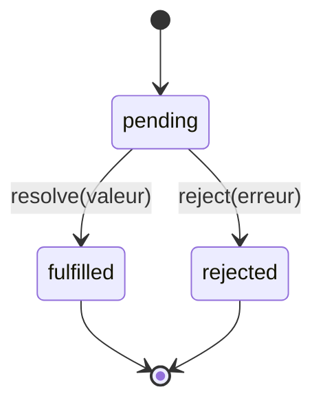

## Pourquoi l'asynchrone est partout en Node

En PHP, ton code est **synchrone par défaut** : une ligne attend la précédente,
un appel à la base de données bloque jusqu'à obtenir sa réponse, et c'est très
bien ainsi puisque chaque requête a **son propre worker** dédié (module 1).

En Node, une opération d'I/O qui bloquerait le thread bloquerait **tout le
monde** (rappel du module 1) : c'est pour ça que quasiment toute opération
d'I/O de Node est **asynchrone** — elle rend la main immédiatement et te
prévient plus tard, via un mécanisme de rappel.

> **Passerelle PHP/Symfony.** `$pdo->query(...)`, `file_get_contents(...)`,
> `$client->request(...)` (HttpClient) : en PHP, ces appels sont **bloquants**
> et renvoient directement leur résultat. En Node, leurs équivalents
> (`db.query(...)`, `fs.readFile(...)`, `fetch(...)`) sont **asynchrones** :
> ils renvoient soit immédiatement (sans le résultat, via un callback), soit
> une **promesse** — un objet représentant « un résultat qui arrivera plus
> tard ».

## Le style historique : les callbacks « error-first »

La première approche de Node, encore présente dans beaucoup d'APIs natives
(`fs`, `crypto`...), est le **callback error-first** : une fonction appelée à
la fin de l'opération, dont le **premier argument** est toujours l'erreur
(`null` si tout s'est bien passé).

```js
import fs from "node:fs"

fs.readFile("data.json", "utf8", (err, content) => {
  if (err) {
    console.error("Failed to read file:", err.message)
    return
  }
  console.log("Content:", content)
})
```

> **Passerelle PHP/Symfony.** Rien d'équivalent en PHP : les exceptions
> (`try/catch`) gèrent nativement les erreurs de façon synchrone. Le callback
> error-first est une convention **manuelle** née du fait qu'un callback
> asynchrone ne peut pas simplement `throw` — l'erreur doit être **transmise**
> en argument, puisque l'appelant a déjà rendu la main depuis longtemps quand
> le callback s'exécute.

## Le problème : le « callback hell »

Enchaîner plusieurs opérations asynchrones dépendantes avec des callbacks
produit un code qui s'imbrique en pyramide, difficile à lire et à maintenir.

```js
// "Callback hell": each step nests one level deeper
getUser(userId, (err, user) => {
  if (err) return handleError(err)
  getOrders(user.id, (err, orders) => {
    if (err) return handleError(err)
    getInvoice(orders[0].id, (err, invoice) => {
      if (err) return handleError(err)
      console.log("Invoice:", invoice) // 3 levels deep just to get here
    })
  })
})
```

> ⚠️ **Erreur fréquente — gérer l'erreur à CHAQUE niveau, en oubliant un
> niveau.** Avec des callbacks imbriqués, il faut vérifier `err` à **chaque**
> étage. Un seul niveau oublié (`if (err) return handleError(err)` manquant)
> laisse l'erreur silencieusement se propager avec des données `undefined` —
> une classe de bug très fréquente avant l'arrivée des promesses.

## La promesse : un objet qui représente « bientôt disponible »

Une **`Promise`** enveloppe un résultat futur dans un objet à **trois états** :
`pending` (en attente), `fulfilled` (résolue avec succès) ou `rejected`
(échouée). On y réagit avec `.then()` (succès), `.catch()` (échec) et
`.finally()` (dans tous les cas).



```js
function getUser(userId) {
  return new Promise((resolve, reject) => {
    db.query("SELECT * FROM users WHERE id = ?", [userId], (err, rows) => {
      if (err) reject(err)         // failure: the Promise becomes "rejected"
      else resolve(rows[0])        // success: the Promise becomes "fulfilled"
    })
  })
}

getUser(42)
  .then((user) => console.log("User:", user))
  .catch((err) => console.error("Failed:", err.message))
```

Le vrai gain apparaît en **chaînant** plusieurs étapes : chaque `.then()`
renvoie une **nouvelle** promesse, ce qui aplatit la pyramide de callbacks en
une séquence linéaire.

```js
getUser(userId)
  .then((user) => getOrders(user.id))
  .then((orders) => getInvoice(orders[0].id))
  .then((invoice) => console.log("Invoice:", invoice))
  .catch((err) => handleError(err)) // ONE catch for the WHOLE chain
```

> 💡 **À retenir.** Un seul `.catch()` en fin de chaîne suffit à intercepter
> **n'importe quelle** erreur survenue à **n'importe quelle** étape
> précédente — fini le risque d'oublier une vérification à un niveau imbriqué.

## À retenir

- L'asynchrone est **omniprésent** en Node parce que bloquer le thread unique
  bloquerait toutes les requêtes en cours (module 1).
- Les callbacks **error-first** (`(err, result) => ...`) sont la convention
  historique, encore présente dans des APIs natives comme `fs`.
- Enchaîner des callbacks imbriqués produit du **callback hell** : illisible,
  et facile à mal gérer sur les erreurs.
- Une **`Promise`** représente un résultat futur (`pending` → `fulfilled` ou
  `rejected`) et se **chaîne** avec `.then()`/`.catch()`, aplatissant la
  pyramide en une séquence linéaire avec une gestion d'erreur centralisée.
